# 第6章　プロセス中心の記述 - CSPによる並行システム

ミニ要約：
- プロセス代数・チャネルで並行/同期を表現
- 図6-1の観点でデッドロック/進行性を分析
- 図11-1/図10-1と連携しDevOps/検証層へ展開

本章では、コード例を次の2種類で表記します。

- 【ツール準拠（そのまま動く）】CSPM（FDR）として文法的に成立し、そのまま貼り付けて解析できる例（ASCII記法：`->`, `[]`, `|||`, `[| X |]`, `P[[a <- b]]` など）
- 【擬似記法】説明用の簡略表記。Unicode記号（`→`, `□`, `⊓` など）や一部のガード/where/イベントパラメータはCSPMと一致しないため、そのままではツール投入できません

## 6.1 並行性の本質：なぜ難しいのか

### 逐次的思考の限界

人間の脳は、基本的に逐次的な思考に適応しています。物事を順番に考え、一歩ずつ論理を進めることに長けています。この思考パターンは、単一プロセスのプログラムでは非常に有効です。「AをしてからBをして、その結果に基づいてCまたはDをする」といった流れは、自然に理解できます。（図6-1参照）

しかし、並行システムでは、複数の事象が同時に進行します。レストランで例えると、厨房では複数のシェフが異なる料理を並行して調理し、ホールでは複数のウェイターが異なるテーブルにサービスを提供しています。この複雑な相互作用を、逐次的思考だけで理解することは困難です。

並行性の困難さは、可能な実行パターンの組み合わせ爆発にあります。2つのプロセスがそれぞれ3つの操作を行う場合、可能な実行順序は20通りにもなります。プロセス数や操作数が増えれば、この数は指数的に増大します。

### 相互作用による創発的複雑性

並行システムの最も興味深い、そして困難な側面は、個々のプロセスは単純でも、その相互作用により予期しない複雑な振る舞いが創発することです。これは、物理学の「多体問題」や生物学の「群れの行動」に似た現象です。

例えば、2つのプロセスが同じリソースにアクセスしようとする場合を考えてみましょう。各プロセス単体では完全に正しく動作しますが、同時実行により「競合状態」が発生し、予期しない結果が生じることがあります。

【擬似記法】
```text
プロセス A: リソースを読む → 値を更新 → リソースに書く
プロセス B: リソースを読む → 値を更新 → リソースに書く
```

これらの操作が交互に実行されると、一方の更新がもう一方により上書きされ、データの不整合が発生します。

### 非決定性という現実

並行システムでは、「非決定性」が避けられない特徴です。同じ初期状態から開始しても、実行のタイミングにより異なる結果が生じる可能性があります。これは、プログラムの動作を予測困難にし、デバッグを複雑にします。

しかし、非決定性は必ずしも悪いものではありません。システムの柔軟性や効率性を提供することもあります。重要なのは、非決定性を制御し、システムの安全性と活性を保証することです。


（読み取りポイント：プロセス合成・通信・検証観点（FDR）を俯瞰）

（読み取りポイント：図6-1参照）
- プロセス代数: 並列合成/選択/逐次のオペレータで振る舞いを記述
- チャネル通信: 同期/非同期の違いとデッドロック回避設計
- 検証観点: トレース/フロー/失敗・ダイバージェンス（FDR）

### 章末課題（抜粋）

解答の骨子・採点観点は[付録D]({{ '/appendices/appendix-d/' | relative_url }})を参照。

1. 二つのプロセスの並行合成がデッドロックに陥る最小例を日本語で記述し、回避策（プロトコル/バッファ）を1つ提案せよ。
2. 失敗・ダイバージェンスの観点から、非同期化の副作用（例えば無限バッファ）を50–80字で述べよ。

＜解答の方向性（骨子）＞
- 問1: 双方向同期の待ち合わせが典型。片方向化/時間制約/有限バッファで緩和。
- 問2: 無限待ち/順序逆転/背圧喪失による安全性・進行性の劣化を指摘。

### 時間と因果関係の複雑化

逐次システムでは、時間の流れと因果関係は明確です。「AがBより前に実行される」ことは、「AがBの原因となりうる」ことを意味します。しかし、並行システムでは、物理的時刻と論理的時刻が異なり、因果関係が複雑になります。

分散システムでは、この問題がさらに深刻になります。異なるノード間での時刻同期は困難で、「同時」という概念自体が曖昧になります。相対性理論が物理学に与えた影響と似て、分散システムでは絶対的な時間の概念を放棄する必要があります。

### 故障の部分性

並行・分散システムでは、システムの一部が故障しても、残りの部分は動作し続けることがあります。これは「部分故障」と呼ばれ、システム設計に新たな複雑性をもたらします。

従来の逐次システムでは、故障は全体的でした。プログラムがクラッシュすれば、すべてが停止します。しかし、分散システムでは、ネットワークの一部が切断されても、他の部分は動作し続けます。この状況で、どのようにシステムの一貫性を保つかは、重要な設計課題です。

### 並行性の利点

これらの困難さにもかかわらず、並行性は現代のシステムにとって不可欠です。その理由は：

**性能向上**: 複数のCPUコアを活用し、処理時間を短縮
**応答性の向上**: ユーザーインターフェースをブロックせずにバックグラウンド処理を実行
**スケーラビリティ**: 処理能力を水平方向に拡張
**可用性**: 一部の故障に対する耐性
**自然なモデリング**: 現実世界の並行性を直接反映

並行システムの設計は困難ですが、適切な抽象化と形式的手法により、その複雑性を管理できます。CSPは、そのための強力なツールの一つです。
（開発プロセス/CIへの組み込みは第11章、検証レベルの役割分担は図10-1参照）

## 6.2 CSPの世界観：プロセスとコミュニケーション

### Tony Hoareの洞察

CSP（Communicating Sequential Processes）は、1978年にTony Hoareによって発表されました。Hoare は、並行システムの本質は「コミュニケーション」にあるという深い洞察を得ました。プロセス同士がどのようにメッセージを交換し、同期するかが、システムの振る舞いを決定するという考えです。

この洞察は革命的でした。従来の並行プログラミングでは、共有メモリや共有変数による相互作用が主流でした。しかし、Hoareは「メッセージ パッシング」による明示的なコミュニケーションこそが、並行システムを理解し設計するための適切な抽象化であることを示しました。

### プロセスという抽象化

CSPにおける「プロセス」は、逐次的に実行される操作の列です。重要なのは、プロセス内部は従来の逐次プログラムと同様に理解できることです。複雑さは、プロセス間の相互作用にのみ集中されます。

この分離により、「プロセス内部の正しさ」と「プロセス間の相互作用の正しさ」を独立して考えることができます。これは、複雑性の管理において重要な原理です。

【擬似記法】
```csp
VENDING_MACHINE = coin → (tea → VENDING_MACHINE | coffee → VENDING_MACHINE)
```

この表記では、自動販売機のプロセスが「硬貨の投入」に続いて「お茶またはコーヒーの選択」を行い、その後初期状態に戻ることを表現しています。

### 事象による相互作用

CSPでは、プロセス間の相互作用を「事象（event）」として抽象化します。事象は、プロセス間でのメッセージ交換、同期、リソースアクセスなどを統一的に表現する概念です。

事象の重要な特徴は「同期性」です。事象は、関与するすべてのプロセスが準備できたときにのみ発生します。これにより、プロセス間の協調を自然に表現できます。

【擬似記法】
```csp
CUSTOMER = arrive → order → pay → leave → CUSTOMER
CASHIER = greet → order → pay → CASHIER

SYSTEM = CUSTOMER [| {order, pay} |] CASHIER
```

この例では、`order` と `pay` が両プロセスで同名のため、同期集合 `{order, pay}` に含めた事象はランデブー同期（待ち合わせ）として発生します。異なる名前の事象が自動的に同期するわけではなく、必要ならイベント名を揃えるか、renaming（リネーム）で同期条件を明示します。

### チャネルによる構造化

実用的なシステムでは、多数のプロセスが相互作用します。CSPでは、「チャネル」という概念により、この複雑性を管理します。チャネルは、特定のプロセス間での通信経路を表現します。

【ツール準拠（そのまま動く）】
```csp
channel in, out : {0..1}

PRODUCER = in!0 -> PRODUCER
BUFFER = in?x -> out!x -> BUFFER
CONSUMER = out?x -> CONSUMER

SYSTEM = (PRODUCER [| {|in|} |] BUFFER) [| {|out|} |] CONSUMER
```

この例では、`in` と `out` の2つのチャネルで段階的に同期します。`PRODUCER` と `BUFFER` は `in` の事象で同期し、`BUFFER` と `CONSUMER` は `out` の事象で同期します。

### 階層的システム構築

CSPの強力な特徴の一つは、小さなプロセスから大きなシステムを階層的に構築できることです。この構成可能性により、複雑なシステムも理解可能な部分に分解できます。

【擬似記法】
```csp
CELL = left?x → right!x → CELL
PIPE(n) = if n = 0 then CELL 
          else CELL [| {right, left} |] PIPE(n-1)
```

この再帰的定義により、任意の長さのパイプラインを構築できます。

### 選択と並行の統合

CSPでは、「選択」と「並行」を統一的な枠組みで扱います。これにより、複雑な制御構造も自然に表現できます。

**外部選択（□）**: 環境からの入力により選択が決まる
【擬似記法】
```csp
ATM = card_insert → (pin_correct → transaction □ pin_incorrect → reject)
```

**内部選択（⊓）**: プロセス内部の非決定的選択
【擬似記法】
```csp
RANDOM = heads → SUCCESS ⊓ tails → FAILURE
```

**並行合成（||）**: 複数のプロセスの並行実行
【ツール準拠（そのまま動く）】
```csp
PROCESS1 = a -> PROCESS1
PROCESS2 = b -> PROCESS2
PROCESS3 = c -> PROCESS3

SYSTEM = PROCESS1 || PROCESS2 || PROCESS3
```

### 時間抽象化の利点

CSPでは、具体的な実行時間を抽象化し、事象の順序関係のみに焦点を当てます。この抽象化により、タイミングの詳細に惑わされることなく、システムの本質的な振る舞いを分析できます。

ただし、必要に応じて時間制約も導入できます。「timed CSP」では、事象の発生時刻や期限を明示的に扱えます。

### 故障と例外の取り扱い

CSPでは、正常な動作だけでなく、故障や例外的状況も自然に表現できます。故障も一種の事象として扱うことで、故障処理を通常の制御構造と統一的に記述できます。

【擬似記法】
```csp
RELIABLE_SERVICE = 
  request → (
    success → response → RELIABLE_SERVICE
    □
    failure → retry → RELIABLE_SERVICE
    □
    timeout → abort → RELIABLE_SERVICE
  )
```

この統一的な取り扱いにより、システムの堅牢性を設計段階から考慮できます。

## 6.3 基本的なプロセスとその合成

### プリミティブプロセス

CSPのすべての複雑なシステムは、少数の基本的なプロセスから構築されます。これらのプリミティブプロセスを理解することが、CSP全体の理解の基礎となります。

**STOP**: 何もしないプロセス（デッドロック）
【ツール準拠（そのまま動く）】
```csp
STOP
```

**SKIP**: 正常終了するプロセス
【ツール準拠（そのまま動く）】
```csp
SKIP
```

**単純な事象プロセス**:
【擬似記法】
```csp
a → STOP          // 事象aの後に停止
a → b → STOP      // 事象a、bの順次実行
```

これらの基本要素は、音楽の音符のように、組み合わせることで豊かな表現を生み出します。

### 前置演算子（→）

前置演算子は、CSPの最も基本的な構成要素です。「事象が発生した後に、特定の振る舞いを行う」ことを表現します。

【擬似記法】
```csp
coin → (tea → STOP | coffee → STOP)
```

この表記は、「硬貨投入後に、お茶またはコーヒーを選択できる」ことを意味します。

前置演算子の重要な特徴は、事象の同期性です。指定された事象が発生するまで、プロセスは待機状態にあります。

### 選択演算子

CSPには、複数種類の選択演算子があります。それぞれ異なる意味を持ち、適切な場面で使い分けることが重要です。

**外部選択（□）**: 環境の選択
【擬似記法】
```csp
ATM = card_insert → pin_entry □ admin_key → maintenance_mode
```

顧客がカードを挿入するか、管理者がキーを使うかは、環境（利用者）が決定します。

**内部選択（⊓）**: プロセスの選択
【擬似記法】
```csp
COIN_FLIP = heads → WIN ⊓ tails → LOSE
```

どちらが選ばれるかは、プロセス内部の非決定性によります。

**ガード付き選択**:
【擬似記法】
```csp
BUFFER = size < MAX & input?x → add.x → BUFFER
        □ size > 0 & output!first → remove → BUFFER
```

条件が満たされた場合にのみ選択可能になります。

### 並行合成演算子

複数のプロセスを並行実行させるための演算子群は、CSPの核心的な機能です。

**独立並行（|||）**: 完全に独立した並行実行
【ツール準拠（そのまま動く）】
```csp
PRINTER = print_job -> PRINTER
SCANNER = scan_doc -> SCANNER
KEYBOARD = key_press -> KEYBOARD

SYSTEM = PRINTER ||| SCANNER ||| KEYBOARD
```

プロセス間に相互作用はなく、完全に並行して動作します。

**同期並行（[| X |]）**: 指定された事象での同期
【ツール準拠（そのまま動く）】
```csp
CUSTOMER = arrive -> order -> pay -> leave -> CUSTOMER
CASHIER = greet -> order -> pay -> CASHIER

SYSTEM = CUSTOMER [| {order, pay} |] CASHIER
```

`order`と`pay`事象で同期し、他の事象は独立して実行されます。

**インターリーブ（|||）**: 事象の交互実行
【擬似記法】
```csp
AB_SEQUENCE = A ||| B
where A = a → b → A
      B = c → d → B
```

AとBの事象が任意の順序で交互に実行されます。

### パイプライン構成

プロセス間でのデータ フローを表現するため、パイプライン構成がよく使われます。

【擬似記法】
```csp
PRODUCER = produce.data → c12!data → PRODUCER
PROCESSOR = c12?x → process.x → c23!process(x) → PROCESSOR  
CONSUMER = c23?x → consume.x → CONSUMER

PIPELINE = (PRODUCER [| {c12} |] PROCESSOR)
           [| {c23} |] CONSUMER
```

この構成により、データが生産者から消費者まで段階的に処理されます。

### 再帰による無限プロセス

多くの実用システムは、継続的に動作する必要があります。CSPでは、再帰により無限に動作するプロセスを自然に表現できます。

**単純な再帰**:
【擬似記法】
```csp
CLOCK = tick → CLOCK
```

**状態を持つ再帰**:
【擬似記法】
```csp
COUNTER(n) = up → COUNTER(n+1) 
           □ down → COUNTER(n-1)
           □ reset → COUNTER(0)
```

**相互再帰**:
【擬似記法】
```csp
PING = ping → PONG
PONG = pong → PING
```

### プロセス ファミリー

類似したプロセスの集合を扱うため、プロセス ファミリーという概念があります。

【擬似記法】
```csp
WORKER(id) = task?t → process.id.t → result!process(t) → WORKER(id)
WORKERS = ||| i:{1..N} @ WORKER(i)
```

N個のワーカープロセスが並行して動作します。

### 隠蔽と抽象化

内部的な事象を外部から見えなくするため、隠蔽演算子（\）を使います。

【ツール準拠（そのまま動く）】
```csp
INTERNAL_PROCESS = internal_event1 -> internal_event2 -> external_event -> INTERNAL_PROCESS
PUBLIC_INTERFACE = INTERNAL_PROCESS \ {internal_event1, internal_event2}
```

これにより、システムの内部構造を隠し、外部インターフェースのみを公開できます。

### 名前変更

プロセスの再利用のため、事象名を変更する演算子があります。

【ツール準拠（そのまま動く）】
```csp
channel in, out : {0..1}
channel input, output : {0..1}

GENERIC_BUFFER = in?x -> out!x -> GENERIC_BUFFER
SPECIFIC_BUFFER = GENERIC_BUFFER[[in <- input, out <- output]]
```

これにより、汎用的なプロセス定義を特定の文脈で再利用できます。

### プロセス結合の設計原則

効果的なプロセス結合のための設計原則：

1. **最小インターフェース**: 必要最小限の事象でのみ同期
2. **対称性**: 可能な限り対称的な設計
3. **再利用性**: 汎用的なプロセス定義
4. **段階的詳細化**: 抽象から具体への段階的構築

これらの原則により、理解しやすく、保守しやすい並行システムを設計できます。

## 6.4 同期とコミュニケーション

### 同期の本質的意味

同期（synchronization）は、並行システムにおいて最も重要な概念の一つです。CSPでは、同期を「複数のプロセスが特定の時点で協調すること」として理解します。これは、オーケストラの演奏者が指揮者に合わせて演奏することや、ダンサーが音楽に合わせて踊ることに似ています。

CSPの同期は「ランデブー同期」と呼ばれます。事象が発生するためには、その事象に関与するすべてのプロセスが準備完了状態になる必要があります。この制約により、プロセス間の協調が自然に表現されます。

### チャネル通信の仕組み

CSPでは、プロセス間の通信を「チャネル」という抽象的な通信経路で表現します。チャネルは、電話回線や郵便配達のように、メッセージを運ぶ媒体として機能します。

**出力（!）**: メッセージの送信
【擬似記法】
```csp
SENDER = ch!message → SENDER
```

**入力（?）**: メッセージの受信
【擬似記法】
```csp
RECEIVER = ch?x → process.x → RECEIVER
```

**同期通信**: 送信と受信が同時に発生
【ツール準拠（そのまま動く）】
```csp
channel ch : {0..1}

SENDER = ch!0 -> SENDER
RECEIVER = ch?x -> RECEIVER

COMMUNICATION = SENDER [| {|ch|} |] RECEIVER
```

この抽象では、送信と受信が同一の事象として同時に発生する（= 片方だけが進まない）ため、送受の整合性条件を仕様として明示できます。一方で、実システムにおける通信路の信頼性（損失・遅延・再送・バッファリング等）は別途モデル化が必要です。

### バッファリングの概念

実世界の通信では、しばしばバッファリングが必要になります。CSPでは、バッファーも一つのプロセスとして表現できます。

**単一要素バッファー**:
【擬似記法】
```csp
BUFFER1 = in?x → out!x → BUFFER1
```

**容量Nのバッファー**:
【擬似記法】
```csp
BUFFER(n) = (n > 0) & out!front → BUFFER(n-1)
          □ (n < MAX) & in?x → BUFFER(n+1)
```

**先入先出（FIFO）バッファー**:
【擬似記法】
```csp
FIFO_BUFFER(queue) = 
  (queue ≠ ⟨⟩) & out!head(queue) → FIFO_BUFFER(tail(queue))
  □ (len(queue) < MAX) & in?x → FIFO_BUFFER(queue ⌢ ⟨x⟩)
```

### 優先度付き通信

システムによっては、メッセージに優先度が必要な場合があります。

【擬似記法】
```csp
PRIORITY_HANDLER = 
  urgent?x → handle_urgent.x → PRIORITY_HANDLER
  □ normal?y → handle_normal.y → PRIORITY_HANDLER
  where urgent has priority over normal
```

### ブロードキャスト通信

一つのメッセージを複数の受信者に送信する場合：

【擬似記法】
```csp
BROADCASTER = message?x → (out1!x || out2!x || out3!x) → BROADCASTER

MULTICAST_SYSTEM = BROADCASTER 
                 [| {out1} |] RECEIVER1
                 [| {out2} |] RECEIVER2  
                 [| {out3} |] RECEIVER3
```

### 選択的通信

状況に応じて通信相手を選択する場合：

【擬似記法】
```csp
ROUTER = 
  input?msg → (
    (destination(msg) = A) & to_A!msg → ROUTER
    □ (destination(msg) = B) & to_B!msg → ROUTER
    □ (destination(msg) = C) & to_C!msg → ROUTER
  )
```

### タイムアウト付き通信

実際のシステムでは、通信の失敗や遅延を考慮する必要があります。

【擬似記法】
```csp
RELIABLE_SENDER = 
  send!message → (
    ack → SUCCESS
    □ timeout → retry → RELIABLE_SENDER
  )
```

### ハンドシェイク プロトコル

複雑な通信では、複数段階のハンドシェイクが必要になることがあります。

【擬似記法】
```csp
CLIENT = request!req → response?res → CLIENT
SERVER = request?req → process.req → response!result → SERVER

THREE_WAY_HANDSHAKE = 
  syn → syn_ack → ack → ESTABLISHED
```

### 同期パターンの分類

CSPで表現できる同期パターンを分類すると：

**1対1通信**: 単純なメッセージ交換
**1対多通信**: ブロードキャストやマルチキャスト
**多対1通信**: 複数の送信者から単一の受信者
**多対多通信**: 複雑なネットワーク通信

**バリア同期**: 全プロセスが特定の地点で待機
【擬似記法】
```csp
BARRIER(n) = 
  (n > 1) & arrive → BARRIER(n-1)
  □ (n = 1) & arrive → release → BARRIER(N)
```

### リーダー・フォロワー パターン

階層的な制御構造での通信：

【擬似記法】
```csp
LEADER = 
  decision!cmd → (
    follower1.ack → follower2.ack → follower3.ack → commit
  ) → LEADER

FOLLOWER(id) = 
  decision?cmd → execute.cmd → ack → FOLLOWER(id)
```

### 投票プロトコル

分散システムでの合意形成：

【擬似記法】
```csp
VOTER(id) = vote_request?proposal → 
           (approve!id → VOTER(id) □ reject!id → VOTER(id))

COORDINATOR = 
  broadcast_proposal → 
  collect_votes → 
  (majority_approve & commit □ majority_reject & abort) →
  COORDINATOR
```

### 通信の信頼性

現実的なシステムでは、通信の失敗を考慮する必要があります：

**メッセージ損失の処理**:
【擬似記法】
```csp
LOSSY_CHANNEL = msg?x → (deliver!x □ lose → SKIP) → LOSSY_CHANNEL
```

**重複除去**:
【擬似記法】
```csp
DEDUP_RECEIVER = 
  msg?x → (
    (x ∉ received) & process.x → DEDUP_RECEIVER[received ∪ {x}]
    □ (x ∈ received) & duplicate → DEDUP_RECEIVER
  )
```

**順序保証**:
【擬似記法】
```csp
ORDERED_DELIVERY = 
  in?⟨seq, msg⟩ → (
    (seq = expected) & out!msg → ORDERED_DELIVERY[expected+1]
    □ (seq ≠ expected) & buffer.⟨seq,msg⟩ → ORDERED_DELIVERY
  )
```

これらの通信パターンを組み合わせることで、現実的な分散システムの複雑な通信要求を満たすことができます。

## 6.5 デッドロックと活性：システムの病理学

### デッドロックという病理現象

デッドロック（deadlock）は、並行システムにおける最も深刻な問題の一つです。複数のプロセスが互いに相手の行動を待ち続け、システム全体が停止状態に陥る現象です。これは、交差点で4台の車が互いに道を譲り合って動けなくなる状況に似ています。

CSPでは、デッドロックを形式的に定義できます。すべての参加プロセスが、他のプロセスからの事象を待機している状態がデッドロックです。

【擬似記法】
```csp
DEADLOCK_EXAMPLE = 
  (a → b → STOP) [| {a, b} |] (b → a → STOP)
```

この例では、左のプロセスが事象`a`の発生を待ち、右のプロセスが事象`b`の発生を待っているため、どちらも進行できません。

### デッドロック発生の4条件

古典的な研究により、デッドロックが発生するためには以下の4つの条件が同時に満たされる必要があることが知られています：

**1. 相互排除（Mutual Exclusion）**: リソースが同時に複数のプロセスから使用できない
**2. 保持と待機（Hold and Wait）**: プロセスがリソースを保持しながら他のリソースを待機
**3. 非プリエンプション（No Preemption）**: 強制的にリソースを取り上げることができない
**4. 循環待機（Circular Wait）**: プロセス間でリソース待機の循環構造が存在

CSPでこれらの条件を表現すると：

【擬似記法】
```csp
// 相互排除：リソースの排他制御
RESOURCE = acquire → use → release → RESOURCE

// 保持と待機：複数リソースの取得
PROCESS = resource1.acquire → resource2.acquire → 
          work → resource2.release → resource1.release → PROCESS

// 循環待機：プロセス間の循環依存
SYSTEM = (P1 [| {r1,r2} |] P2) \ {r1,r2}
where P1 = r1.acquire → r2.acquire → work → r2.release → r1.release → P1
      P2 = r2.acquire → r1.acquire → work → r1.release → r2.release → P2
```

### デッドロック回避戦略

デッドロックを回避するには、4つの条件のうち少なくとも一つを破る必要があります。

**資源順序付け（Resource Ordering）**:
【擬似記法】
```csp
ORDERED_PROCESS = 
  (id(r1) < id(r2)) & r1.acquire → r2.acquire → work →
  r2.release → r1.release → ORDERED_PROCESS
```

すべてのプロセスが同じ順序でリソースを取得することで、循環待機を防ぎます。

**タイムアウト機構**:
【擬似記法】
```csp
TIMEOUT_PROCESS = 
  r1.acquire → (
    r2.acquire → work → r2.release → r1.release → TIMEOUT_PROCESS
    □ timeout → r1.release → retry → TIMEOUT_PROCESS
  )
```

**銀行家アルゴリズム**:
【擬似記法】
```csp
BANKER = 
  request?⟨pid, resource⟩ → (
    safe_state(allocate(pid, resource)) & grant!pid → BANKER
    □ ¬safe_state(allocate(pid, resource)) & deny!pid → BANKER
  )
```

### ライブロックという微妙な問題

ライブロック（livelock）は、プロセスが動作しているにもかかわらず、実質的な進歩がない状態です。狭い廊下で二人が出会い、互いに避けようとして同じ方向に動き続ける状況に似ています。

【擬似記法】
```csp
LIVELOCK_EXAMPLE = 
  P1 [| {move} |] P2
where P1 = move.left → detect_collision → move.right → P1
      P2 = move.right → detect_collision → move.left → P2
```

### 活性（Liveness）の保証

活性とは、「良いことがいつかは起こる」という性質です。CSPでは、活性を複数の観点から分析できます。

**無飢餓性（Starvation Freedom）**: すべてのプロセスが最終的に進歩する
【擬似記法】
```csp
FAIR_SCHEDULER = 
  schedule!p1 → schedule!p2 → schedule!p3 → FAIR_SCHEDULER
```

**公平性（Fairness）**: 継続的に機会があるプロセスは最終的に実行される
【擬似記法】
```csp
FAIR_ACCESS = 
  (request.p1 → grant.p1 → FAIR_ACCESS) |||
  (request.p2 → grant.p2 → FAIR_ACCESS) |||
  FAIRNESS_CONSTRAINT
```

### 進歩条件の形式化

システムの進歩を保証するための条件を形式化できます：

**最小進歩保証**:
【擬似記法】
```csp
PROGRESS = □◊(progress_event)  // 「常に最終的に進歩事象が発生」
```

**有界待機**:
【擬似記法】
```csp
BOUNDED_WAIT = request → ◊≤n(grant)  // 「要求から最大n時間以内に許可」
```

### 検出と回復

デッドロックの検出と回復も重要な技術です：

**デッドロック検出器**:
【擬似記法】
```csp
DETECTOR = 
  monitor_state → (
    deadlock_detected & recovery_action → DETECTOR
    □ normal_state & continue → DETECTOR
  )
```

**回復戦略**:
【擬似記法】
```csp
RECOVERY = 
  abort_victim → rollback → restart → RECOVERY
  □ preempt_resource → reassign → RECOVERY
```

### 哲学者の食事問題

デッドロックの古典的な例である「哲学者の食事問題」をCSPで分析しましょう：

【擬似記法】
```csp
// 問題のある実装（デッドロック発生可能）
PHILOSOPHER(i) = 
  pickup.left(i) → pickup.right(i) → eat → 
  putdown.right(i) → putdown.left(i) → think → PHILOSOPHER(i)

DINING_PHILOSOPHERS = 
  ||| i:{1..5} @ PHILOSOPHER(i)

// 解決策1：非対称的な取得順序
PHILOSOPHER_FIXED(i) = 
  (i < 5) & pickup.left(i) → pickup.right(i) → eat → 
           putdown.right(i) → putdown.left(i) → think → PHILOSOPHER_FIXED(i)
  □ (i = 5) & pickup.right(i) → pickup.left(i) → eat → 
              putdown.left(i) → putdown.right(i) → think → PHILOSOPHER_FIXED(i)

// 解決策2：ウェイター制御
WAITER = 
  request.i → (
    available_forks(i) & grant.i → WAITER
    □ ¬available_forks(i) & wait.i → WAITER
  )
```

### 性能への影響

デッドロック回避策は、しばしば性能に影響を与えます：

**保守的戦略**: 安全だが効率が悪い
**楽観的戦略**: 効率的だが回復コストが高い
**適応的戦略**: 状況に応じて戦略を変更

【擬似記法】
```csp
ADAPTIVE_SYSTEM = 
  low_contention & OPTIMISTIC_PROTOCOL
  □ high_contention & CONSERVATIVE_PROTOCOL
```

### ツールによる検証

CSPモデルのデッドロック検証には専用ツールが利用できます：

- **FDR (Failures-Divergences Refinement)**: 厳密な検証
- **ProB**: 模型検査とアニメーション  
- **PAT**: 確率的検証

これらのツールにより、設計段階でデッドロックの可能性を発見し、修正できます。

## 6.6 実例で学ぶ：レストランシステムの設計

### システム要求の整理

レストランシステムは、並行システム設計の優れた例題です。複数の役割を持つ人々（顧客、ウェイター、シェフ、レジ係）が協調して動作し、限られたリソース（座席、厨房設備、食材）を共有する必要があります。

**主要な登場人物**：
- 顧客（複数）
- ウェイター（複数）  
- シェフ（複数）
- レジ係
- マネージャー

**共有リソース**：
- テーブル（座席）
- 厨房設備
- 食材在庫
- メニュー情報

**主要プロセス**：
1. 顧客の入店と着席
2. 注文の受付と厨房への伝達
3. 料理の調理と配膳
4. 会計と退店

### 基本的なプロセス定義

まず、各役割の基本的な振る舞いをCSPで定義しましょう：

【擬似記法】
```csp
// 顧客の行動パターン
CUSTOMER(id) = 
  arrive → wait_for_table → 
  seat.id → browse_menu → order.id → 
  wait_for_food → eat → request_bill → 
  pay → leave → CUSTOMER(id)

// ウェイターの行動パターン
WAITER(id) = 
  greet_customer → take_order → 
  transmit_to_kitchen → serve_food → 
  present_bill → process_payment → 
  clean_table → WAITER(id)

// シェフの行動パターン  
CHEF(id) = 
  receive_order → check_ingredients → 
  cook → plate_food → ready_for_service → 
  CHEF(id)

// レジ係の行動パターン
CASHIER = 
  receive_payment_request → calculate_total → 
  process_payment → issue_receipt → CASHIER
```

### テーブル管理サブシステム

レストランの座席管理は重要なサブシステムです。限られた座席を効率的に割り当て、デッドロックを回避する必要があります。

【擬似記法】
```csp
// テーブル管理プロセス
TABLE_MANAGER = 
  customer_arrives → (
    available_table & assign_table → TABLE_MANAGER
    □ no_available_table & add_to_waitlist → TABLE_MANAGER
  )
  □ table_freed → update_availability → 
    (waitlist_empty & TABLE_MANAGER 
     □ waitlist_not_empty & serve_next_customer → TABLE_MANAGER)

// 個別テーブルの状態管理
TABLE(id) = 
  reserve.id → occupied.id → 
  serve.id → eating.id → 
  clear.id → clean.id → TABLE(id)

// 全テーブルシステム
RESTAURANT_TABLES = 
  ||| table_id:{1..N} @ TABLE(table_id)
```

### 注文処理ワークフロー

注文から配膳までの複雑なワークフローを並行プロセスとして設計します：

【擬似記法】
```csp
// 注文受付プロセス
ORDER_TAKING = 
  customer_ready → approach_table → 
  present_menu → answer_questions → 
  take_order → confirm_order → 
  transmit_to_kitchen → ORDER_TAKING

// 厨房オーダー管理
KITCHEN_ORDER_MANAGER = 
  new_order?order → (
    ingredients_available(order) & 
    assign_to_chef!order → KITCHEN_ORDER_MANAGER
    □ ingredients_unavailable(order) & 
    inform_shortage → KITCHEN_ORDER_MANAGER
  )

// 調理プロセス
COOKING_PROCESS(chef_id) = 
  assigned_order?order → 
  gather_ingredients.order → 
  cook.order → 
  quality_check.order → 
  ready_for_pickup!order → 
  COOKING_PROCESS(chef_id)

// 配膳プロセス
FOOD_SERVICE = 
  food_ready?order → 
  locate_customer.order → 
  deliver_food.order → 
  check_satisfaction → 
  FOOD_SERVICE
```

### リソース管理：厨房設備

厨房設備（コンロ、オーブン、調理台）の排他制御を実装します：

【擬似記法】
```csp
// 設備管理プロセス
EQUIPMENT_MANAGER = 
  request_equipment?⟨chef, equipment⟩ → (
    equipment_available(equipment) & 
    grant_access!⟨chef, equipment⟩ → EQUIPMENT_MANAGER
    □ equipment_busy(equipment) & 
    queue_request!⟨chef, equipment⟩ → EQUIPMENT_MANAGER
  )
  □ release_equipment?⟨chef, equipment⟩ → 
    update_availability → 
    serve_next_request → EQUIPMENT_MANAGER

// 個別設備の状態
STOVE(id) = 
  reserve.id → cooking.id → release.id → STOVE(id)

OVEN(id) = 
  preheat.id → reserve.id → baking.id → release.id → OVEN(id)

// 設備群の並行管理
KITCHEN_EQUIPMENT = 
  (||| stove_id:{1..4} @ STOVE(stove_id))
  |||
  (||| oven_id:{1..2} @ OVEN(oven_id))
```

### 在庫管理システム

食材の在庫管理と発注プロセスを組み込みます：

【擬似記法】
```csp
// 在庫管理プロセス
INVENTORY_MANAGER = 
  use_ingredient?⟨ingredient, quantity⟩ → (
    sufficient_stock(ingredient, quantity) & 
    update_stock → check_reorder_level → 
    (below_threshold & trigger_reorder □ adequate_stock & SKIP) → 
    INVENTORY_MANAGER
    □ insufficient_stock(ingredient, quantity) & 
    report_shortage → INVENTORY_MANAGER
  )
  □ receive_delivery?⟨ingredient, quantity⟩ → 
    update_stock → INVENTORY_MANAGER

// 自動発注システム
AUTO_ORDERING = 
  check_inventory → (
    reorder_needed & place_order → wait_for_delivery → AUTO_ORDERING
    □ stock_adequate & schedule_next_check → AUTO_ORDERING
  )
```

### 支払い処理システム

複数の支払い方法に対応した決済システム：

【擬似記法】
```csp
// 決済プロセス
PAYMENT_PROCESSING = 
  payment_request?⟨table, amount⟩ → 
  calculate_total.amount → 
  present_payment_options → 
  (cash_payment → process_cash → issue_receipt → PAYMENT_PROCESSING
   □ card_payment → process_card → 
     (transaction_approved & issue_receipt → PAYMENT_PROCESSING
      □ transaction_declined & request_alternative → PAYMENT_PROCESSING)
   □ digital_payment → process_digital → 
     verify_payment → issue_receipt → PAYMENT_PROCESSING)

// 会計システム統合
ACCOUNTING_SYSTEM = 
  transaction_completed?details → 
  record_sale → update_daily_total → 
  (end_of_day & generate_report □ continue_operation) → 
  ACCOUNTING_SYSTEM
```

### 緊急時対応

食品安全や火災などの緊急事態への対応も設計に含めます：

【擬似記法】
```csp
// 緊急事態管理
EMERGENCY_SYSTEM = 
  (fire_alarm → evacuate_all → shutdown_equipment → EMERGENCY_SYSTEM
   □ food_safety_issue → stop_affected_orders → investigate → EMERGENCY_SYSTEM  
   □ power_outage → emergency_lighting → preserve_cold_storage → EMERGENCY_SYSTEM
   □ normal_operation → monitor → EMERGENCY_SYSTEM)

// 避難プロトコル
EVACUATION_PROTOCOL = 
  emergency_detected → 
  sound_alarm → 
  (guide_customers_out ||| secure_premises ||| contact_authorities) → 
  all_clear → resume_operations → EVACUATION_PROTOCOL
```

### システム全体の統合

個々のサブシステムを統合して、完全なレストランシステムを構築します：

【擬似記法】
（以下は構成の概念例であり、プロセス定義の省略があるためCSPMとしてはそのまま実行できません）
```csp
RESTAURANT_SYSTEM = 
  (CUSTOMER_MANAGEMENT 
   [| {arrive, seat, order, pay, leave} |] 
   STAFF_COORDINATION)
  [| {order, food_ready, payment} |]
  (KITCHEN_OPERATIONS 
   [| {ingredients, equipment} |] 
   RESOURCE_MANAGEMENT)
  \ {internal_communications}

where 
  CUSTOMER_MANAGEMENT = ||| id:{1..MAX_CUSTOMERS} @ CUSTOMER(id)
  STAFF_COORDINATION = 
    (||| id:{1..N_WAITERS} @ WAITER(id)) |||
    (||| id:{1..N_CHEFS} @ CHEF(id)) |||
    CASHIER
  KITCHEN_OPERATIONS = 
    KITCHEN_ORDER_MANAGER ||| 
    (||| id:{1..N_CHEFS} @ COOKING_PROCESS(id))
  RESOURCE_MANAGEMENT = 
    INVENTORY_MANAGER ||| 
    EQUIPMENT_MANAGER ||| 
    TABLE_MANAGER
```

### 性能最適化の考慮

実用的なシステムでは、性能最適化も重要です：

【擬似記法】
```csp
// 負荷バランシング
LOAD_BALANCER = 
  new_order?order → (
    find_least_busy_chef → 
    assign_order!⟨chef, order⟩ → LOAD_BALANCER
  )

// ピーク時対応
PEAK_TIME_MANAGEMENT = 
  detect_rush_hour → 
  (increase_staff ||| prioritize_fast_orders ||| optimize_seating) →
  monitor_queue_length → 
  (acceptable_wait_time & continue □ excessive_wait & escalate) →
  PEAK_TIME_MANAGEMENT
```

### 検証すべき性質

設計したシステムに対して、以下の性質を検証する必要があります：

**安全性**：
- デッドロック不発生
- リソースの排他制御
- 食品安全基準の遵守

**活性**：
- すべての顧客が最終的にサービスを受ける
- 注文が無限に遅延しない
- 設備が無限に占有されない

**公平性**：
- 先着順でのサービス提供
- スタッフの負荷分散
- リソースの公平な利用

このレストランシステムの例により、CSPが現実的な複雑システムの設計にどのように適用できるかが理解できます。並行性、リソース管理、エラー処理のすべてを統一的な枠組みで扱えることが、CSPの大きな価値です。

---

## 章末課題

### 基礎理解演習1：CSP記法の読解

以下のCSPプロセス定義を読んで、システムの振る舞いを説明してください：

【擬似記法】
```csp
PRODUCER = produce → buffer!item → PRODUCER
CONSUMER = buffer?x → consume.x → CONSUMER  
BUFFER = in?x → out!x → BUFFER

SYSTEM = PRODUCER [| {buffer} |] BUFFER[buffer/in, buffer/out] [| {buffer} |] CONSUMER
```

説明すべき内容：
1. 各プロセスの役割と動作
2. プロセス間の同期点
3. システム全体のデータフロー
4. 可能な実行シーケンスの例

### 基礎理解演習2：デッドロック分析

以下のシステムでデッドロックが発生する可能性を分析してください：

【擬似記法】
```csp
PROCESS_A = resource1.acquire → resource2.acquire → 
           work → resource2.release → resource1.release → PROCESS_A

PROCESS_B = resource2.acquire → resource1.acquire → 
           work → resource1.release → resource2.release → PROCESS_B

SYSTEM = PROCESS_A [| {resource1.acquire, resource1.release, 
                     resource2.acquire, resource2.release} |] PROCESS_B
```

分析内容：
1. デッドロック発生のシナリオ
2. デッドロック発生の4条件の確認
3. 防止策の提案（少なくとも2つ）
4. 修正されたCSP定義

### 実践演習1：ATMシステムの設計

以下の要求を満たすATMシステムをCSPでモデル化してください：

**基本機能**：
- カード挿入・暗証番号入力
- 残高照会・引き出し・預け入れ
- 明細印刷・カード排出

**並行性要求**：
- 複数のATMが同一銀行システムにアクセス
- 各ATMは同時に一人の顧客のみサービス
- 中央銀行システムでの排他制御

**安全性要求**：
- 不正アクセスの防止
- 残高不足時の引き出し拒否
- ネットワーク障害時の安全な停止

1. 主要プロセスの定義
2. リソース管理機構
3. エラー処理の統合
4. システム全体の統合

### 実践演習2：プロセス合成の活用

前のATMシステムについて、以下の拡張を行ってください：

1. **階層的設計**
   - 基本操作プロセスから複合操作プロセスを構成
   - インターフェース層とビジネスロジック層の分離

2. **並行性の制御**
   - 複数顧客の同時利用（異なるATM）
   - 管理者による保守モードの実装

3. **通信パターン**
   - ATMと中央システム間の信頼性の高い通信
   - 障害検出と回復機構

### 発展演習：分散システムの設計

複数ノードからなる分散ファイルシステムをCSPで設計してください：

**システム構成**：
- クライアントノード（複数）
- ストレージノード（複数）
- メタデータサーバー（冗長化）

**要求**：
- ファイルの読み書き操作
- データの冗長化（レプリケーション）
- ノード障害への耐性
- 一貫性の保証

**設計課題**：
1. ノード間通信プロトコル
2. 障害検出と回復
3. 分散合意アルゴリズム
4. 負荷分散機構

**検証事項**：
- デッドロック不発生
- データ一貫性の保証
- 部分障害に対する堅牢性
- 公平性（すべてのクライアントがサービスを受けられる）

これらの演習を通じて、CSPによる実践的な並行システム設計能力を身につけ、次章でのより高度な時間的性質の記述への準備を整えてください。
