# 第12章　ツールと自動化

ミニ要約：
- 検証をツールチェーン/CIへ統合
- 反例最小化・分割/再実行で運用安定
- 段階別深度とメトリクス（図11-1/10-1）

## 12.1 ツールエコシステムの全体像

### 技術の実用化における道具の重要性

形式的手法の実用性は、理論的な美しさではなく、実際の開発現場での使いやすさによって決まります。最も優れた理論であっても、適切なツール支援がなければ、学習コストと運用コストが開発チームの能力を超え、結果として採用されません。
（プロセス全体の統合像は図11-1、第10章の検証レベルの使い分けとあわせて設計）

歴史を振り返ると、多くの技術革新は優れたツールの出現により実用化が加速されています。コンパイラの発明によりプログラミング言語が普及し、統合開発環境（IDE）の発達により開発生産性が向上し、バージョン管理システムの普及によりチーム開発が効率化されました。形式的手法においても、ツールの成熟度が普及の鍵を握っています。

### ツールチェーンの設計思想

効果的な形式的手法の活用には、単一のツールではなく、相互に連携するツールチェーンが必要です。このツールチェーンは、以下の機能要素を統合する必要があります。

**仕様記述支援**：形式的仕様を効率的に記述するためのエディタ、構文チェック、補完機能。これらは開発者の認知負荷を軽減し、記述エラーを防止します。

**検証実行**：記述された仕様に対する模型検査、定理証明、制約充足の実行機能。これらは仕様の一貫性と実現可能性を確認します。

**結果解釈**：検証結果、反例、証明の可視化と解釈支援機能。複雑な検証結果を人間が理解できる形で提示します。

**統合連携**：既存の開発ツール（IDE、ビルドシステム、バージョン管理）との連携機能。孤立したツールではなく、開発ワークフローに自然に統合される必要があります。

### ツール選択の戦略的観点

ツール選択は技術的要件だけでなく、組織の能力、プロジェクトの制約、長期的な戦略を総合的に判断する必要があります。

**学習曲線の管理**：チームの現在のスキルレベルと、新ツール習得に投資できる時間・リソースのバランス。急峻な学習曲線は導入の障害となります。

**エコシステムの健全性**：ツールの開発体制、コミュニティの活発さ、長期的な維持可能性。優れたツールであっても、開発が停止すれば将来的なリスクとなります。


（読み取りポイント：仕様→検証→解釈→統合の連携を俯瞰）

**スケーラビリティの考慮**：小規模な実験では問題なくても、実際のプロジェクト規模では性能や使い勝手に問題が生じる可能性。事前の検証が重要です。

**ベンダーロックインの回避**：特定のツールや企業への過度な依存は、将来的な選択肢を制限します。可能な限り標準的な入出力形式を持つツールを選択することが重要です。

### 段階的ツール導入戦略

ツールの導入は、技術的能力の向上と並行して段階的に進める必要があります。一度にすべてのツールを導入することは、チームの混乱と導入失敗を招く可能性があります。

**第1段階：学習支援ツール**
形式的手法の概念学習を支援する教育的ツールから開始。例えば、Alloy Analyzerのような視覚的フィードバックの豊富なツール。

**第2段階：軽量検証ツール**
実用的価値を実感できる軽量な検証ツールの導入。設定が簡単で、即座に結果が得られるツール。

**第3段階：統合開発ツール**
既存の開発環境に統合され、日常的な開発作業の一部として使用できるツール。

**第4段階：高度専門ツール**
複雑な問題に対処するための高機能ツール。専門的な知識を持つメンバーが主導して使用。

### ツール投資のROI評価

ツールへの投資は、技術的な興味ではなく、明確なビジネス価値に基づいて判断する必要があります。

**直接的効果**：開発時間の短縮、バグ発見の早期化、テスト工数の削減など、定量的に測定可能な効果。

**間接的効果**：設計品質の向上、知識の蓄積、チームスキルの向上など、長期的な価値創出。

**機会コスト**：ツール導入に費やすリソースを他の改善活動に投資した場合の効果との比較。

**リスク軽減**：ツール導入により回避できる潜在的なリスク（重大バグ、設計変更、顧客満足度低下）の価値評価。

これらの観点から総合的にツール投資の価値を評価し、組織の戦略的目標と整合させることが重要です。

## 12.2 仕様記述ツールの選択と活用

### 仕様記述ツールの分類と特徴

仕様記述ツールは、その記述能力、対象システム、学習コストによって分類できます。適切なツール選択は、プロジェクトの性格と開発チームの能力に依存します。

**軽量仕様記述ツール**：
Alloy、TLA+のような比較的学習コストが低く、短期間で価値を実感できるツール。プロトタイピングや設計検証に適しています。これらのツールは、完全性よりも発見的価値を重視し、設計の初期段階での問題発見に有効です。

**重量級仕様記述ツール**：
B方法、Z記法、VDMのような包括的な仕様記述が可能なツール。大規模システムの厳密な仕様化に適していますが、習得に時間を要し、専門的知識が必要です。

**ドメイン特化ツール**：
SCADE（航空宇宙）、SPARK（安全クリティカル）、Dafny（プログラム検証）のような特定の分野に特化したツール。該当分野では高い生産性を発揮しますが、適用範囲が限定されます。

### ツール選択の判断基準

プロジェクトに最適なツールを選択するための体系的な評価基準を確立することが重要です。

**表現力の評価**：
対象システムの特性（状態の複雑さ、並行性、リアルタイム性、分散性）に対して、ツールの表現能力が十分かを評価。不十分な表現力は、重要な性質の記述不能や、不自然なモデル化を強制する結果となります。

**使いやすさの評価**：
構文の直感性、エラーメッセージの分かりやすさ、デバッグ支援機能の充実度。これらはチームの生産性に直接影響します。

**ツール成熟度の評価**：
開発履歴の長さ、ユーザーコミュニティの規模、文書の充実度、サポート体制。成熟したツールは、実用上の問題が少なく、問題解決のためのリソースも豊富です。

**統合性の評価**：
既存の開発環境、バージョン管理システム、継続的統合システムとの統合のしやすさ。孤立したツールは、開発ワークフローの断絶を引き起こします。

### 効果的な活用パターン

ツールの機能を最大限に活用するための実践的なパターンを理解することが重要です。

**探索的仕様記述**：
要求理解の曖昧な初期段階では、完璧な仕様を作成するよりも、素早くプロトタイプ的な仕様を作成し、検証を通じて理解を深めるアプローチが有効です。

**段階的詳細化**：
高レベルの抽象仕様から始めて、段階的に詳細を追加していく手法。各段階で検証を実行し、問題を早期に発見します。

**視点別モデリング**：
同一システムを異なる視点（構造、振る舞い、性能、セキュリティ）からモデル化し、各視点での一貫性を確認。複雑なシステムの理解には、多面的なアプローチが有効です。

**反復的改善**：
初期の仕様に対する検証結果を基に、仕様を継続的に改善していくサイクル。完璧な初期仕様を求めるよりも、改善可能な仕様から始める方が実用的です。

## 12.3 CI段階別の検証深度と実装例

現実的な導入では、CIの段階ごとに検証の深さと所要時間を調整します。以下は代表的な分割例です。

| 段階 | トリガー | 目的 | 主な検証 | 代表ツール例 |
|---|---|---|---|---|
| PR | push/PR | 即時フィードバック | 契約チェック、軽量模型検査（小モデル）、静的解析 | TLA+小モデル/TLC短時間、Alloyスコープ小、静的解析 |
| 夜間 | cron | 網羅性の向上 | 状態空間拡大、探索上限引き上げ、シナリオ網羅 | TLC長時間、Alloyスコープ拡大、CSPモデル検査 |
| リリース前 | 手動/タグ | リスク極小化 | クリティカル性質の完全検証、証明の再検証 | 証明（Rocq/Dafny）、TLA+特性確認、形式的レビュー |

導入ミニ手順:
- 小さく始める: PR 段階に「高速・安定・再現容易」なチェックを1～2個追加
- 反例から学ぶ: 失敗時に最小反例を収集し、再現スクリプトを標準化
- 漸進的強化: 夜間→リリース前へと対象性質と探索深さを段階的に拡大

CI実装例（GitHub Actions）:

本リポジトリでは、実動する例として `.github/workflows/formal-checks.yml` を同梱している。  
PR段階は `bash examples/ci/pr-quick-check.sh` を実行し、夜間/手動では探索深度や反復を拡大し、`.artifacts/` 配下をartifactとして保存する。

例（抜粋）：

```yaml
jobs:
  pr-quick:
    steps:
      - uses: actions/setup-java@v4
        with:
          distribution: temurin
          java-version: "17"
      - name: Minimal formal checks
        run: bash examples/ci/pr-quick-check.sh
```

失敗時ログ例（要約）:

```text
TLC: Invariant violated: Inv
State trace:
  1: ...
  2: ...
  ...
See: .artifacts/tlc/<model>/tlc.log
```

上記のように、短時間・小スコープの検証をPRに配置し、夜間に探索深度やスコープを拡大することで、開発速度と品質保証の両立を図る。

## 12.4 運用Tips：安定運用と反例活用

- フレーク対策: 乱数seed固定、時間/深さ/スコープの上限設定、結果キャッシュで再現性を担保
- トリアージ: 失敗時は「再現手順・最小反例・影響範囲（仕様/実装/環境）」の3点を自動収集
- 優先度付け: クリティカル性質（安全性/整合性）は強制ゲート、性能系はソフトゲートで段階導入
- 反例の最小化: スライシングや探索制限で短いトレースを抽出し、学習/レビュー効率を上げる
- リソース管理: 長時間ジョブは夜間に集約。並列度とメモリ上限をCIキューと調整
- フィードバックループ: 反例→仕様/コード修正→再検証のサイクルをテンプレ化し、平均修正時間を短縮

### 反例の自動最小化（delta風）
- 目的: 冗長なトレース/入力を縮約し、学習/レビュー/修正の効率を最大化
- 手段: 2分探索/スライス/制約弱化で短い再現ケースへ削減（保存すべき性質＝失敗の再現）
- 注意: 過度な最小化で根因が隠蔽されないよう、メタ情報（前提/環境）を保持

### CIの分割/再実行戦略
- 失敗の局所化: 手法/領域/仕様単位でジョブを分割し、原因切り分けを高速化
- 再実行ポリシー: flake 判定（seed差/時刻差）時のみリトライ、恒常失敗はトリアージへ
- キャッシュ: 成果物/依存解決/探索中間結果を活用し、安定かつ高速化

### 成果指標（メトリクス）
- MTTR（Mean Time To Repair）: 反例検出→修正完了までの平均時間
- 反例再現率: ローカル/CIで再現可能な失敗の割合（seed固定・スクリプト整備の結果）
- 検出密度: 変更行数あたりの検出件数（探索深度/スコープと相関）
- 偽陰性率の兆候: 夜間/リリース前との差分分析で抽象化/境界づけの過度を検知

### チーム開発での活用

個人作業では効果的なツールでも、チーム開発では異なる課題が生じます。

**共有可能性の確保**：
仕様の記述形式、命名規則、モジュール化方針を統一し、チームメンバー間での理解と保守を可能にします。

**分散作業の支援**：
大規模な仕様を複数のメンバーで並行開発するための分割方針と統合手順の確立。依存関係の管理と一貫性の保持が重要です。

**知識の共有**：
ツールの使用方法、ベストプラクティス、よくある問題とその解決法を組織的に蓄積し、共有する体制の構築。

**品質管理**：
仕様の品質（完全性、一貫性、保守性）を継続的に評価し、改善するプロセスの確立。

### 導入時の典型的な問題と対策

実際の導入では、予期しない問題が発生することが多く、事前の対策準備が重要です。

**学習コストの過小評価**：
ツールベンダーの宣伝やデモでは簡単に見えても、実際の習得には予想以上の時間がかかることが多い。現実的な学習計画と、段階的な能力向上を前提とした導入計画が必要です。

**スケーラビリティの問題**：
小規模な例題では問題なくても、実際のプロジェクト規模では性能や使い勝手に問題が生じる場合がある。事前のスケーラビリティテストと、必要に応じた代替手段の準備が重要です。

**既存ツールとの競合**：
新しいツールが既存の開発ツールチェーンと干渉し、予期しない問題を引き起こす場合がある。段階的導入と、問題発生時のロールバック計画が必要です。

**期待値の管理**：
ツールの能力に対する過度の期待は、現実とのギャップによる失望と導入断念を引き起こす。現実的な目標設定と、段階的な成果の積み重ねが重要です。

これらの問題を事前に認識し、適切な対策を準備することで、ツール導入の成功率を大幅に向上させることができます。

## 12.5 検証ツールの効果的利用

### 検証ツールの分類と適用領域

検証ツールは、その検証手法と対象により明確な特徴と適用領域を持ちます。適切なツール選択は、検証したい性質とシステムの特徴に依存します。

**模型検査ツール**：
SPIN、NuSMV、TLA+/TLC、Apalache、Java PathFinderなど。有限状態システムの網羅的検証に優れ、並行システムやプロトコルの検証に適しています。状態爆発問題により大規模システムでは限界がありますが、重要な部分システムの徹底的な検証には非常に有効です。TLA+では、探索ベースのTLCに加えて、SMTベースで追加検査を行うApalacheも選択肢になります。

**定理証明器**：
Rocq（旧称Coq）、Isabelle/HOL、Lean、Agdaなど。数学的に厳密な証明により最高レベルの信頼性を提供しますが、高度な専門知識と大きな工数を要求します。安全クリティカルシステムの核心部分や、暗号アルゴリズムの正しさ証明に適用されます。

**プログラム検証ツール**：
Dafny、SPARK、Frama-C、CBMC、VeriFast、Why3など。実際のプログラムコードに対する直接的な検証を提供。開発ワークフローに統合しやすく、実用的価値が高い反面、表現できる性質に制限があります。

**制約充足・SMTソルバー**：
Z3、cvc5（旧CVC4）、Yices、MathSATなど。他の検証ツールのバックエンドとして動作することが多く、直接使用するよりも間接的に恩恵を受けることが一般的です。

### 検証戦略の立案

効果的な検証には、システムの特徴と開発制約を考慮した戦略的なアプローチが必要です。

**階層的検証戦略**：
システムを複数の抽象レベルに分解し、各レベルで適切な検証手法を適用。アーキテクチャレベルでは模型検査、モジュールレベルではプログラム検証、アルゴリズムレベルでは定理証明など、レベルに応じた最適な手法を選択します。

**リスクベース検証**：
システム全体を均等に検証するのではなく、リスクと重要度に応じて検証の深度を調整。安全性に直結する部分は厳密な検証を行い、比較的リスクの低い部分は軽量な検証で済ませるアプローチです。

**補完的検証**：
複数の検証手法を組み合わせて、各手法の弱点を補完。例えば、模型検査で見つからない問題を定理証明で発見し、定理証明では扱いにくい問題を模型検査で対処するなど、手法の特性を活かした使い分けです。

### 検証プロセスの最適化

検証作業を効率的に進めるためのプロセス設計が重要です。

**段階的複雑化**：
最も単純なケースから始めて、段階的に複雑さを増していく手法。初期段階で基本的な問題を発見・修正し、後段で高度な性質を検証します。この手法により、複雑な問題の発見を効率化できます。

**反例駆動改善**：
検証で発見された反例を詳細に分析し、それを基にシステムや仕様を改善するサイクル。反例は単なるエラーの指摘ではなく、理解を深めるための貴重な情報源として活用します。

**証明の再利用**：
一度構築した証明や検証モデルを、類似の問題に再利用する体制の構築。証明ライブラリやモデルテンプレートの整備により、検証作業の効率を大幅に改善できます。

**自動化の活用**：
繰り返し実行される検証作業の自動化。継続的統合システムに検証を組み込み、コード変更のたびに自動的に検証を実行する体制を構築します。

### 検証結果の解釈と活用

検証ツールが出力する結果を正しく解釈し、実際の改善に結び付けることが重要です。

**反例の体系的分析**：
模型検査で発見される反例を、表面的な現象ではなく根本原因の観点から分析。反例のトレースを詳細に追跡し、問題の本質を理解します。

**証明失敗の診断**：
定理証明で証明が完了しない場合の診断方法。証明の行き詰まりが、定理の偽性によるものか、証明戦略の不適切さによるものかを判断し、適切な対処を行います。

**検証限界の認識**：
各検証手法の限界を正しく理解し、検証されていない部分のリスクを適切に評価。検証の完了が品質の保証を意味するわけではないという認識が重要です。

**改善アクションの優先順位付け**：
検証で発見された問題の重要度と修正コストを総合的に評価し、改善アクションの優先順位を決定。すべての問題を同じ優先度で扱うのではなく、戦略的な判断が必要です。

### 検証品質の継続的改善

検証プロセス自体の品質を向上させるための仕組みが必要です。

**検証カバレッジの測定**：
仕様や実装のどの部分が検証されているかを定量的に測定。カバレッジの不足している部分を特定し、追加の検証を計画します。

**偽陽性・偽陰性の分析**：
検証ツールが報告する問題のうち、実際の問題でないもの（偽陽性）と、実際の問題を見逃しているもの（偽陰性）を分析。ツールの設定や検証戦略の改善に活用します。

**検証効率の測定**：
検証にかかる時間と発見される問題の重要度から、検証の効率を評価。効率の低い検証作業を特定し、手法やツールの改善を検討します。

**チーム能力の向上**：
検証作業を通じて蓄積される知識とスキルを組織的に共有し、チーム全体の検証能力を向上させる仕組みの構築。

これらの取り組みにより、検証作業を単発の活動ではなく、継続的に改善される組織能力として発展させることができます。

## 12.6 コード生成と実装支援

### 形式仕様からのコード生成の可能性と限界

形式仕様からの自動コード生成は、形式的手法の最も魅力的な応用の一つですが、その可能性と限界を正確に理解することが重要です。

**完全自動生成の適用領域**：
数学的性質が明確に定義され、実装の選択肢が限定される領域では、高品質なコード生成が可能です。例えば、プロトコルスタック、状態機械、データ変換処理、制約チェック処理などです。これらの領域では、仕様の記述レベルと実装の抽象レベルが近く、機械的な変換が可能です。

**部分的支援の価値**：
完全な自動生成が困難な場合でも、コード骨格の生成、インターフェース定義の生成、テストケースの生成など、部分的な支援により大きな価値を提供できます。これらの支援により、実装時の見落としや不整合を防止できます。

**生成コードの品質制約**：
自動生成されるコードは、一般的に可読性や保守性よりも正確性を重視した構造となります。性能の最適化や、特定のプラットフォームへの適応も限定的です。したがって、生成コードをそのまま使用するか、手動で最適化するかの判断が必要です。

### 実装ガイダンスとしての形式仕様活用

コード生成が困難な場合でも、形式仕様は実装の指針として大きな価値を提供します。

**契約プログラミングの実践**：
形式仕様で記述された事前条件、事後条件、不変条件を、実装言語の契約機能（assertion、annotation等）として記述。実行時の検証により、実装の正確性を継続的に確認できます。

**型システムの活用**：
形式仕様で定義されたデータ型や制約を、実装言語の型システムに反映。コンパイル時のエラー検出により、多くの実装エラーを防止できます。特に、代数的データ型やジェネリクス機能を持つ言語では、仕様の構造を直接表現できます。

**テスト駆動実装の支援**：
形式仕様から導出されるテストケースを用いて、テスト駆動開発を実践。仕様の網羅性により、通常のテスト駆動開発よりも高いテストカバレッジを達成できます。

**リファクタリングの安全性**：
形式仕様により、リファクタリング前後の機能等価性を検証。大規模なコード変更においても、機能の保持を保証できます。

### コード生成ツールの選択と活用

実用的なコード生成には、適切なツールの選択と設定が重要です。

**生成対象の明確化**：
システム全体の自動生成を目指すのではなく、生成に適した部分を特定し、限定的な適用から始める戦略。例えば、データアクセス層、通信プロトコル処理、バリデーション処理など、定型的な処理に焦点を絞ります。

**テンプレートのカスタマイズ**：
生成ツールのデフォルトテンプレートを、プロジェクトの coding standard や性能要件に合わせてカスタマイズ。生成コードの品質と開発チームの要求の整合を図ります。

**生成コードと手動コードの統合**：
完全に自動生成される部分と手動で実装される部分の境界を明確にし、両者の統合方法を設計。生成コードの更新が手動コードに影響しないような分離を実現します。

**バージョン管理との統合**：
生成コードのバージョン管理方法を確立。仕様の変更により生成コードが更新された場合の変更追跡と影響分析を可能にします。

### 品質保証プロセスとの統合

生成コードの品質保証は、手動実装とは異なるアプローチが必要です。

**生成プロセスの検証**：
コード生成器自体の正しさを検証。生成ルールの正確性、テンプレートの妥当性、変換アルゴリズムの健全性を確認します。

**生成コードの検査**：
自動生成されたコードに対する静的解析、動的テスト、性能測定を実施。生成コードの品質が要求を満たしていることを確認します。

**トレーサビリティの確保**：
仕様の各要素が生成コードのどの部分に対応するかを追跡可能にし、問題発生時の原因特定を効率化。また、要求変更時の影響範囲の特定も可能になります。

**回帰テストの自動化**：
仕様変更により生成コードが更新された場合の回帰テストを自動化。変更の影響を迅速に検証し、品質の継続的な保持を実現します。

### 実装支援の段階的発展

コード生成と実装支援の能力は、段階的に発展させることが現実的です。

**第1段階：スケルトン生成**：
クラス定義、インターフェース定義、メソッドシグネチャなど、実装の骨格を生成。実装の一貫性と完全性を保証します。

**第2段階：制約チェック生成**：
事前条件、事後条件、不変条件のチェック処理を自動生成。実行時の検証により、実装の正確性を確保します。

**第3段階：ビジネスロジック生成**：
定型的な処理（CRUD操作、データ変換、状態遷移）の実装を自動生成。開発効率の大幅な向上を実現します。

**第4段階：最適化コード生成**：
性能要件や platform 特性を考慮した最適化されたコードの生成。高度な最適化技術を活用し、手動実装を上回る品質を実現します。

### 導入における成功要因と注意点

コード生成の導入を成功させるための要因と注意すべき点を理解することが重要です。

**現実的な期待設定**：
コード生成により「プログラミングが不要になる」という過度な期待は、失望と導入断念を招きます。生産性向上と品質改善の具体的な目標設定が重要です。

**段階的導入**：
システム全体への一括適用ではなく、限定的な領域での成功を積み重ねる戦略。初期の成功体験により、チームの理解と支持を獲得します。

**スキル要件の管理**：
コード生成の効果的な活用には、形式仕様の作成能力と生成ツールの運用知識が必要。これらのスキルの習得計画と教育体制の整備が不可欠です。

**保守性の考慮**：
生成コードの保守性（可読性、デバッグ容易性、拡張性）を考慮した設計。長期的な運用を前提とした品質基準の設定が重要です。

これらの要因を適切に管理することで、コード生成と実装支援は、開発チームの能力を大幅に向上させる強力なツールとなります。

## 12.7 継続的インテグレーションとの統合

### CI/CDパイプラインにおける形式的検証の位置づけ

現代のソフトウェア開発において、継続的インテグレーション（CI）と継続的デプロイメント（CD）は必須の手法となっています。形式的手法の実用化には、これらの自動化されたワークフローに形式的検証を統合することが不可欠です。

**品質ゲートとしての検証**：
従来のビルド、単体テスト、結合テストに加えて、形式的検証を品質ゲートとして組み込みます。コードの変更が形式仕様との一致を破る場合、自動的にビルドを失敗させ、問題の早期発見を実現します。

**段階的検証の実装**：
すべての検証を同一のパイプラインで実行するのではなく、検証の重要度と実行時間に応じて段階的に実行。軽量な検証は毎回のコミットで実行し、重い検証は夜間バッチや週次で実行するなど、現実的なバランスを取ります。

**並列化による高速化**：
独立性の高い検証作業を並列実行することで、パイプラインの実行時間を短縮。開発チームの作業リズムを阻害しない検証体制を構築します。

### 自動化可能な検証作業の特定

形式的検証のすべてが自動化に適しているわけではありません。自動化の効果が高い作業を特定し、優先的に統合することが重要です。

**構文チェックと一貫性検証**：
形式仕様の構文エラー、型エラー、参照エラーなどの基本的な検証は完全に自動化可能。これらの検証により、明らかなミスを即座に発見できます。

**模型検査の自動実行**：
有限の状態空間を持つ問題に対する模型検査は、完全に自動化可能。デッドロック、安全性違反、活性違反などの重要な性質を継続的に検証できます。

**契約検証の実行**：
プログラム内に記述された事前条件、事後条件の検証を自動実行。実装と仕様の乖離を実行時に検出できます。

**回帰検証の実施**：
過去に作成された証明や検証モデルの有効性を継続的に確認。仕様や実装の変更により、既存の検証結果が無効になっていないかを自動的にチェックします。

### 検証結果の可視化と報告

CI/CDパイプラインで実行される検証結果を、開発チームが効率的に理解し活用できる形で提示することが重要です。

**ダッシュボードの構築**：
検証結果の概要を一目で把握できるダッシュボードを構築。成功・失敗の状況、検証カバレッジ、性能指標などを視覚的に表示します。

**詳細レポートの生成**：
問題が発見された場合の詳細レポートを自動生成。反例のトレース、証明の失敗箇所、推奨される修正方法などの情報を含めます。

**トレンド分析の提供**：
時系列での検証結果の変化を分析し、品質の向上・悪化の傾向を可視化。長期的な品質管理の指標として活用します。

**通知機能の実装**：
重要な問題が発見された場合の適切な通知機能。問題の重要度に応じて、即座の対応が必要なものと後回し可能なものを区別します。

### 性能とスケーラビリティの管理

形式的検証をCI/CDパイプラインに統合する際の最大の課題は、検証にかかる時間と計算資源です。

**検証時間の最適化**：
増分検証の活用により、変更された部分のみを検証し、実行時間を短縮。大規模なシステムでも現実的な時間内での検証を可能にします。

**クラウドリソースの活用**：
計算集約的な検証作業をクラウド環境で実行し、オンデマンドでのスケーリングを実現。コスト効率と実行時間のバランスを最適化します。

**キャッシュ機能の実装**：
検証結果のキャッシュにより、同一の検証の重複実行を避け、全体的な効率を向上。特に、依存関係のある複数のプロジェクトで共通の検証結果を再利用します。

**タイムアウト機能の設定**：
検証時間の上限を設定し、過度に長時間の検証によりパイプライン全体が停止することを防止。重要度に応じたタイムアウト値の設定が必要です。

### 開発ワークフローとの調和

形式的検証の統合が、既存の開発ワークフローを阻害しないよう配慮が必要です。

**ブランチ戦略との整合**：
feature ブランチ、development ブランチ、main ブランチなど、それぞれのブランチの特性に応じた検証レベルの調整。開発の自由度と品質保証のバランスを取ります。

**プルリクエストとの統合**：
プルリクエストのレビュープロセスに形式的検証結果を組み込み、コードレビューの質を向上。人間によるレビューと機械による検証の相互補完を実現します。

**デプロイメント条件の設定**：
本番環境へのデプロイメントにおける形式的検証の通過を必須条件として設定。重大な問題を含むコードの本番投入を防止します。

**ホットフィックスへの対応**：
緊急修正時における検証プロセスの簡素化手順を準備。品質保証と迅速な対応のバランスを取る仕組みを構築します。

### 運用監視との連携

CI/CDパイプラインでの検証と、本番環境での運用監視を連携させることで、包括的な品質保証を実現できます。

**運用時契約チェック**：
開発時に検証された契約条件を、本番環境でも継続的に監視。実行時環境での仕様違反を早期に検出します。

**性能仕様の監視**：
形式的に記述された性能仕様（応答時間、スループット、リソース使用量）を運用環境で継続監視。性能劣化の早期発見と対処を可能にします。

**ログベース検証**：
システムのログから重要な性質（セキュリティポリシー、ビジネスルール）の遵守状況を検証。運用中のシステムの健全性を継続的に確認します。

**フィードバックループの構築**：
運用環境で発見された問題を開発プロセスにフィードバックし、検証内容の改善につなげる仕組み。実環境での知見を活用した継続的な品質向上を実現します。

継続的インテグレーションとの統合により、形式的手法は一回限りの活動ではなく、開発プロセス全体に浸透した継続的な品質保証手段として機能します。この統合により、高品質なソフトウェアの継続的な提供が可能になります。

## 12.8 ツール導入の成功パターンと失敗回避

### 成功する導入の共通パターン

多数の組織での形式的手法ツール導入事例を分析すると、成功するプロジェクトには明確な共通パターンが存在します。これらのパターンを理解し適用することで、導入成功の確率を大幅に向上させることができます。

**明確な問題意識からの出発**：
成功する導入は、必ず具体的で切実な問題意識から始まります。「新しい技術を試したい」という技術的興味ではなく、「現在の品質問題を解決したい」「開発効率を向上させたい」「規制要求に対応したい」といった明確なビジネス課題が動機となります。

**小規模実証からの開始**：
いきなり大規模な適用を行うのではなく、限定的な範囲での実証実験から開始。初期の成功体験により組織内での信頼を獲得し、段階的に適用範囲を拡大していく戦略が有効です。実証実験では、技術的実現可能性だけでなく、組織的な受容性も同時に検証します。

**専門家と実務者の協働**：
外部の専門家による技術指導と、内部の実務者による現実的な適用の組み合わせが成功の鍵となります。専門家のみでは組織の実情に合わない提案となり、実務者のみでは技術的な深度が不足する傾向があります。

**継続的な学習投資**：
ツール導入を一回限りの活動ではなく、継続的な学習と改善のプロセスとして位置づけ。初期の投資だけでなく、継続的な教育・研修・改善活動への投資を確保します。

### 典型的な失敗パターンとその回避策

失敗パターンを事前に理解し、適切な対策を講じることで、多くの失敗を回避できます。

**過度な期待による失望**：
形式的手法やツールに対する非現実的な期待（「すべての問題が解決される」「開発が劇的に楽になる」）は、現実とのギャップによる失望と導入断念を招きます。

**回避策**：導入前に現実的な目標設定を行い、期待できる効果と限界を明確に伝える。小さな成功を積み重ねることで、健全な期待値を形成します。

**技術偏重による組織的配慮不足**：
技術的な側面のみに注目し、組織文化、既存プロセス、人材育成などの組織的側面を軽視することで、技術的には成功しても組織的に定着しない結果となります。

**回避策**：技術導入と並行して、組織変革、プロセス改善、文化醸成にも投資する。変革管理の専門知識も活用します。

**完璧主義による遅延**：
最初から完璧なツール環境や完全な仕様記述を目指すことで、実用化が遅れ、関係者の興味が失われるパターンです。

**回避策**：「動くものを早く作る」というアジャイル的なアプローチを採用。不完全でも価値のあるものから始め、継続的に改善していきます。

**孤立化による継続性の欠如**：
形式的手法の適用を特別な活動として位置づけ、通常の開発プロセスから切り離すことで、持続可能性を失うパターンです。

**回避策**：既存の開発プロセス、ツールチェーン、評価制度に形式的手法を統合する。特別扱いではなく、自然な活動として定着させます。

### 組織能力に応じた導入戦略

組織の現在の能力と文化に応じて、導入戦略を調整することが重要です。

**技術力重視組織での導入**：
高い技術力を持つ組織では、技術的な詳細への関心が高い反面、実用性やROIに対する関心が低い場合があります。技術的な深度を保ちながらも、ビジネス価値を明確に示すことが重要です。

**品質重視組織での導入**：
既に高い品質意識を持つ組織では、形式的手法の価値を理解しやすい環境があります。既存の品質活動との連携と相互強化を図ることで、効果的な導入が可能です。

**効率重視組織での導入**：
開発効率を最重視する組織では、学習コストや初期の生産性低下に対する抵抗が強い場合があります。短期的な効果を示せる軽量な手法から開始し、段階的に発展させる戦略が有効です。

**安全性重視組織での導入**：
安全クリティカルなシステムを扱う組織では、形式的手法の価値を最も理解しやすい環境があります。規制要求との関連性を明確にし、コンプライアンス観点からの導入を図ります。

### 長期的な維持・発展戦略

ツール導入の成功は、初期導入だけでなく、長期的な維持・発展にかかっています。

**知識の組織内蓄積**：
外部専門家への依存を段階的に減らし、組織内での知識蓄積と専門家育成を図る。特定個人への依存ではなく、組織的な能力として定着させます。

**ツールの継続的評価**：
導入したツールの効果と問題点を定期的に評価し、必要に応じて新しいツールへの移行や追加導入を検討。技術の進歩に応じた継続的な改善を図ります。

**コミュニティとの連携**：
社外の形式的手法コミュニティとの連携により、最新の技術動向や事例を継続的に収集。孤立した取り組みではなく、業界全体の発展に参画します。

**次世代への継承**：
組織内での形式的手法の知識と経験を次の世代に継承する仕組みの構築。人材の異動や退職による知識の散逸を防止します。

### 投資対効果の継続的測定

ツール導入の投資対効果を継続的に測定し、改善に活用することが重要です。

**定量的指標の設定**：
バグ発見率、開発効率、テスト工数、リリース後障害率など、測定可能な指標を設定し、定期的に測定。導入前後の比較により効果を定量化します。

**定性的価値の評価**：
設計品質の向上、チームの理解度向上、顧客満足度の向上など、数値では表しにくいが重要な価値についても適切に評価する仕組みを構築します。

**コストの継続的管理**：
ツールライセンス、教育研修、運用保守などの継続的なコストを正確に把握し、効果との比較により投資の妥当性を評価します。

**改善アクションの実施**：
測定結果に基づく継続的な改善アクションの実施。効果的な部分の拡大と、効果の低い部分の見直しを継続的に実行します。

これらの成功パターンの理解と失敗回避策の実践により、形式的手法ツールの導入を成功に導き、組織の長期的な競争力向上につなげることができます。

---

## 12.9 AIエージェント前提のCI/ガードレール設計

AIエージェントを導入すると、PRの作成速度が上がる一方で、仕様逸脱のリスクも増えます。ここでは「AIが提案 → 検証器が判定 → 人が承認」の統制を前提に、CIのガードレールを設計します。

### 12.9.1 必須チェックの最小セット（PR段階）

- 仕様差分がある場合は、対応する形式仕様も更新されていること
- 形式仕様の検証ログ（seed/深さ/スコープ）が添付されていること
- 反例が出た場合の修正手順がPRに記録されていること

### 12.9.2 ルールを強制するための例（指示ファイル）

`.github/copilot-instructions.md` などの指示ファイルに、検証の必須条件を明記します（例）。

```
変更に仕様差分がある場合は、対応する形式仕様と検証ログを必ず更新する。
検証ログには seed/深さ/スコープ/実行コマンドを含める。
```

### 12.9.3 PR/夜間/リリース前の段階化（再掲）

- PR：短時間・小スコープでの検証（合計≤90秒目安）
- 夜間：探索深度とスコープを拡大し、偽陰性を低減
- リリース前：クリティカル性質の再検証と承認フローを強化

AI生成物（仕様草案/証明スクリプト/CI設定）のレビュー観点が属人化しないよう、付録F.9「AI生成物の品質保証チェックリスト（仕様/証明/CI）」をPRテンプレとして利用する。

### 12.9.4 例外フロー


AI支援のワークフローやテンプレートの詳細な実践テンプレートとプロンプト例については、[付録F]({{ '/appendices/appendix-f/' | relative_url }})を参照してください。

例外的に検証をスキップする場合は、理由・代替策・フォローアップ期限を明記し、承認者を固定します。例外を常態化させないことが運用の要点です。

## 章末課題

**AI利用時の提出ルール（共通）**
- AIの出力は提案として扱い、合否は検証器で判定する
- 提出物: 使用プロンプト / 生成仕様・不変条件 / 検証コマンドとログ（seed/深さ/スコープ） / 反例が出た場合の修正履歴
- 詳細なテンプレは付録D・付録Fを参照する


解答の骨子・採点観点は[付録D]({{ '/appendices/appendix-d/' | relative_url }})を参照。

### 理解確認演習1：ツール選択マトリクス

以下の仮想プロジェクトについて、最適なツール選択を行ってください：

**プロジェクト概要**：
- 対象：医療機器の制御ソフトウェア
- チーム規模：8名（うち形式的手法経験者1名）
- 開発期間：18ヶ月
- 品質要求：FDA承認が必要
- 技術的特徴：リアルタイム制御、安全性クリティカル

**課題**：
1. 仕様記述、検証、実装支援のそれぞれについて、最適なツールを選択してください
2. 選択理由を技術的要件、組織的制約、リスク評価の観点から説明してください
3. ツール導入の段階的計画（18ヶ月間）を作成してください
4. 予想される困難とその対策を整理してください

### 理解確認演習2：CI/CD統合設計

既存のWebアプリケーション開発プロジェクトに形式的検証を統合する計画を作成してください：

**現状**：
- 技術スタック：React + Node.js + PostgreSQL
- 開発手法：アジャイル（2週間スプリント）
- CI/CDツール：GitHub Actions
- デプロイ：AWS ECS（本番環境、ステージング環境）
- チーム：フロントエンド3名、バックエンド4名、DevOps1名

**統合課題**：
1. 既存のCI/CDパイプラインに形式的検証を統合する具体的な設計
2. 検証レベル（軽量/重量）の段階的配置
3. 検証失敗時のワークフロー設計
4. 性能影響の最小化戦略
5. チームへの影響評価と緩和策

### 実践演習1：コード生成戦略

以下のシステムについて、形式仕様からのコード生成戦略を立案してください：

**対象システム**：オンライン書店の注文処理システム
**主要機能**：
- 在庫管理（追加、減算、確認）
- 注文処理（作成、変更、キャンセル）
- 支払処理（認証、決済、返金）
- 配送管理（準備、発送、追跡）

**戦略立案項目**：
1. 完全自動生成に適した部分と手動実装が必要な部分の分類
2. 生成対象の優先順位付けとその理由
3. 使用するツールと生成テンプレートの設計方針
4. 生成コードと手動コードの統合方法
5. 品質保証プロセス（テスト、レビュー、検証）
6. 保守性確保のための設計原則

### 実践演習2：ツール導入失敗の事例分析

以下の失敗事例を分析し、改善策を提案してください：

**事例**：某IT企業でのAlloy導入失敗
**経緯**：
- 新プロダクト開発で品質向上を目指してAlloy導入を決定
- 外部コンサルタントによる3日間の集中研修を実施
- 実際のプロジェクトでの適用を開始
- 2ヶ月後、学習コストの高さと実用性への疑問により導入を断念

**提供情報**：
- チーム：12名（平均経験5年、数学的背景なし）
- プロジェクト：6ヶ月のWebサービス開発
- 既存プロセス：アジャイル開発、高い開発速度を重視
- 導入動機：競合他社との差別化、技術ブランディング

**分析課題**：
1. 失敗の根本原因分析（技術的要因、組織的要因、プロセス的要因）
2. 各段階（計画、導入、実行、評価）での問題点の特定
3. 成功に向けた改善案の策定
4. 代替アプローチの提案（異なるツール、異なる導入方法）
5. 類似の失敗を避けるためのチェックリスト作成

### 発展演習：統合ツールチェーン設計

実際の大規模組織での形式的手法ツールチェーンを設計してください：

**組織プロフィール**：
- 業界：自動車（自動運転システム開発）
- 規模：開発者200名（複数拠点）
- 技術分野：組み込みシステム、リアルタイム制御、機械学習
- 品質要求：ISO 26262（機能安全）、各国の自動運転規制
- 既存ツール：MATLAB/Simulink、AUTOSAR、Git、Jenkins

**設計要件**：
1. **ツールチェーン全体設計**：
   - 仕様記述から実装、検証までの統合ワークフロー
   - 既存ツールとの連携方式
   - 複数拠点での協働を支援する仕組み

2. **段階的導入計画**：
   - 3年間での導入ロードマップ
   - 各段階での目標と成功指標
   - リスク軽減策と代替案

3. **運用体制設計**：
   - 専門家チームと一般開発者の役割分担
   - 教育研修プログラム
   - 品質保証プロセスとの統合

4. **技術的詳細設計**：
   - ツール間のデータ交換フォーマット
   - バージョン管理とトレーサビリティ
   - 性能とスケーラビリティの確保

5. **経済性評価**：
   - 投資計画（初期投資、運用コスト）
   - ROI計算とビジネスケース
   - 継続的な効果測定方法

**提出形式**：技術責任者向けの提案書（30-40ページ）

これらの演習を通じて、ツールと自動化に関する実践的な判断力と設計能力を身につけ、実際のプロジェクトでの形式的手法の効果的活用を実現してください。
