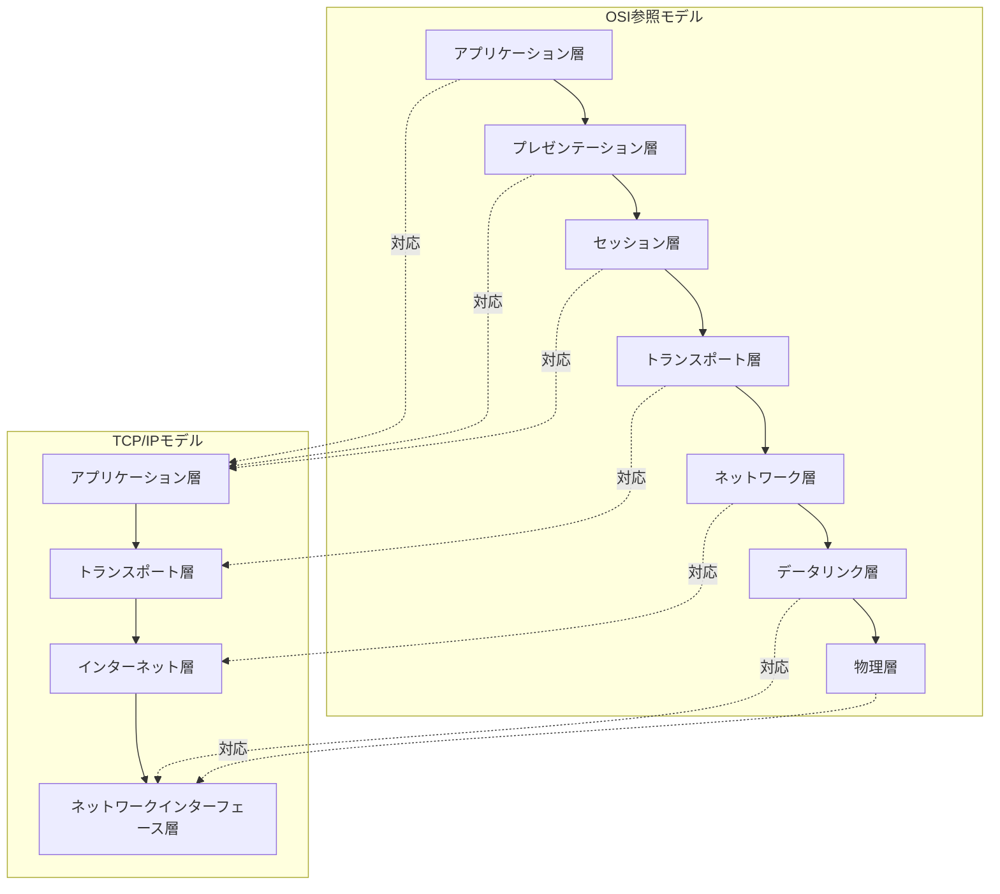
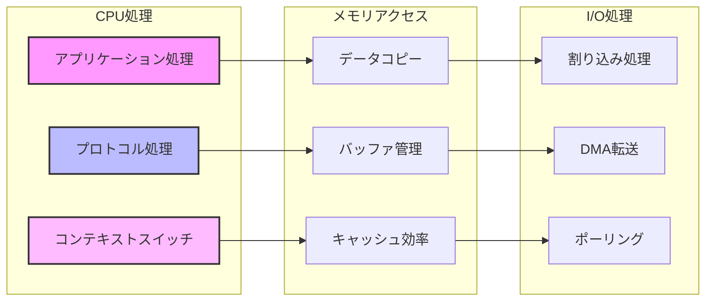

# 第1章：プロトコルスタックの設計思想

## 本章の目的と到達点

ネットワーク通信において、なぜプロトコルを階層化する必要があるのか。この根本的な問いに対する答えを理解することが、以降のすべての技術理解の基礎となる。本章では、プロトコルスタックの設計思想を実装の観点から解説し、各層の責任分離がもたらす利点と、それに伴う実装上の制約を明らかにする。

本章を読み終えた時点で、読者は以下の判断ができるようになる：
- プロトコル設計における階層化の必然性を説明できる
- 各層間の相互作用とそのオーバーヘッドを評価できる
- パフォーマンス要件に応じた最適化手法を選択できる
- 各層におけるセキュリティ脅威と対策を理解できる

## 1.1 階層化アーキテクチャの必然性

### 単一プロトコルの限界

初期のネットワークシステムでは、アプリケーションが直接物理層を制御する単一プロトコルが存在した。しかし、この方式には致命的な問題があった。

物理媒体が変更されるたびに、すべてのアプリケーションを書き換える必要があった。例えば、同軸ケーブルから光ファイバーへの移行時、各アプリケーションの通信部分を全面的に修正しなければならない。これは開発効率とシステムの保守性の観点から現実的ではない。

### モジュラリティの要求

この問題を解決するため、通信機能を独立した層に分離するアプローチが採用された。各層は明確に定義されたインターフェースを持ち、上位層は下位層の実装詳細を知る必要がない。

この設計により、各層は独立して進化できる。物理層の技術が10BASE-Tから1000BASE-Tに変わっても、上位層のプロトコルは変更不要となる。

### 責任分離による複雑性の管理

各層は特定の責任を持つ：
- **物理層**：ビットの伝送
- **データリンク層**：隣接ノード間の信頼性のある通信
- **ネットワーク層**：エンドツーエンドの経路制御
- **トランスポート層**：プロセス間の信頼性のある通信
- **アプリケーション層**：アプリケーション固有のプロトコル

この責任分離により、各層の実装者は自層の機能に集中でき、システム全体の複雑性が管理可能なレベルに保たれる。

## 1.2 OSI参照モデルとTCP/IPモデルの設計思想

### 理想と現実の対比

OSI参照モデルは、国際標準化機構（ISO）が定めた理想的な7層モデルである。一方、TCP/IPモデルは実装を重視した4層モデルである。[図1-1]に両モデルの対応関係を示す。

[図1-1: OSI参照モデルとTCP/IPモデルの比較]


### なぜTCP/IPが勝利したか

OSI参照モデルは理論的に美しいが、TCP/IPモデルが実際のインターネットで採用された理由は以下の通りである：

**実装の単純性**
- OSIの7層は実装が複雑
- TCP/IPの4層は必要十分
- レイヤー間のオーバーヘッドが少ない

**実績と普及**
- ARPANETでの実証
- UNIXへの早期実装
- オープンな仕様公開

**柔軟性**
- 新しいアプリケーションプロトコルの追加が容易
- 下位層の技術進化に対応可能
- End-to-End原則の採用

### 実装効率とプロトコル設計のトレードオフ

プロトコル設計では、以下のトレードオフを常に考慮する必要がある：

**機能の豊富さ vs 実装の複雑さ**
- 多機能なプロトコルは柔軟だが、実装とデバッグが困難
- シンプルなプロトコルは堅牢だが、機能が限定的

**レイヤー分離 vs パフォーマンス**
- 厳密な層分離は保守性を高めるが、オーバーヘッドが増加
- クロスレイヤー最適化は高速だが、保守性が低下

**汎用性 vs 特化性**
- 汎用プロトコルは広く使えるが、特定用途では非効率
- 特化プロトコルは効率的だが、適用範囲が限定的

## 1.3 カプセル化とデカプセル化の実装原理

### データの変換プロセス

ネットワーク通信では、各層でヘッダーを付加するカプセル化と、ヘッダーを除去するデカプセル化が行われる。[図1-2]にこのプロセスを示す。

[図1-2: カプセル化とデカプセル化のプロセス]
```mermaid
sequenceDiagram
    participant App as アプリケーション
    participant Trans as トランスポート層
    participant Net as ネットワーク層
    participant Link as データリンク層
    participant Phy as 物理層
    
    Note over App,Phy: 送信側（カプセル化）
    App->>Trans: データ
    Trans->>Trans: TCPヘッダー追加
    Trans->>Net: セグメント
    Net->>Net: IPヘッダー追加
    Net->>Link: パケット
    Link->>Link: Ethernetヘッダー追加
    Link->>Phy: フレーム
    Phy->>Phy: ビット列に変換
    
    Note over App,Phy: 受信側（デカプセル化）
    Phy->>Link: ビット列
    Link->>Link: Ethernetヘッダー除去
    Link->>Net: パケット
    Net->>Net: IPヘッダー除去
    Net->>Trans: セグメント
    Trans->>Trans: TCPヘッダー除去
    Trans->>App: データ
```

### ヘッダー処理のオーバーヘッド

各層でのヘッダー処理は、以下のオーバーヘッドを生む：

**メモリコピーのコスト**
```
従来の実装：
1. アプリケーション → カーネルバッファ（コピー1回）
2. 各層でヘッダー付加時のバッファ再配置（潜在的なコピー）
3. カーネルバッファ → NICバッファ（コピー1回）

合計：最小2回、最大で層数分のメモリコピー
```

**CPU処理のコスト**
```
各層での処理：
- チェックサム計算：O(n) where n = データサイズ
- ヘッダー解析：固定時間だが、キャッシュミスの可能性
- ルーティング判定：ルーティングテーブルサイズに依存
```

### 最適化手法

**ゼロコピー技術**

カーネルバイパスにより、アプリケーションからNICへ直接データを転送：
```
利点：
- メモリコピーの削減（2回 → 0回）
- CPUキャッシュの有効活用
- レイテンシの大幅削減

実装例：
- DPDK（Data Plane Development Kit）
- Linux io_uring
- RDMA（Remote Direct Memory Access）
```

**ヘッダー事前計算**

静的な部分を事前に計算し、キャッシュ：
```
事前計算可能な要素：
- 固定的なIPヘッダー部分
- TCPオプション
- Ethernetフレームの固定部分

効果：
- パケット生成時間の短縮
- CPU使用率の削減
```

## 1.4 レイヤー間相互作用の実装課題

### クロスレイヤー最適化の可能性

理想的には各層は独立すべきだが、パフォーマンスのためには層間の協調が必要な場合がある。[図1-3]にレイヤー間の相互作用とパフォーマンスへの影響を示す。

[図1-3: レイヤー間相互作用とパフォーマンス特性]


### 最適化の例

**TCP/IPの統合処理**
```
従来：TCPとIPを別々に処理
最適化：共通処理の統合
- チェックサム計算の一括化
- ヘッダー生成の同時実行
- ルーティングキャッシュの共有

効果：処理時間を20〜30%削減
```

**アプリケーション層との協調**
```
例：HTTP/2のストリーム多重化
- TCPの輻輳制御との連携
- 優先度に基づくパケットスケジューリング
- アプリケーションヒントによる最適化

効果：エンドツーエンドレイテンシの改善
```

### 実装における抽象化の破れ

完全な層分離は理想だが、現実には以下の「抽象化の破れ」が発生する：

**パフォーマンスのための妥協**
- TCPオフロード：NICがトランスポート層の処理を実行
- Large Receive Offload（LRO）：複数パケットの結合
- チェックサムオフロード：ハードウェアでの計算

**セキュリティのための破れ**
- Deep Packet Inspection：アプリケーション層データの検査
- ファイアウォール：複数層にまたがるルール適用
- QoS：アプリケーション認識型の帯域制御

### 各層のセキュリティ考慮事項

プロトコルスタックの各層には固有のセキュリティ脅威が存在し、層ごとに適切な対策が必要である。

**物理層のセキュリティ**
```
脅威：
- 盗聴（光ファイバータッピング）
- 電磁波漏洩
- ケーブルの物理的切断

対策：
- 暗号化された光伝送
- シールドケーブルの使用
- 物理的アクセス制御
```

**データリンク層のセキュリティ**
```
脅威：
- MACアドレススプーフィング
- ARPスプーフィング
- VLANホッピング

対策：
# ポートセキュリティの設定例
interface GigabitEthernet0/1
  switchport port-security
  switchport port-security maximum 2
  switchport port-security mac-address sticky
  switchport port-security violation restrict

# Dynamic ARP Inspectionの有効化
ip arp inspection vlan 100
ip arp inspection validate src-mac dst-mac ip
```

**ネットワーク層のセキュリティ**
```
脅威：
- IPスプーフィング
- ルーティング攻撃
- フラグメンテーション攻撃

対策：
# uRPF（Unicast Reverse Path Forwarding）の設定
interface GigabitEthernet0/1
  ip verify unicast source reachable-via rx

# IPSecによる暗号化
crypto ipsec transform-set ESP-AES-SHA esp-aes 256 esp-sha-hmac
crypto map IPSEC-MAP 10 ipsec-isakmp
  set peer 192.168.1.1
  set transform-set ESP-AES-SHA
  match address VPN-TRAFFIC
```

**トランスポート層のセキュリティ**
```
脅威：
- SYNフラッド攻撃
- セッションハイジャック
- ポートスキャン

対策：
# SYN Cookiesの有効化（Linux）
echo 1 > /proc/sys/net/ipv4/tcp_syncookies

# TCP接続の制限
iptables -A INPUT -p tcp --dport 80 -m connlimit --connlimit-above 100 -j REJECT
iptables -A INPUT -p tcp --dport 80 -m state --state NEW -m recent --set
iptables -A INPUT -p tcp --dport 80 -m state --state NEW -m recent --update --seconds 60 --hitcount 10 -j DROP
```

**運用のための破れ**
- ICMP：ネットワーク層からの診断情報
- パスMTU探索：層をまたいだサイズ調整
- ECN（Explicit Congestion Notification）：ネットワーク層からトランスポート層への通知

## 1.5 プロトコルスタック実装のパフォーマンス特性

### CPUキャッシュを考慮したデータ構造設計

現代のCPUはキャッシュ階層を持ち、メモリアクセスパターンがパフォーマンスに大きく影響する。

**キャッシュフレンドリーな設計**
```c
// 悪い例：キャッシュラインをまたぐ構造
struct packet_header {
    uint8_t  version;      // 1バイト
    uint8_t  padding[7];   // 7バイトのパディング
    uint32_t source_ip;    // 4バイト
    uint32_t dest_ip;      // 4バイト
    // ... キャッシュライン境界 ...
    uint16_t source_port;  // 2バイト
    uint16_t dest_port;    // 2バイト
};

// 良い例：頻繁にアクセスするフィールドを同一キャッシュラインに
struct packet_header_optimized {
    uint32_t source_ip;    // 4バイト
    uint32_t dest_ip;      // 4バイト
    uint16_t source_port;  // 2バイト
    uint16_t dest_port;    // 2バイト
    uint8_t  version;      // 1バイト
    uint8_t  flags;        // 1バイト
    uint16_t checksum;     // 2バイト
} __attribute__((packed, aligned(64))); // 64バイトアライメント
```

**効果の測定**
```
キャッシュミス率の削減：
- L1キャッシュヒット率：85% → 95%
- パケット処理レイテンシ：30% 削減
- スループット：最大40% 向上
```

### 割り込み処理とポーリングの選択基準

ネットワークI/Oの処理方式は、システムの特性に応じて選択する必要がある。

**割り込みモード**
```
適用場面：
- 低〜中程度のトラフィック
- レイテンシ重視のアプリケーション
- 省電力が重要な環境

特性：
- 即座の応答（マイクロ秒単位）
- CPU使用率はトラフィックに比例
- コンテキストスイッチのオーバーヘッド
```

**ポーリングモード**
```
適用場面：
- 高トラフィック環境（10Gbps以上）
- スループット重視
- 専用コアが利用可能

特性：
- 予測可能なレイテンシ
- CPU使用率は常に100%
- キャッシュ効率が高い
```

**ハイブリッドアプローチ（NAPI）**
```
Linux NAPIの動作：
1. 低トラフィック時：割り込みモード
2. 閾値超過：ポーリングモードへ移行
3. トラフィック減少：割り込みモードへ復帰

利点：
- 両モードの長所を活用
- 動的な最適化
- 幅広いワークロードに対応
```

### パフォーマンス測定と分析

**主要メトリクス**
```
レイテンシ指標：
- First Packet Latency：最初のパケットの処理時間
- Round Trip Time：往復遅延時間
- Jitter：遅延のばらつき

スループット指標：
- Packets Per Second（PPS）
- Bits Per Second（bps）
- Goodput：実効スループット

リソース使用率：
- CPU使用率（コア別）
- メモリ帯域使用率
- PCIe帯域使用率
```

**測定ツールと手法**
```bash
# パケット処理性能の測定
perf record -e cycles,instructions,cache-misses ./packet_processor
perf report

# レイテンシ分布の可視化
bpftrace -e 'kprobe:ip_rcv { @start[tid] = nsecs; }
             kretprobe:ip_rcv { @latency = hist(nsecs - @start[tid]); }'

# CPU使用率の詳細分析
mpstat -P ALL 1
```

### セキュアなプロトコルスタック実装の原則

**Defense in Depth（多層防御）**
```
各層での防御実装：
1. 物理層：暗号化光伝送
2. データリンク層：802.1X認証
3. ネットワーク層：IPSec
4. トランスポート層：TLS/SSL
5. アプリケーション層：アプリケーション固有の認証・暗号化

効果：
- 単一層の突破があっても他層で防御
- 攻撃の早期検出
- 被害の最小化
```

**Zero Trust Architecture の実装**
```
原則：
- すべての通信を検証
- 最小権限の原則
- 継続的な監視

実装例：
# マイクロセグメンテーション
iptables -N MICROSEG_WEB
iptables -N MICROSEG_APP
iptables -N MICROSEG_DB

# 各セグメント間の厳密な制御
iptables -A MICROSEG_WEB -s 10.1.1.0/24 -d 10.1.2.0/24 -p tcp --dport 8080 -j ACCEPT
iptables -A MICROSEG_WEB -j DROP
```

## まとめ

プロトコルスタックの階層化は、ネットワークシステムの複雑性を管理し、各層の独立した進化を可能にする本質的な設計原理である。しかし、実装においては以下の点を常に考慮する必要がある：

**設計の原則**
- 責任の明確な分離
- インターフェースの安定性
- 拡張可能性の確保

**実装の現実**
- パフォーマンスのための最適化
- ハードウェア機能の活用
- 運用要件への対応

**最適化の方向性**
- メモリコピーの削減
- キャッシュ効率の向上
- 並列処理の活用

これらの理解は、以降の章で扱う個別技術の深い理解につながる。次章では、データリンク層の中核技術であるEthernetとVLANの設計と実装を詳しく見ていく。