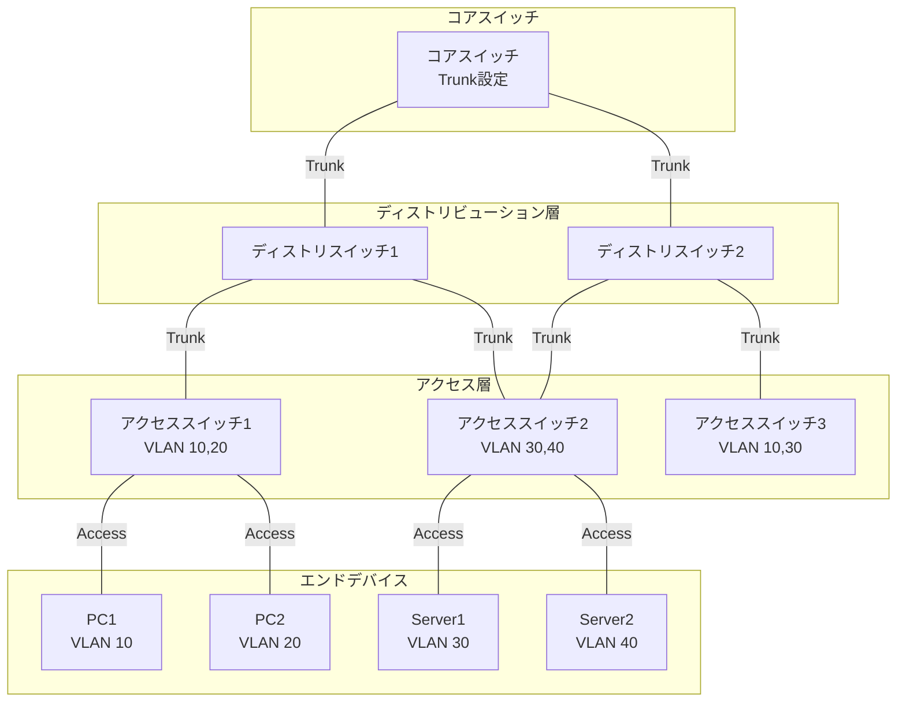
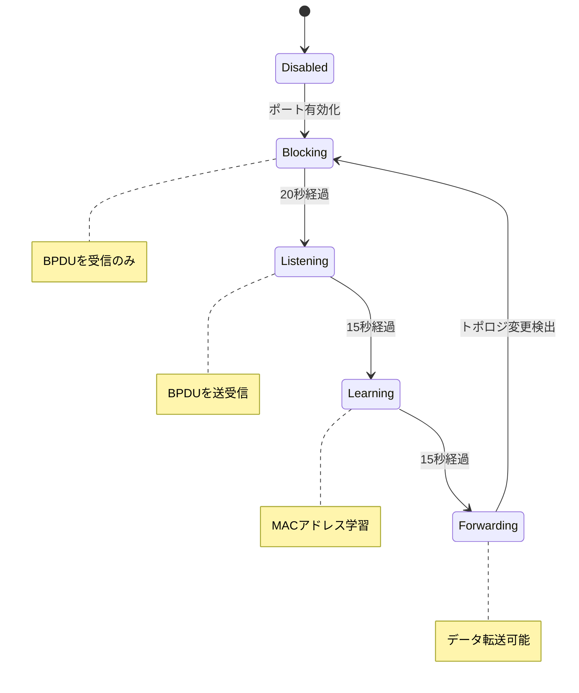

# 第2章：L2ネットワークの設計と実装

## 本章の目的と到達点

データリンク層（L2）は、物理的に接続されたノード間での確実な通信を実現する。なぜEthernetが他の技術を押しのけて事実上の標準となったのか。本章では、その技術的必然性を探るとともに、VLAN、スパニングツリー、リンクアグリゲーションなど、現代のL2ネットワークを構成する要素技術の設計思想と実装を解説する。

本章を読み終えた時点で、読者は以下の能力を獲得する：
- Ethernetの成功要因を技術的観点から説明できる
- VLANによるネットワーク分割の設計と、その限界を理解できる
- ループ対策技術の選択と、収束時間を考慮した設計ができる
- 負荷分散の偏りを理解した上で、適切なリンクアグリゲーション設計ができる

## 2.1 Ethernet支配の技術的必然性

### CSMA/CDの単純性とスケーラビリティ

Ethernetの成功は、CSMA/CD（Carrier Sense Multiple Access with Collision Detection）という単純で効果的なアクセス制御方式に始まる。

**基本動作原理**
1. **キャリアセンス**：送信前に回線の使用状況を確認
2. **衝突検出**：同時送信による衝突を検出
3. **バックオフ**：衝突時は指数バックオフで再送信を待機

この単純さが以下の利点をもたらした：
- 中央制御不要の分散制御
- 実装の容易さとコスト削減
- ノード追加・削除の柔軟性

### 他のL2技術が消えた理由

**Token Ring（IEEE 802.5）**
```text
特徴：
- 決定論的なアクセス（トークン巡回）
- 最大遅延時間の保証

消滅理由：
- 複雑な実装（トークン管理）
- 高コスト（特殊なハードウェア）
- 障害時の復旧が困難
```

**FDDI（Fiber Distributed Data Interface）**
```text
特徴：
- 100Mbpsの高速通信
- 二重リング構造による冗長性

消滅理由：
- 非常に高価
- Ethernetの高速化（Fast Ethernet）
- 管理の複雑性
```

### Ethernetの進化と適応

Ethernetは時代の要求に応じて進化を続けた：

**速度の向上**
```text
10BASE-T (1990)    : 10 Mbps
100BASE-TX (1995)  : 100 Mbps
1000BASE-T (1999)  : 1 Gbps
10GBASE-T (2006)   : 10 Gbps
40GBASE-T (2016)   : 40 Gbps
100GBASE-T (開発中) : 100 Gbps
```

**全二重通信への移行**
- スイッチの導入により衝突ドメインが解消
- CSMA/CDが不要に（現在は使われていない）
- 送受信の同時実行が可能

## 2.2 MACアドレス学習とスイッチング実装

### Ethernetフレーム構造の理解

スイッチング動作を理解するには、まずEthernetフレームの構造を知る必要がある。[図2-1]にフレーム構造を示す。

[図2-1: Ethernetフレーム構造]


### CAMテーブルの実装とメモリ制約

スイッチの中核は、MACアドレスとポートの対応を記録するCAM（Content Addressable Memory）テーブルである。

**CAMテーブルの動作**
```python
class CAMTable:
    def __init__(self, max_entries=8192):
        self.table = {}  # MAC -> (port, timestamp)
        self.max_entries = max_entries
        self.aging_time = 300  # 5分
    
    def learn(self, mac_address, port):
        """MACアドレスを学習"""
        current_time = time.time()
        
        # テーブルが満杯の場合、古いエントリを削除
        if len(self.table) >= self.max_entries:
            self.age_out_entries()
        
        self.table[mac_address] = (port, current_time)
    
    def lookup(self, mac_address):
        """MACアドレスから出力ポートを検索"""
        if mac_address in self.table:
            port, timestamp = self.table[mac_address]
            if time.time() - timestamp < self.aging_time:
                return port
            else:
                # エージアウト
                del self.table[mac_address]
        return None  # 不明な場合はフラッディング
```

**メモリ制約と実装上の考慮点**
```text
一般的なスイッチのCAMテーブルサイズ：
- 小規模スイッチ: 8K エントリ
- 中規模スイッチ: 32K エントリ  
- 大規模スイッチ: 128K+ エントリ

1エントリのメモリ使用量：
- MACアドレス: 6バイト
- ポート番号: 2バイト
- タイムスタンプ: 4バイト
- メタデータ: 4バイト
合計: 約16バイト

32Kエントリの場合: 32,768 × 16 = 512KB
```

### MACアドレス枯渇攻撃への対策

攻撃者が大量の偽MACアドレスを送信し、CAMテーブルを溢れさせる攻撃への対策が必要である。

**ポートセキュリティの実装**
```python
class SecurePort:
    def __init__(self, port_number, max_mac_addresses=1):
        self.port_number = port_number
        self.max_mac_addresses = max_mac_addresses
        self.allowed_macs = set()
        self.sticky_macs = set()  # 永続的に記憶
        self.violation_count = 0
    
    def check_mac(self, mac_address):
        """MACアドレスの正当性をチェック"""
        if mac_address in self.allowed_macs:
            return True
        
        if len(self.allowed_macs) < self.max_mac_addresses:
            self.allowed_macs.add(mac_address)
            return True
        
        # 違反検出
        self.violation_count += 1
        return False
    
    def violation_action(self):
        """違反時のアクション"""
        if self.violation_count > 10:
            return "shutdown"  # ポートを無効化
        elif self.violation_count > 5:
            return "restrict"  # 不正なフレームを破棄
        else:
            return "protect"   # ログのみ
```

## 2.3 VLAN設計の原理と実装パターン

### ブロードキャストドメイン分離の必要性

大規模なL2ネットワークでは、ブロードキャストトラフィックが問題となる。VLANはこの問題を解決する。

**ブロードキャストの影響**
```text
ネットワーク規模別のブロードキャスト負荷：
- 100ノード: 約1%の帯域使用
- 500ノード: 約5%の帯域使用
- 1000ノード: 約10%の帯域使用（性能劣化開始）
- 5000ノード: 約50%の帯域使用（実用限界）
```

### VLAN設計パターン

実際のネットワークでは、目的に応じたVLAN設計が重要である。[図2-2]に典型的なVLAN設計パターンを示す。

[図2-2: VLAN設計パターン]


**設計パターンの分類**

1. **機能別VLAN**
```text
VLAN 10: 営業部門
VLAN 20: 開発部門
VLAN 30: 管理部門
VLAN 99: 管理用

利点：
- 部門間のトラフィック分離
- セキュリティポリシーの適用が容易

欠点：
- 部門変更時の再設定
- 物理的な配置と論理的な配置の不一致
```

2. **サービス別VLAN**
```text
VLAN 100: ユーザーデータ
VLAN 200: VoIP
VLAN 300: ビデオ会議
VLAN 400: ゲストアクセス

利点：
- QoSの適用が容易
- サービス単位での管理

欠点：
- VLAN数の増加
- 複雑な設定
```

### VLAN IDの枯渇とVXLANへの移行

標準的なVLANは12ビットのIDを使用し、最大4094個のVLANしか作成できない。

**VLAN IDの制限**
```text
総数: 4096個（0-4095）
使用可能: 4094個（0と4095は予約）

典型的な使用状況：
- 1-99: インフラ用
- 100-999: ユーザーVLAN
- 1000-1999: サービスVLAN
- 2000-2999: テスト用
- 3000-3999: 予備
```

**VXLANによる拡張**
```text
VXLANの特徴：
- 24ビットのVNI（VXLAN Network Identifier）
- 約1600万の論理ネットワーク
- L3ネットワーク上でL2を拡張

適用場面：
- データセンター間接続
- マルチテナント環境
- クラウド基盤
```

## 2.4 スパニングツリーの功罪と代替技術

### L2ループの危険性

L2ネットワークでループが発生すると、ブロードキャストストームにより瞬時にネットワークが停止する。

**ブロードキャストストームの仕組み**
```text
1. ブロードキャストフレーム送信
2. スイッチAが全ポートに転送
3. スイッチBも全ポートに転送
4. フレームがスイッチAに戻る
5. 無限ループ発生

影響：
- CPU使用率100%
- メモリ枯渇
- 完全な通信断
```

### スパニングツリープロトコル（STP）の動作

STPは冗長性を保ちながらループを防ぐ。[図2-3]に状態遷移を示す。

[図2-3: スパニングツリー収束プロセス]


### 収束時間とネットワーク規模の関係

**STPの収束時間**
```text
標準STP（802.1D）:
- 初期収束: 30〜50秒
- トポロジ変更: 30〜50秒

RSTP（802.1w）:
- 初期収束: 1〜2秒
- トポロジ変更: 1〜2秒

ネットワーク規模の影響:
- 10スイッチ: +0秒
- 50スイッチ: +1〜2秒
- 100スイッチ: +3〜5秒
- 200スイッチ: +10秒以上
```

### 代替技術の比較

**TRILL（Transparent Interconnection of Lots of Links）**
```text
特徴:
- IS-ISルーティングプロトコル使用
- 最短パス転送
- ループフリーかつ全リンク使用

課題:
- 実装の複雑性
- ベンダーサポート限定
```

**SPB（Shortest Path Bridging）**
```text
特徴:
- IEEE 802.1aq標準
- IS-ISベース
- VLANごとの最短パス

課題:
- 大規模ネットワークでのスケーラビリティ
- 設定の複雑性
```

**EVPN（Ethernet VPN）**
```text
特徴:
- BGPによる制御プレーン
- VXLANと組み合わせて使用
- マルチパス対応

利点:
- 成熟した技術
- 大規模対応
- ベンダー間の相互運用性
```

## 2.5 リンクアグリゲーションの実装詳細

### ハッシュアルゴリズムによる負荷分散

リンクアグリゲーションでは、トラフィックを複数の物理リンクに分散する。

**ハッシュアルゴリズムの選択**
```python
class LinkAggregation:
    def __init__(self, member_links):
        self.member_links = member_links
        self.hash_algorithm = 'L3_L4'  # デフォルト
    
    def select_link(self, packet):
        """パケットに基づいてリンクを選択"""
        if self.hash_algorithm == 'L2':
            # MACアドレスベース
            hash_input = packet.src_mac + packet.dst_mac
        elif self.hash_algorithm == 'L3':
            # IPアドレスベース
            hash_input = packet.src_ip + packet.dst_ip
        elif self.hash_algorithm == 'L3_L4':
            # IP + ポート番号
            hash_input = (packet.src_ip + packet.dst_ip + 
                         packet.src_port + packet.dst_port)
        
        hash_value = hash(hash_input)
        link_index = hash_value % len(self.member_links)
        return self.member_links[link_index]
```

### 負荷分散の偏り問題

**偏りの原因**
```text
1. 少数のフローが帯域を占有
   - 大容量ファイル転送
   - ビデオストリーミング

2. ハッシュの偏り
   - 特定のアドレス組み合わせ
   - 同一サブネット内通信

3. アプリケーション特性
   - 単一TCPコネクション
   - 固定的な通信パターン
```

**測定と監視**
```python
class LAGMonitor:
    def __init__(self, lag_interface):
        self.lag_interface = lag_interface
        self.stats = defaultdict(lambda: {'bytes': 0, 'packets': 0})
    
    def collect_stats(self):
        """各メンバーリンクの使用状況を収集"""
        for link in self.lag_interface.member_links:
            stats = link.get_statistics()
            self.stats[link.name]['bytes'] = stats.tx_bytes
            self.stats[link.name]['packets'] = stats.tx_packets
    
    def calculate_imbalance(self):
        """負荷分散の偏りを計算"""
        total_bytes = sum(s['bytes'] for s in self.stats.values())
        link_count = len(self.stats)
        ideal_bytes = total_bytes / link_count
        
        imbalance = 0
        for link_stats in self.stats.values():
            deviation = abs(link_stats['bytes'] - ideal_bytes)
            imbalance += deviation / ideal_bytes
        
        return imbalance / link_count  # 0が理想、1.0以上は問題
```

### LACP実装時の注意点

LACP（Link Aggregation Control Protocol）は動的なリンクアグリゲーションを実現する。

**LACP設定パラメータ**
```text
主要パラメータ:
- System Priority: 32768（デフォルト）
- Port Priority: 32768（デフォルト）
- Timeout: Short（1秒）/ Long（30秒）
- Mode: Active / Passive

推奨設定:
- 両端Active（積極的なネゴシエーション）
- Short Timeout（高速障害検出）
- 明示的なSystem Priority設定
```

**トラブルシューティング**
```bash
# LACP状態確認
show lacp neighbor
show lacp internal

# よくある問題:
1. 片方向リンク
   - 原因: ケーブル不良、SFP故障
   - 対策: UDLD（Unidirectional Link Detection）

2. 設定不一致
   - 原因: チャネルグループ番号の相違
   - 対策: 設定の二重確認

3. スパニングツリーとの干渉
   - 原因: PortChannelでのSTP設定
   - 対策: 物理ポートではなく論理ポートで設定
```

## まとめ

L2ネットワーク技術は、Ethernetの単純性と拡張性により統一されたが、企業ネットワークの要求に応えるため、様々な拡張技術が開発されてきた。

**技術選択の指針**

1. **VLAN設計**
   - 小規模: 機能別VLAN
   - 中規模: サービス別VLAN
   - 大規模: VXLANへの移行

2. **ループ防止**
   - 従来型: RSTP
   - 次世代: EVPN-VXLAN

3. **冗長性**
   - 2リンク: Static LAG
   - 3リンク以上: LACP
   - 異なるスイッチ: MLAG/vPC

**運用上の教訓**
- シンプルな設計を心がける
- 標準技術を優先する
- 十分な監視とドキュメント化
- 定期的な設定レビュー

次章では、これらのL2技術の上で動作するL3（ネットワーク層）技術について、IPアドレッシングとルーティングを中心に解説する。