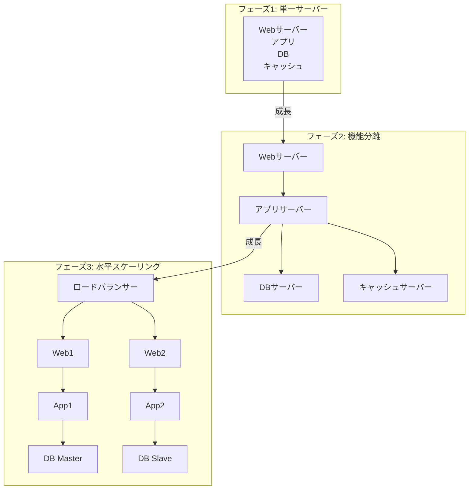
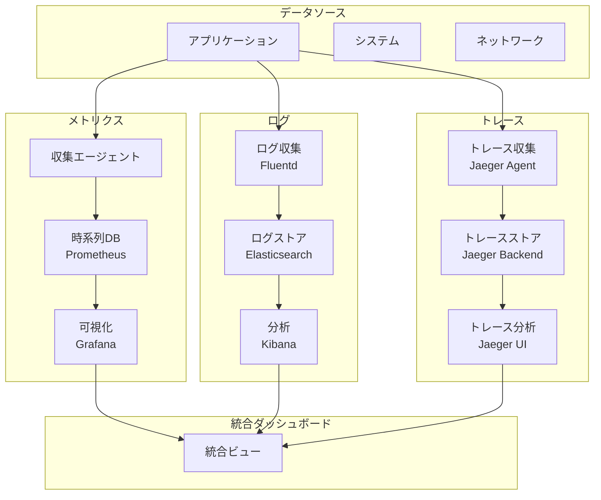
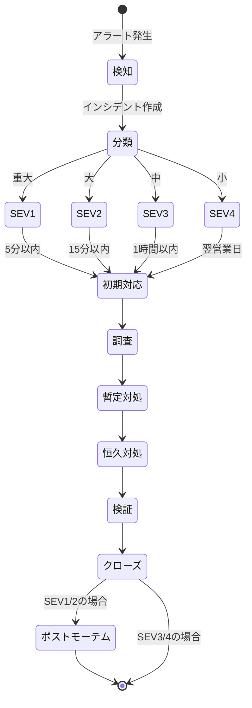

# 第12章：エンドツーエンドシステム設計

## 本章の目的と到達点

個別の技術要素を理解しても、それらを統合したシステム全体の設計は別の課題である。ネットワーク、サーバー、ストレージ、セキュリティ、可用性。これらすべての要素が調和して動作するシステムを、どのように設計すればよいのか。

本章では、これまでに学んだ技術要素を統合し、スケーラブルで運用可能なシステムを設計する方法を解説する。特に、ボトルネックの予測と対策、可観測性の実装、キャパシティプランニングなど、システム全体を俯瞰した設計・運用の要点を明確にする。

統合的なシステム設計とは、単に個々の技術を組み合わせることではない。それは、システム全体の振る舞いを理解し、各コンポーネント間の相互作用を最適化し、将来の成長に備えることである。

本章を読み終えた時点で、読者は以下の能力を獲得する：
- 垂直/水平スケーリングの選択基準と、その転換点を予測できる
- アプリケーション特性を考慮したクロスレイヤー最適化を実施できる
- メトリクス、ログ、トレースを統合した可観測性を実装できる
- 成長予測に基づいたキャパシティプランニングと、インシデント対応プロセスを確立できる

## 12.1 スケーラビリティの段階的設計

### スケーラビリティの本質

スケーラビリティとは、システムが負荷の増加に対して適切に対応できる能力である。しかし、この「適切に」という言葉には、多くの考慮事項が含まれる。コスト効率、応答時間、可用性、運用複雑性など、すべてがトレードオフの関係にある。

スケーラビリティの設計は、現在の要求を満たすだけでなく、将来の成長パターンを予測し、段階的な拡張が可能なアーキテクチャを構築することである。

システムの成長に応じたスケーラビリティの段階を[図12-1]に示す。

[図12-1: スケーラビリティの段階]


### 垂直スケーリングから水平スケーリングへ

#### 垂直スケーリングの特性

垂直スケーリング（スケールアップ）は、単一のサーバーのリソースを増強するアプローチである。

**利点**：
- アプリケーションの変更が不要
- データの一貫性が保たれる
- 運用がシンプル
- レイテンシが低い

**限界**：
- ハードウェアの物理的制限
- コストの指数関数的増加
- 単一障害点
- ダウンタイムを伴うアップグレード

**垂直スケーリングの経済性**：
```text
サーバースペックと価格の関係（例）：
CPU: 8コア, RAM: 32GB   → $1,000/月
CPU: 16コア, RAM: 64GB  → $2,500/月（2.5倍）
CPU: 32コア, RAM: 128GB → $6,000/月（6倍）
CPU: 64コア, RAM: 256GB → $15,000/月（15倍）

性能向上は線形だが、コストは指数関数的に増加
```

#### 水平スケーリングへの転換点

垂直スケーリングから水平スケーリングへの転換を検討すべきタイミングは、以下の指標で判断する。

**技術的指標**：
```python
def should_scale_horizontally(metrics):
    indicators = {
        'cpu_utilization': metrics.cpu_usage > 70,  # CPU使用率が恒常的に高い
        'memory_pressure': metrics.memory_usage > 80,  # メモリ使用率が高い
        'io_saturation': metrics.iowait > 20,  # I/O待機が多い
        'cost_efficiency': metrics.next_upgrade_cost / metrics.current_cost > 3,
        'availability_requirement': metrics.required_uptime > 99.9,
        'growth_rate': metrics.monthly_growth_rate > 10  # 月間成長率
    }
    
    # 3つ以上の指標が該当する場合、水平スケーリングを推奨
    triggered_indicators = sum(1 for indicator in indicators.values() if indicator)
    return triggered_indicators >= 3
```

**ビジネス指標**：
- 予測される成長率が現在のハードウェアの拡張限界を超える
- 24時間365日のサービス提供が必要
- 地理的に分散したユーザーベース
- コスト最適化の要求

#### 水平スケーリングの実装戦略

水平スケーリングには、アプリケーションアーキテクチャの根本的な見直しが必要である。

**ステートレス化**：
```python
# ステートフルな実装（スケーリング困難）
class StatefulService:
    def __init__(self):
        self.user_sessions = {}  # サーバーメモリに保存
    
    def login(self, user_id, credentials):
        if self.authenticate(credentials):
            self.user_sessions[user_id] = {
                'login_time': time.time(),
                'data': self.load_user_data(user_id)
            }
            return True
        return False

# ステートレスな実装（スケーリング容易）
class StatelessService:
    def __init__(self, session_store, data_store):
        self.session_store = session_store  # Redis等の外部ストア
        self.data_store = data_store
    
    def login(self, user_id, credentials):
        if self.authenticate(credentials):
            session_data = {
                'login_time': time.time(),
                'user_id': user_id
            }
            session_id = generate_session_id()
            self.session_store.set(session_id, session_data, ttl=3600)
            return session_id
        return None
```

**データの分散**：
```python
# シャーディング戦略
class ShardingStrategy:
    def __init__(self, shard_count):
        self.shard_count = shard_count
        self.shards = [DatabaseConnection(f"shard_{i}") for i in range(shard_count)]
    
    def get_shard(self, key):
        # 一貫性のあるハッシュ関数を使用
        shard_index = hash(key) % self.shard_count
        return self.shards[shard_index]
    
    def rebalance(self, new_shard_count):
        # シャード数変更時のデータ移行
        old_shards = self.shards
        self.shard_count = new_shard_count
        self.shards = [DatabaseConnection(f"shard_{i}") for i in range(new_shard_count)]
        
        # データの再配置
        for old_shard in old_shards:
            for key, value in old_shard.scan():
                new_shard = self.get_shard(key)
                if new_shard != old_shard:
                    new_shard.put(key, value)
                    old_shard.delete(key)
```

### 段階的なスケーリング計画

システムの成長に応じた段階的なスケーリング計画を立てることが重要である。

#### フェーズ1：単一サーバー（0-1万ユーザー）

```text
構成：
- Webアプリケーション、データベース、キャッシュを同一サーバーで実行
- 静的ファイルも同じサーバーから配信

最適化：
- アプリケーションレベルのキャッシング
- データベースのインデックス最適化
- 静的ファイルの圧縮
```

#### フェーズ2：機能分離（1万-10万ユーザー）

```text
構成：
- Webサーバーとデータベースサーバーの分離
- 静的ファイルのCDN配信
- キャッシュサーバー（Redis/Memcached）の導入

最適化：
- データベースのレプリケーション（読み取り負荷分散）
- セッションの外部化
- 非同期処理の導入
```

#### フェーズ3：水平スケーリング（10万-100万ユーザー）

```text
構成：
- 複数のWebサーバーとロードバランサー
- データベースのマスター/スレーブ構成
- キャッシュクラスタ
- メッセージキューの導入

最適化：
- データベースシャーディング
- マイクロサービス化の開始
- 自動スケーリングの実装
```

#### フェーズ4：大規模分散システム（100万ユーザー以上）

```text
構成：
- 地理的分散（マルチリージョン）
- サービスメッシュ
- イベント駆動アーキテクチャ
- ポリグロットパーシステンス

最適化：
- エッジコンピューティング
- 機械学習による予測的スケーリング
- カオスエンジニアリング
```

## 12.2 クロスレイヤー最適化の実践

### クロスレイヤー最適化の必要性

従来のレイヤー設計では、各層が独立して最適化される。しかし、エンドツーエンドの性能を最大化するには、レイヤー間の相互作用を考慮した最適化が必要である。

クロスレイヤー最適化とは、アプリケーションの特性を理解し、その要求に応じてネットワーク、OS、ストレージなど各層のパラメータを調整することである。

### アプリケーション特性の分析

最適化の第一歩は、アプリケーションの特性を正確に理解することである。

#### ワークロードの分類

```python
class WorkloadAnalyzer:
    def analyze_workload(self, metrics):
        workload_type = {
            'cpu_bound': False,
            'memory_bound': False,
            'io_bound': False,
            'network_bound': False
        }
        
        # CPU使用率とI/O待機の比率でCPUバウンドを判定
        if metrics.cpu_user > 70 and metrics.iowait < 10:
            workload_type['cpu_bound'] = True
        
        # メモリ使用パターンでメモリバウンドを判定
        if metrics.page_fault_rate > 1000 or metrics.swap_usage > 0:
            workload_type['memory_bound'] = True
        
        # I/O待機時間でI/Oバウンドを判定
        if metrics.iowait > 30:
            workload_type['io_bound'] = True
        
        # ネットワーク使用率でネットワークバウンドを判定
        if metrics.network_utilization > 80:
            workload_type['network_bound'] = True
        
        return workload_type
```

#### アクセスパターンの特定

```python
class AccessPatternIdentifier:
    def identify_pattern(self, access_log):
        patterns = {
            'sequential': 0,
            'random': 0,
            'temporal_locality': 0,
            'spatial_locality': 0
        }
        
        # シーケンシャルアクセスの検出
        sequential_accesses = 0
        for i in range(1, len(access_log)):
            if access_log[i].offset == access_log[i-1].offset + access_log[i-1].size:
                sequential_accesses += 1
        
        patterns['sequential'] = sequential_accesses / len(access_log)
        
        # 時間的局所性の検出（同じデータへの繰り返しアクセス）
        access_counts = defaultdict(int)
        for access in access_log:
            access_counts[access.key] += 1
        
        repeated_accesses = sum(1 for count in access_counts.values() if count > 1)
        patterns['temporal_locality'] = repeated_accesses / len(access_counts)
        
        return patterns
```

### 層別最適化の実施

#### ネットワーク層の最適化

アプリケーションの通信パターンに応じたネットワーク設定の調整。

```bash
# 大量の小さなパケットを扱うアプリケーション（チャットなど）
echo 1 > /proc/sys/net/ipv4/tcp_nodelay  # Nagleアルゴリズムの無効化
echo 0 > /proc/sys/net/ipv4/tcp_slow_start_after_idle  # アイドル後のスロースタート無効化

# 大容量データ転送アプリケーション（ファイル共有など）
echo 4194304 > /proc/sys/net/core/rmem_max  # 受信バッファ最大値
echo 4194304 > /proc/sys/net/core/wmem_max  # 送信バッファ最大値
echo "4096 87380 4194304" > /proc/sys/net/ipv4/tcp_rmem
echo "4096 65536 4194304" > /proc/sys/net/ipv4/tcp_wmem
```

#### OS層の最適化

アプリケーションのCPU使用パターンに応じたスケジューラー設定。

```python
# CPUアフィニティの設定
def optimize_cpu_affinity(process_type):
    if process_type == "network_intensive":
        # ネットワーク割り込みを処理するCPUと同じCPUに配置
        cpu_mask = get_network_interrupt_cpus()
        set_process_affinity(cpu_mask)
    
    elif process_type == "cache_sensitive":
        # L3キャッシュを共有するCPUコアに制限
        cpu_mask = get_same_l3_cache_cpus()
        set_process_affinity(cpu_mask)
    
    elif process_type == "parallel_compute":
        # NUMA最適化：同一NUMAノード内のCPUを使用
        numa_node = get_optimal_numa_node()
        cpu_mask = get_numa_node_cpus(numa_node)
        set_process_affinity(cpu_mask)
```

#### ストレージ層の最適化

アプリケーションのI/Oパターンに応じたストレージ設定。

```python
class StorageOptimizer:
    def optimize_for_workload(self, workload_type, device):
        if workload_type == "sequential_read":
            # プリフェッチの積極的な設定
            self.set_read_ahead(device, 2048)  # 2MB
            self.set_io_scheduler(device, "deadline")
            
        elif workload_type == "random_read":
            # プリフェッチの抑制
            self.set_read_ahead(device, 0)
            self.set_io_scheduler(device, "noop")  # SSDの場合
            
        elif workload_type == "database":
            # データベース向けの最適化
            self.set_io_scheduler(device, "deadline")
            self.set_nr_requests(device, 1024)
            self.enable_write_cache(device)
            
        elif workload_type == "log_writing":
            # ログ書き込み向けの最適化
            self.set_io_scheduler(device, "noop")
            self.disable_write_barriers(device)  # バッテリーバックアップ前提
```

### 統合的な最適化

個別の層の最適化だけでなく、層間の相互作用を考慮した統合的な最適化が重要である。

#### Zero-Copy最適化

データのコピーを削減することで、CPU使用率とメモリ帯域を節約する。

```python
# 従来の方法（複数回のコピー）
def traditional_file_send(filename, socket):
    # 1. ディスク → カーネルバッファ
    # 2. カーネルバッファ → ユーザー空間
    with open(filename, 'rb') as f:
        data = f.read()  # ユーザー空間にコピー
    
    # 3. ユーザー空間 → カーネルバッファ
    # 4. カーネルバッファ → ネットワーク
    socket.send(data)

# Zero-Copy（sendfile）
def zerocopy_file_send(filename, socket):
    with open(filename, 'rb') as f:
        # ディスク → ネットワーク（直接転送）
        os.sendfile(socket.fileno(), f.fileno(), 0, os.path.getsize(filename))
```

#### NUMA最適化

Non-Uniform Memory Access環境での最適化。

```python
class NUMAOptimizer:
    def __init__(self):
        self.numa_nodes = self.detect_numa_topology()
    
    def optimize_memory_allocation(self, process_id):
        # プロセスが実行されているCPUのNUMAノードを特定
        cpu = self.get_process_cpu(process_id)
        numa_node = self.get_cpu_numa_node(cpu)
        
        # メモリ割り当てポリシーを設定
        self.set_memory_policy(process_id, {
            'mode': 'bind',
            'nodes': [numa_node],
            'flags': ['local_alloc']
        })
    
    def optimize_network_processing(self):
        # ネットワークカードのNUMAノードを特定
        for nic in self.get_network_interfaces():
            numa_node = self.get_device_numa_node(nic)
            
            # 割り込み処理を同じNUMAノードのCPUに設定
            irq_cpus = self.get_numa_node_cpus(numa_node)
            self.set_irq_affinity(nic, irq_cpus)
            
            # 受信パケット処理も同じNUMAノードで実行
            self.set_rps_cpus(nic, irq_cpus)
```

## 12.3 可観測性の実装設計

### 可観測性の三本柱

可観測性（Observability）は、システムの内部状態を外部から理解する能力である。これは、メトリクス、ログ、トレースの三本柱によって実現される。

可観測性を実現する三本柱の関係を[図12-2]に示す。

[図12-2: 可観測性の三本柱]


#### メトリクス：システムの健康状態

メトリクスは、システムの状態を数値で表現したものである。

```python
class MetricsCollector:
    def __init__(self):
        self.metrics = {
            'system': SystemMetrics(),
            'application': ApplicationMetrics(),
            'business': BusinessMetrics()
        }
    
    def collect_system_metrics(self):
        return {
            # リソース使用率
            'cpu_usage': psutil.cpu_percent(interval=1),
            'memory_usage': psutil.virtual_memory().percent,
            'disk_io': {
                'read_bytes': psutil.disk_io_counters().read_bytes,
                'write_bytes': psutil.disk_io_counters().write_bytes,
                'read_time': psutil.disk_io_counters().read_time,
                'write_time': psutil.disk_io_counters().write_time
            },
            'network_io': {
                'bytes_sent': psutil.net_io_counters().bytes_sent,
                'bytes_recv': psutil.net_io_counters().bytes_recv,
                'packets_sent': psutil.net_io_counters().packets_sent,
                'packets_recv': psutil.net_io_counters().packets_recv
            }
        }
    
    def collect_application_metrics(self):
        return {
            # アプリケーション固有のメトリクス
            'request_rate': self.get_request_rate(),
            'response_time': {
                'p50': self.get_percentile(50),
                'p95': self.get_percentile(95),
                'p99': self.get_percentile(99)
            },
            'error_rate': self.get_error_rate(),
            'queue_length': self.get_queue_length(),
            'active_connections': self.get_active_connections()
        }
```

#### ログ：イベントの詳細記録

構造化ログにより、機械的な処理が可能になる。

```python
import json
import time
from datetime import datetime

class StructuredLogger:
    def __init__(self, service_name):
        self.service_name = service_name
        self.hostname = socket.gethostname()
    
    def log(self, level, message, **kwargs):
        log_entry = {
            '@timestamp': datetime.utcnow().isoformat(),
            'level': level,
            'service': self.service_name,
            'host': self.hostname,
            'message': message,
            'context': kwargs
        }
        
        # トレースIDがあれば追加
        if hasattr(threading.current_thread(), 'trace_id'):
            log_entry['trace_id'] = threading.current_thread().trace_id
        
        # JSON形式で出力
        print(json.dumps(log_entry))
    
    def log_request(self, request, response, duration):
        self.log('INFO', 'HTTP Request', 
                method=request.method,
                path=request.path,
                status_code=response.status_code,
                duration_ms=duration * 1000,
                user_agent=request.headers.get('User-Agent'),
                remote_addr=request.remote_addr)
```

#### トレース：リクエストの追跡

分散システムにおけるリクエストの流れを追跡する。

```python
class DistributedTracer:
    def __init__(self):
        self.spans = []
    
    def start_span(self, operation_name, parent_span=None):
        span = {
            'trace_id': parent_span['trace_id'] if parent_span else self.generate_trace_id(),
            'span_id': self.generate_span_id(),
            'parent_span_id': parent_span['span_id'] if parent_span else None,
            'operation_name': operation_name,
            'start_time': time.time(),
            'tags': {},
            'logs': []
        }
        return span
    
    def finish_span(self, span):
        span['duration'] = time.time() - span['start_time']
        self.spans.append(span)
        
        # バックエンドに送信
        self.export_span(span)
    
    def inject_context(self, span, carrier):
        """トレースコンテキストをHTTPヘッダーに注入"""
        carrier['X-Trace-ID'] = span['trace_id']
        carrier['X-Span-ID'] = span['span_id']
        carrier['X-Parent-Span-ID'] = span['parent_span_id'] or ''
    
    def extract_context(self, carrier):
        """HTTPヘッダーからトレースコンテキストを抽出"""
        return {
            'trace_id': carrier.get('X-Trace-ID'),
            'span_id': carrier.get('X-Parent-Span-ID'),  # 親のspan_idになる
            'parent_span_id': None
        }
```

### 統合的な可観測性プラットフォーム

三本柱を統合することで、システムの全体像を把握できる。

#### 相関分析の実装

```python
class ObservabilityCorrelator:
    def __init__(self, metrics_store, log_store, trace_store):
        self.metrics_store = metrics_store
        self.log_store = log_store
        self.trace_store = trace_store
    
    def investigate_issue(self, timestamp, duration=300):
        """特定の時刻の問題を調査"""
        findings = {}
        
        # 1. メトリクスの異常を検出
        anomalies = self.detect_metric_anomalies(timestamp, duration)
        findings['metric_anomalies'] = anomalies
        
        # 2. 同時刻のエラーログを検索
        error_logs = self.log_store.search(
            start_time=timestamp - duration/2,
            end_time=timestamp + duration/2,
            level='ERROR'
        )
        findings['error_logs'] = error_logs
        
        # 3. 遅いトレースを特定
        slow_traces = self.trace_store.find_traces(
            start_time=timestamp - duration/2,
            end_time=timestamp + duration/2,
            min_duration=self.get_p95_duration() * 2
        )
        findings['slow_traces'] = slow_traces
        
        # 4. 相関関係を分析
        correlations = self.analyze_correlations(findings)
        
        return {
            'findings': findings,
            'correlations': correlations,
            'root_cause_candidates': self.identify_root_causes(correlations)
        }
```

#### アラート設計

効果的なアラートは、ノイズを最小化しつつ、重要な問題を見逃さない。

```python
class AlertingStrategy:
    def __init__(self):
        self.alert_rules = []
        self.suppression_rules = []
    
    def add_slo_based_alert(self, slo_name, target, window):
        """SLOベースのアラート"""
        rule = {
            'name': f'SLO violation: {slo_name}',
            'condition': f'slo_{slo_name}_error_budget_remaining < {100 - target}',
            'window': window,
            'severity': 'critical' if target >= 99 else 'warning',
            'actions': ['page_oncall', 'create_incident']
        }
        self.alert_rules.append(rule)
    
    def add_symptom_based_alert(self, symptom, threshold, duration):
        """症状ベースのアラート（原因ではなく影響に着目）"""
        rule = {
            'name': f'User impact: {symptom}',
            'condition': f'{symptom} > {threshold}',
            'duration': duration,
            'severity': 'critical',
            'actions': ['notify_team', 'auto_scale']
        }
        self.alert_rules.append(rule)
    
    def add_suppression_rule(self, parent_alert, child_alerts):
        """アラートの抑制ルール（カスケードアラートの防止）"""
        rule = {
            'condition': f'active_alert == "{parent_alert}"',
            'suppress': child_alerts,
            'duration': 300  # 5分間抑制
        }
        self.suppression_rules.append(rule)
```

## 12.4 キャパシティプランニング

### 成長予測モデルの構築

キャパシティプランニングは、将来のリソース需要を予測し、適切なタイミングで拡張を行うプロセスである。

#### 時系列分析による予測

```python
import numpy as np
from sklearn.linear_model import LinearRegression
from statsmodels.tsa.seasonal import seasonal_decompose

class GrowthPredictor:
    def __init__(self, historical_data):
        self.data = historical_data
        self.model = None
    
    def decompose_time_series(self):
        """時系列データをトレンド、季節性、残差に分解"""
        decomposition = seasonal_decompose(
            self.data, 
            model='multiplicative', 
            period=7  # 週次の季節性
        )
        
        return {
            'trend': decomposition.trend,
            'seasonal': decomposition.seasonal,
            'residual': decomposition.resid
        }
    
    def predict_linear_growth(self, days_ahead):
        """線形成長を仮定した予測"""
        X = np.array(range(len(self.data))).reshape(-1, 1)
        y = self.data.values
        
        model = LinearRegression()
        model.fit(X, y)
        
        future_X = np.array(range(len(self.data), len(self.data) + days_ahead)).reshape(-1, 1)
        predictions = model.predict(future_X)
        
        return predictions
    
    def predict_with_seasonality(self, days_ahead):
        """季節性を考慮した予測"""
        decomposed = self.decompose_time_series()
        
        # トレンドの予測
        trend_model = LinearRegression()
        X = np.array(range(len(decomposed['trend'].dropna()))).reshape(-1, 1)
        y = decomposed['trend'].dropna().values
        trend_model.fit(X, y)
        
        # 将来のトレンドを予測
        future_X = np.array(range(len(X), len(X) + days_ahead)).reshape(-1, 1)
        future_trend = trend_model.predict(future_X)
        
        # 季節性パターンを繰り返し適用
        seasonal_pattern = decomposed['seasonal'].iloc[:7].values
        future_seasonal = np.tile(seasonal_pattern, (days_ahead // 7) + 1)[:days_ahead]
        
        # 予測値 = トレンド × 季節性
        predictions = future_trend * future_seasonal
        
        return predictions
```

#### リソース要求の予測

```python
class ResourceRequirementPredictor:
    def __init__(self):
        self.resource_models = {
            'cpu': self.cpu_model,
            'memory': self.memory_model,
            'storage': self.storage_model,
            'network': self.network_model
        }
    
    def cpu_model(self, active_users, requests_per_user):
        """CPU要求の予測モデル"""
        base_cpu = 0.001  # CPUコア/リクエスト
        peak_factor = 2.5  # ピーク時の倍率
        
        average_cpu = active_users * requests_per_user * base_cpu
        peak_cpu = average_cpu * peak_factor
        
        return {
            'average': average_cpu,
            'peak': peak_cpu,
            'recommended': peak_cpu * 1.2  # 20%の余裕
        }
    
    def memory_model(self, active_users, cache_size_per_user):
        """メモリ要求の予測モデル"""
        base_memory = 50  # MB/ユーザー（アプリケーション）
        cache_memory = cache_size_per_user
        overhead = 1.3  # JVMヒープ外のメモリなど
        
        total_memory = (base_memory + cache_memory) * active_users * overhead
        
        return {
            'required': total_memory,
            'recommended': total_memory * 1.25  # 25%の余裕
        }
    
    def predict_requirements(self, user_growth_prediction):
        """総合的なリソース要求予測"""
        predictions = {}
        
        for day, user_count in enumerate(user_growth_prediction):
            daily_requirements = {}
            
            for resource_type, model in self.resource_models.items():
                if resource_type == 'cpu':
                    req = model(user_count, requests_per_user=10)
                elif resource_type == 'memory':
                    req = model(user_count, cache_size_per_user=5)
                # ... 他のリソースタイプ
                
                daily_requirements[resource_type] = req
            
            predictions[day] = daily_requirements
        
        return predictions
```

### リソース配分の最適化

限られたリソースを効率的に配分する戦略。

#### ビンパッキング問題としての定式化

```python
class ResourceAllocator:
    def __init__(self, available_servers):
        self.servers = available_servers
    
    def allocate_services(self, services):
        """サービスをサーバーに最適配置"""
        # First Fit Decreasing アルゴリズム
        services_sorted = sorted(services, 
                               key=lambda s: s.resource_requirements()['cpu'], 
                               reverse=True)
        
        allocations = []
        
        for service in services_sorted:
            allocated = False
            
            for server in self.servers:
                if self.can_fit(server, service):
                    self.assign_to_server(server, service)
                    allocations.append({
                        'service': service.name,
                        'server': server.id,
                        'utilization': self.calculate_utilization(server)
                    })
                    allocated = True
                    break
            
            if not allocated:
                # 新しいサーバーが必要
                new_server = self.provision_new_server()
                self.assign_to_server(new_server, service)
                allocations.append({
                    'service': service.name,
                    'server': new_server.id,
                    'action': 'new_server_provisioned'
                })
        
        return allocations
    
    def optimize_allocation(self, current_allocations):
        """既存の配置を最適化（再配置）"""
        # シミュレーテッドアニーリング
        temperature = 1000
        cooling_rate = 0.003
        current_cost = self.calculate_total_cost(current_allocations)
        
        while temperature > 1:
            # ランダムな移動を試行
            new_allocations = self.random_move(current_allocations)
            new_cost = self.calculate_total_cost(new_allocations)
            
            # 改善またはある確率で悪化も受け入れ
            if new_cost < current_cost or random.random() < math.exp((current_cost - new_cost) / temperature):
                current_allocations = new_allocations
                current_cost = new_cost
            
            temperature *= 1 - cooling_rate
        
        return current_allocations
```

#### 自動スケーリングポリシー

```python
class AutoScalingPolicy:
    def __init__(self):
        self.scaling_rules = []
        self.cooldown_period = 300  # 5分
        self.last_scaling_time = 0
    
    def add_metric_based_rule(self, metric, threshold, action):
        """メトリクスベースのスケーリングルール"""
        rule = {
            'type': 'metric',
            'metric': metric,
            'threshold': threshold,
            'comparison': 'greater_than',
            'action': action,
            'duration': 300  # 5分間継続
        }
        self.scaling_rules.append(rule)
    
    def add_predictive_rule(self, prediction_model):
        """予測的スケーリングルール"""
        rule = {
            'type': 'predictive',
            'model': prediction_model,
            'look_ahead': 3600,  # 1時間先を予測
            'action': 'scale_out',
            'buffer': 1.2  # 20%の余裕
        }
        self.scaling_rules.append(rule)
    
    def evaluate_scaling_decision(self, current_metrics, predictions):
        """スケーリング判断の評価"""
        if time.time() - self.last_scaling_time < self.cooldown_period:
            return None  # クールダウン期間中
        
        for rule in self.scaling_rules:
            if rule['type'] == 'metric':
                if self.evaluate_metric_rule(rule, current_metrics):
                    self.last_scaling_time = time.time()
                    return rule['action']
            
            elif rule['type'] == 'predictive':
                if self.evaluate_predictive_rule(rule, predictions):
                    self.last_scaling_time = time.time()
                    return rule['action']
        
        return None
```

## 12.5 インシデント対応の体系化

### 障害分類とエスカレーション

インシデントを適切に分類し、影響度に応じた対応を行う。

インシデント対応の標準的なフローを[図12-3]に示す。

[図12-3: インシデント対応フロー]


#### 障害の分類体系

```python
class IncidentClassifier:
    def __init__(self):
        self.severity_levels = {
            'SEV1': {
                'description': 'Critical - Complete service outage',
                'response_time': '5 minutes',
                'escalation': ['oncall_primary', 'oncall_secondary', 'manager', 'director'],
                'criteria': [
                    'complete_outage',
                    'data_loss',
                    'security_breach',
                    'revenue_impact > $10000/hour'
                ]
            },
            'SEV2': {
                'description': 'Major - Significant degradation',
                'response_time': '15 minutes',
                'escalation': ['oncall_primary', 'oncall_secondary'],
                'criteria': [
                    'partial_outage',
                    'performance_degradation > 50%',
                    'key_feature_unavailable'
                ]
            },
            'SEV3': {
                'description': 'Minor - Limited impact',
                'response_time': '1 hour',
                'escalation': ['oncall_primary'],
                'criteria': [
                    'non_critical_feature_issue',
                    'performance_degradation < 50%',
                    'workaround_available'
                ]
            },
            'SEV4': {
                'description': 'Low - Minimal impact',
                'response_time': 'Next business day',
                'escalation': ['team_queue'],
                'criteria': [
                    'cosmetic_issue',
                    'documentation_error',
                    'enhancement_request'
                ]
            }
        }
    
    def classify_incident(self, incident_data):
        """インシデントの重要度を判定"""
        for severity, config in self.severity_levels.items():
            for criterion in config['criteria']:
                if self.evaluate_criterion(criterion, incident_data):
                    return {
                        'severity': severity,
                        'config': config,
                        'matched_criterion': criterion
                    }
        
        return {'severity': 'SEV4', 'config': self.severity_levels['SEV4']}
```

#### エスカレーションの自動化

```python
class EscalationManager:
    def __init__(self, notification_service):
        self.notification_service = notification_service
        self.escalation_state = {}
    
    def initiate_escalation(self, incident):
        """エスカレーションプロセスの開始"""
        classification = self.incident_classifier.classify_incident(incident)
        
        escalation_chain = classification['config']['escalation']
        response_time = self.parse_duration(classification['config']['response_time'])
        
        # 初期通知
        self.notify_responder(escalation_chain[0], incident)
        
        # エスカレーションタイマーの設定
        self.escalation_state[incident.id] = {
            'chain': escalation_chain,
            'current_level': 0,
            'started_at': time.time(),
            'response_deadline': time.time() + response_time
        }
        
        # 自動エスカレーションのスケジュール
        self.schedule_escalation(incident.id, response_time)
    
    def acknowledge_incident(self, incident_id, responder):
        """インシデントの承認"""
        if incident_id in self.escalation_state:
            state = self.escalation_state[incident_id]
            state['acknowledged_by'] = responder
            state['acknowledged_at'] = time.time()
            
            # エスカレーションタイマーのキャンセル
            self.cancel_escalation(incident_id)
            
            return {
                'status': 'acknowledged',
                'response_time': state['acknowledged_at'] - state['started_at']
            }
    
    def auto_escalate(self, incident_id):
        """自動エスカレーション"""
        state = self.escalation_state[incident_id]
        
        if state['current_level'] < len(state['chain']) - 1:
            state['current_level'] += 1
            next_responder = state['chain'][state['current_level']]
            
            incident = self.get_incident(incident_id)
            self.notify_responder(next_responder, incident, 
                                is_escalation=True,
                                previous_responder=state['chain'][state['current_level']-1])
            
            # 次のエスカレーションをスケジュール
            self.schedule_escalation(incident_id, self.escalation_interval)
```

### ポストモーテムの標準化

インシデントから学習し、再発を防止するためのプロセス。

#### ポストモーテムテンプレート

```python
class PostmortemTemplate:
    def __init__(self):
        self.sections = [
            'incident_summary',
            'impact',
            'root_cause',
            'timeline',
            'what_went_well',
            'what_went_wrong',
            'action_items',
            'lessons_learned'
        ]
    
    def generate_template(self, incident):
        """インシデントデータから初期テンプレートを生成"""
        template = {
            'incident_id': incident.id,
            'date': incident.start_time,
            'authors': [],
            'status': 'draft',
            
            'incident_summary': {
                'duration': incident.duration,
                'severity': incident.severity,
                'affected_services': incident.affected_services
            },
            
            'impact': {
                'user_impact': self.calculate_user_impact(incident),
                'revenue_impact': self.calculate_revenue_impact(incident),
                'sla_impact': self.calculate_sla_impact(incident)
            },
            
            'timeline': self.extract_timeline(incident),
            
            'root_cause': {
                'description': '',
                'contributing_factors': []
            },
            
            'what_went_well': [],
            'what_went_wrong': [],
            
            'action_items': [],
            
            'lessons_learned': []
        }
        
        return template
    
    def extract_timeline(self, incident):
        """インシデントのタイムラインを自動抽出"""
        timeline = []
        
        # ログとメトリクスから重要なイベントを抽出
        events = self.correlate_events(incident)
        
        for event in sorted(events, key=lambda e: e.timestamp):
            timeline.append({
                'time': event.timestamp,
                'event': event.description,
                'actor': event.actor,
                'impact': event.impact
            })
        
        return timeline
```

#### アクションアイテムの追跡

```python
class ActionItemTracker:
    def __init__(self):
        self.action_items = []
    
    def create_action_item(self, postmortem_id, item):
        """アクションアイテムの作成"""
        action_item = {
            'id': self.generate_id(),
            'postmortem_id': postmortem_id,
            'title': item['title'],
            'description': item['description'],
            'owner': item['owner'],
            'priority': item['priority'],
            'due_date': item['due_date'],
            'status': 'open',
            'created_at': datetime.now(),
            'updates': []
        }
        
        self.action_items.append(action_item)
        
        # オーナーに通知
        self.notify_owner(action_item)
        
        return action_item
    
    def track_progress(self):
        """進捗の追跡とリマインダー"""
        for item in self.action_items:
            if item['status'] == 'open':
                days_until_due = (item['due_date'] - datetime.now()).days
                
                if days_until_due < 0:
                    # 期限超過
                    self.escalate_overdue_item(item)
                elif days_until_due <= 3:
                    # リマインダー送信
                    self.send_reminder(item)
    
    def generate_report(self):
        """アクションアイテムのステータスレポート"""
        report = {
            'total': len(self.action_items),
            'open': sum(1 for item in self.action_items if item['status'] == 'open'),
            'in_progress': sum(1 for item in self.action_items if item['status'] == 'in_progress'),
            'completed': sum(1 for item in self.action_items if item['status'] == 'completed'),
            'overdue': sum(1 for item in self.action_items 
                          if item['status'] != 'completed' and item['due_date'] < datetime.now()),
            'by_priority': self.group_by_priority(),
            'by_owner': self.group_by_owner()
        }
        
        return report
```

### 継続的な改善プロセス

インシデント対応から得られた知見を、システムの改善に活かす。

#### パターン分析

```python
class IncidentPatternAnalyzer:
    def __init__(self, incident_database):
        self.db = incident_database
    
    def analyze_patterns(self, time_range):
        """インシデントのパターンを分析"""
        incidents = self.db.get_incidents(time_range)
        
        patterns = {
            'by_time': self.analyze_temporal_patterns(incidents),
            'by_service': self.analyze_service_patterns(incidents),
            'by_root_cause': self.analyze_root_cause_patterns(incidents),
            'by_correlation': self.analyze_correlations(incidents)
        }
        
        return patterns
    
    def analyze_temporal_patterns(self, incidents):
        """時間的パターンの分析"""
        patterns = {
            'hour_of_day': defaultdict(int),
            'day_of_week': defaultdict(int),
            'after_deployment': defaultdict(int)
        }
        
        for incident in incidents:
            # 時間帯別
            hour = incident.start_time.hour
            patterns['hour_of_day'][hour] += 1
            
            # 曜日別
            day = incident.start_time.weekday()
            patterns['day_of_week'][day] += 1
            
            # デプロイ後の経過時間
            last_deploy = self.get_last_deployment_before(incident.start_time)
            if last_deploy:
                hours_after_deploy = (incident.start_time - last_deploy).hours
                if hours_after_deploy < 24:
                    patterns['after_deployment'][hours_after_deploy] += 1
        
        return patterns
    
    def identify_improvement_areas(self, patterns):
        """改善領域の特定"""
        improvements = []
        
        # 特定の時間帯に集中している場合
        peak_hour = max(patterns['by_time']['hour_of_day'].items(), key=lambda x: x[1])
        if peak_hour[1] > len(incidents) * 0.2:  # 20%以上が特定の時間帯
            improvements.append({
                'area': 'capacity_planning',
                'description': f'Peak incidents at {peak_hour[0]}:00',
                'recommendation': 'Consider auto-scaling or capacity adjustment'
            })
        
        # 特定のサービスに集中している場合
        service_incidents = patterns['by_service']
        for service, count in service_incidents.items():
            if count > len(incidents) * 0.3:  # 30%以上が特定のサービス
                improvements.append({
                    'area': 'service_reliability',
                    'service': service,
                    'description': f'{service} accounts for {count/len(incidents)*100:.1f}% of incidents',
                    'recommendation': 'Focus on improving this service reliability'
                })
        
        return improvements
```

## まとめ

エンドツーエンドのシステム設計は、個別の技術要素の単純な組み合わせではない。それは、システム全体の振る舞いを理解し、各要素間の相互作用を最適化し、将来の変化に備える総合的な取り組みである。

本章で解説した内容を総括すると：

**スケーラビリティの段階的設計**
- 垂直から水平スケーリングへの適切な転換
- アプリケーションアーキテクチャの進化
- 成長に応じた段階的な拡張計画

**クロスレイヤー最適化**
- アプリケーション特性の正確な把握
- 各層の協調的な最適化
- 統合的なパフォーマンス向上

**可観測性の実装**
- メトリクス、ログ、トレースの統合
- 相関分析による問題の早期発見
- 効果的なアラート設計

**キャパシティプランニング**
- データに基づく成長予測
- リソースの効率的な配分
- 自動スケーリングの活用

**インシデント対応**
- 体系的な障害分類とエスカレーション
- ポストモーテムによる学習
- 継続的な改善プロセス

これらの要素を適切に実装することで、単なる動作するシステムではなく、成長し、進化し、障害から回復する、真に実用的なシステムを構築することができる。

次章では、このようなシステムを構築する際の技術選択について、体系的なフレームワークを提示する。