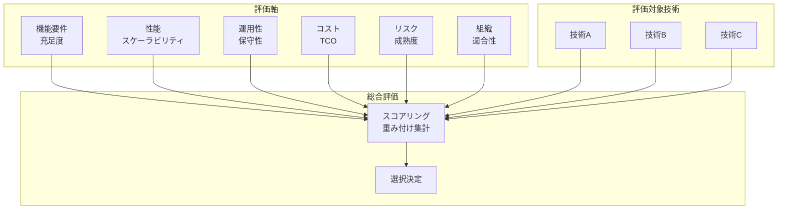
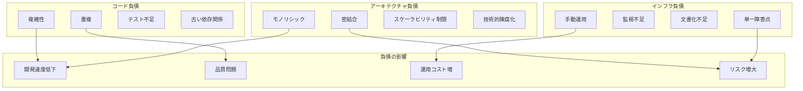
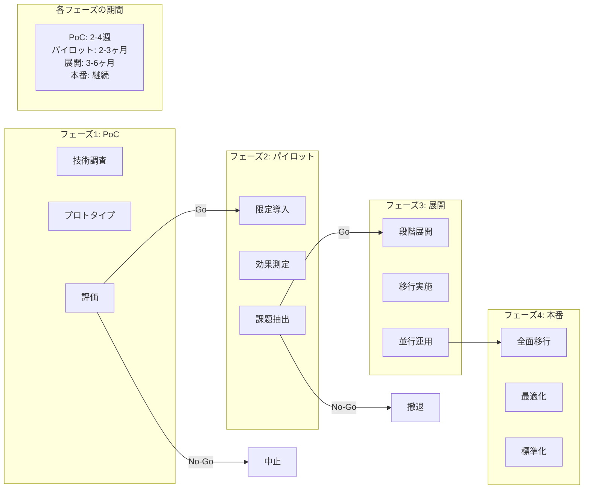

# 第13章：技術選択のフレームワーク

## 本章の目的と到達点

技術選択は、システムの成否を左右する重要な意思決定である。新しい技術が次々と登場し、既存技術も進化を続ける中で、どのように適切な技術を選択すればよいのか。感覚的な判断や流行に流されることなく、客観的な基準に基づいた選択を行うには、体系的なフレームワークが必要である。

本章では、技術評価の多面的な基準から始まり、オープンソースソフトウェアの評価、技術的負債の管理、新技術導入のプロセスまで、技術選択に関わるすべての側面を体系的に解説する。特に、短期的な利益と長期的な持続可能性のバランスを取る方法に焦点を当てる。

技術選択とは、単に機能要件を満たす製品を選ぶことではない。それは、組織の能力、将来の方向性、リスク許容度など、多くの要因を総合的に考慮し、最適な判断を下すプロセスである。

本章を読み終えた時点で、読者は以下の能力を獲得する：
- 多面的な評価基準に基づいた技術選択ができる
- オープンソースプロジェクトの持続可能性を評価できる
- 技術的負債を定量化し、計画的に管理できる
- 新技術導入のリスクとメリットを適切に評価し、段階的な導入計画を立案できる

## 13.1 技術評価の多面的基準

### 評価フレームワークの構築

技術選択において最も重要なのは、評価基準を明確にすることである。しかし、この基準は単一ではなく、複数の観点から構成される必要がある。

包括的な技術評価のフレームワークを[図13-1]に示す。

[図13-1: 技術評価マトリクス]


#### 機能要件の充足度

機能要件は技術選択の出発点だが、それだけでは不十分である。要件を「必須」「重要」「希望」に分類し、重み付けを行う。

```
評価マトリクスの構造：
必須機能（Must Have）
- すべてを満たさない技術は選択対象から除外
- 例：特定のプロトコルサポート、最低限の性能要件

重要機能（Should Have）  
- 80%以上の充足が望ましい
- 例：管理機能、監視機能、自動化対応

希望機能（Nice to Have）
- 差別化要因として評価
- 例：高度な分析機能、UI/UXの洗練度
```

#### 非機能要件の評価

非機能要件は、システムの品質特性を決定する重要な要素である。

**性能評価の観点**：
- レイテンシ：要求から応答までの時間
- スループット：単位時間あたりの処理能力
- スケーラビリティ：負荷増大への対応能力
- リソース効率：CPU、メモリ、ストレージの使用効率

**可用性評価の観点**：
- MTBF（Mean Time Between Failures）：平均故障間隔
- MTTR（Mean Time To Repair）：平均修復時間
- 冗長性オプション：フェイルオーバー、レプリケーション対応
- 災害復旧：バックアップ、リストア機能

**運用性評価の観点**：
- 監視機能：メトリクス、ログ、アラート
- 自動化対応：API、CLI、設定管理ツール対応
- トラブルシューティング：診断ツール、ドキュメント
- アップグレード：ダウンタイムなしでの更新可能性

### 総所有コスト（TCO）の算出

技術選択において、初期費用だけでなく、ライフサイクル全体のコストを考慮することが重要である。

#### 直接コストの要素

**初期コスト**：
- ライセンス費用：ソフトウェアライセンス、サブスクリプション
- ハードウェア費用：必要なサーバー、ストレージ、ネットワーク機器
- 実装費用：インストール、設定、カスタマイズ
- 教育費用：トレーニング、認定資格取得

**継続的コスト**：
- 保守費用：年間サポート契約、アップデート
- 運用人件費：必要な人員数と専門性レベル
- インフラ費用：電力、冷却、データセンタースペース
- ライセンス更新：年次更新、ユーザー数増加による追加費用

#### 間接コストの要素

間接コストは見落とされがちだが、総コストに大きな影響を与える。

**機会コスト**：
- 導入期間中の生産性低下
- 既存システムからの移行に伴うビジネス中断
- 新技術習得に要する時間

**リスクコスト**：
- セキュリティインシデントの潜在的損失
- システム障害による機会損失
- コンプライアンス違反のペナルティ

**技術的負債コスト**：
- 将来の拡張性制限による追加投資
- ベンダーロックインによる交渉力低下
- レガシー化による保守コスト増大

#### TCO計算モデル

```python
class TCOCalculator:
    def __init__(self, evaluation_period_years=5):
        self.period = evaluation_period_years
        self.discount_rate = 0.05  # 割引率
    
    def calculate_tco(self, technology_option):
        # 初期コスト
        initial_costs = (
            technology_option.license_cost +
            technology_option.hardware_cost +
            technology_option.implementation_cost +
            technology_option.training_cost
        )
        
        # 年間運用コスト
        annual_costs = []
        for year in range(self.period):
            yearly_cost = (
                technology_option.annual_license +
                technology_option.support_cost +
                technology_option.staff_cost * technology_option.required_fte +
                technology_option.infrastructure_cost
            )
            
            # 年次増加率を考慮
            yearly_cost *= (1 + technology_option.cost_growth_rate) ** year
            
            # 現在価値に割引
            present_value = yearly_cost / ((1 + self.discount_rate) ** year)
            annual_costs.append(present_value)
        
        # 移行・廃棄コスト
        migration_costs = technology_option.data_migration_cost
        decommission_costs = technology_option.decommission_cost / ((1 + self.discount_rate) ** self.period)
        
        # リスク調整コスト
        risk_costs = self.calculate_risk_adjusted_cost(technology_option)
        
        total_tco = initial_costs + sum(annual_costs) + migration_costs + decommission_costs + risk_costs
        
        return {
            'total_tco': total_tco,
            'initial': initial_costs,
            'operational': sum(annual_costs),
            'migration': migration_costs,
            'decommission': decommission_costs,
            'risk_adjusted': risk_costs,
            'cost_per_year': total_tco / self.period
        }
```

### 定性的評価基準

数値化できない要素も、技術選択において重要な役割を果たす。

#### 組織との適合性

**技術スタックとの整合性**：
- 既存技術との統合容易性
- 共通のプログラミング言語、フレームワーク
- 運用ツールの共通化

**組織文化との適合**：
- オープンソース志向 vs 商用製品志向
- 最新技術採用 vs 安定性重視
- 内製化 vs アウトソーシング

**スキルセットの可用性**：
- 社内に必要なスキルが存在するか
- 労働市場でのスキル供給状況
- 学習曲線の急峻さ

#### 将来性の評価

**技術の成熟度**：
- ガートナーのハイプサイクルでの位置
- 本番環境での実績
- 既知の問題と回避策の存在

**エコシステムの充実度**：
- サードパーティツールの充実
- 統合可能なサービスの多様性
- コミュニティの活発さ

**ベンダー/プロジェクトの持続性**：
- 財務的健全性
- 開発の活発さ
- ロードマップの明確さ

## 13.2 オープンソースの評価基準

### コミュニティの健全性指標

オープンソースプロジェクトの成功は、コミュニティの健全性に大きく依存する。

#### 定量的指標の分析

**開発活動の測定**：
```
コミット頻度：
- 月間コミット数の推移
- コミッター数の推移
- コードチャーンの分析

イシュー/PR活動：
- 新規イシューの作成数
- イシューのクローズ率
- PRのマージまでの時間
- 初回レスポンスまでの時間
```

**コミュニティの多様性**：
```
貢献者分析：
- ユニーク貢献者数
- 貢献の集中度（ジニ係数）
- 企業別貢献比率
- 地理的分布
```

**バス係数の評価**：

バス係数とは、プロジェクトが機能不全に陥るまでに失われる必要のある主要開発者の最小数である。

```python
def calculate_bus_factor(project_contributions):
    """プロジェクトのバス係数を計算"""
    total_commits = sum(project_contributions.values())
    sorted_contributors = sorted(
        project_contributions.items(), 
        key=lambda x: x[1], 
        reverse=True
    )
    
    cumulative_commits = 0
    bus_factor = 0
    
    for contributor, commits in sorted_contributors:
        cumulative_commits += commits
        bus_factor += 1
        
        # 50%以上のコミットをカバーする最小人数
        if cumulative_commits >= total_commits * 0.5:
            break
    
    return bus_factor
```

#### 定性的評価

**ガバナンスモデル**：
- 意思決定プロセスの透明性
- コントリビューター昇格パス
- 行動規範の存在と執行

**ドキュメントの質**：
- インストールガイドの完成度
- APIドキュメントの充実度
- アーキテクチャドキュメントの存在
- 貢献ガイドラインの明確さ

**コミュニケーションチャネル**：
- 公式フォーラムの活発さ
- Slack/Discord等のリアルタイムチャット
- メーリングリストのアーカイブ
- カンファレンス/ミートアップの開催

### サポートとリスクの評価

オープンソースを採用する際は、サポート体制とリスクを慎重に評価する必要がある。

#### サポートオプションの評価

**コミュニティサポート**：
```
評価項目：
- フォーラムでの質問への回答率
- 回答までの平均時間
- 回答の質（問題解決率）
- ドキュメントの検索性

利点：
- 無料で利用可能
- 多様な視点からの回答
- 実践的な解決策

制限：
- SLAの保証なし
- 回答の質にばらつき
- 機密情報を含む質問が困難
```

**商用サポート**：
```
評価項目：
- サポートレベル（24x7、営業時間内等）
- 応答時間のSLA
- 専門家へのエスカレーションパス
- パッチ提供の優先度

利点：
- 保証されたサポートレベル
- 専門的な技術支援
- 法的責任の明確化

考慮点：
- コストの増加
- ベンダー依存度の上昇
- コミュニティ版との機能差
```

**内製サポート**：
```
必要な能力：
- ソースコードの理解
- 問題の診断と修正
- コミュニティへの貢献
- フォークの管理（最終手段）

投資判断基準：
- 技術の重要度
- カスタマイズの必要性
- 長期利用の計画
- 社内スキルの蓄積価値
```

#### リスク評価マトリクス

```python
class OpenSourceRiskAssessment:
    def __init__(self):
        self.risk_factors = {
            'project_abandonment': {
                'probability': self.assess_abandonment_risk,
                'impact': 'high',
                'mitigation': ['fork_preparation', 'alternative_identification']
            },
            'security_vulnerability': {
                'probability': self.assess_security_risk,
                'impact': 'high',
                'mitigation': ['security_scanning', 'rapid_patching_process']
            },
            'license_change': {
                'probability': self.assess_license_risk,
                'impact': 'medium',
                'mitigation': ['license_monitoring', 'version_pinning']
            },
            'breaking_changes': {
                'probability': self.assess_stability_risk,
                'impact': 'medium',
                'mitigation': ['version_control', 'extensive_testing']
            }
        }
    
    def assess_abandonment_risk(self, project_metrics):
        """プロジェクト放棄リスクの評価"""
        risk_score = 0
        
        # 最後のリリースからの経過日数
        days_since_release = project_metrics['days_since_last_release']
        if days_since_release > 365:
            risk_score += 0.3
        elif days_since_release > 180:
            risk_score += 0.1
        
        # アクティブなメンテナー数
        if project_metrics['active_maintainers'] < 3:
            risk_score += 0.3
        
        # 未解決の重要イシュー
        if project_metrics['critical_issues_open'] > 10:
            risk_score += 0.2
        
        # 代替プロジェクトの存在
        if not project_metrics['has_alternatives']:
            risk_score += 0.2
        
        return min(risk_score, 1.0)
```

### ライセンスコンプライアンス

オープンソースライセンスの理解と遵守は、法的リスクを回避するために不可欠である。

#### ライセンスタイプの分類

**許容的ライセンス（Permissive）**：
```
特徴：
- 商用利用、修正、再配布が自由
- ソースコード公開義務なし
- 著作権表示とライセンス条文の保持が必要

主なライセンス：
- MIT License
- Apache License 2.0
- BSD License

適用場面：
- 商用製品への組み込み
- プロプライエタリな拡張
- SaaSでの利用
```

**コピーレフトライセンス（Copyleft）**：
```
特徴：
- 派生物も同じライセンスで公開必須
- ソースコード公開義務あり
- 商用利用は可能だが制約あり

主なライセンス：
- GPL v3
- AGPL v3
- LGPL v3

適用場面：
- 内部利用のみ
- オープンソース製品の開発
- 適切な分離が可能な場合
```

#### ライセンス管理プロセス

```python
class LicenseComplianceManager:
    def __init__(self):
        self.approved_licenses = ['MIT', 'Apache-2.0', 'BSD-3-Clause']
        self.restricted_licenses = ['GPL-3.0', 'AGPL-3.0']
        self.license_policies = self.load_policies()
    
    def scan_dependencies(self, project_path):
        """依存関係のライセンススキャン"""
        dependencies = self.extract_dependencies(project_path)
        compliance_report = {
            'compliant': [],
            'restricted': [],
            'unknown': [],
            'conflicts': []
        }
        
        for dep in dependencies:
            license_info = self.get_license_info(dep)
            
            if not license_info:
                compliance_report['unknown'].append(dep)
            elif license_info in self.approved_licenses:
                compliance_report['compliant'].append({
                    'name': dep.name,
                    'version': dep.version,
                    'license': license_info
                })
            elif license_info in self.restricted_licenses:
                compliance_report['restricted'].append({
                    'name': dep.name,
                    'version': dep.version,
                    'license': license_info,
                    'usage': self.analyze_usage(dep)
                })
        
        # ライセンス間の競合をチェック
        conflicts = self.check_license_conflicts(dependencies)
        compliance_report['conflicts'] = conflicts
        
        return compliance_report
    
    def generate_attribution(self, dependencies):
        """帰属表示の自動生成"""
        attribution_text = "# Third-Party Software Attributions\n\n"
        
        for dep in sorted(dependencies, key=lambda x: x.name):
            attribution_text += f"## {dep.name} v{dep.version}\n"
            attribution_text += f"License: {dep.license}\n"
            attribution_text += f"Copyright: {dep.copyright}\n\n"
            
            if dep.license_text:
                attribution_text += f"```\n{dep.license_text}\n```\n\n"
        
        return attribution_text
```

## 13.3 技術的負債の定量化

### 負債の分類と測定

技術的負債は避けられないが、適切に管理することで、その影響を最小限に抑えることができる。

技術的負債の各カテゴリとその影響を[図13-2]に示す。

[図13-2: 技術的負債の分類]


#### コード負債

コードレベルの技術的負債は、最も直接的に測定可能な形態である。

**複雑性メトリクス**：
```python
class CodeDebtAnalyzer:
    def analyze_complexity(self, codebase):
        metrics = {
            'cyclomatic_complexity': [],
            'cognitive_complexity': [],
            'lines_of_code': 0,
            'duplicate_code_ratio': 0,
            'test_coverage': 0
        }
        
        for file in codebase.get_source_files():
            ast = parse_file(file)
            
            # 循環的複雑度
            for function in ast.functions:
                cc = self.calculate_cyclomatic_complexity(function)
                metrics['cyclomatic_complexity'].append({
                    'function': function.name,
                    'file': file.path,
                    'complexity': cc,
                    'risk_level': self.classify_risk(cc)
                })
            
            # 重複コード検出
            duplicates = self.detect_duplicates(file)
            metrics['duplicate_code_ratio'] += len(duplicates) / file.lines
        
        return metrics
    
    def calculate_debt_cost(self, metrics):
        """技術的負債の金銭的コストを計算"""
        hourly_rate = 100  # 開発者の時間単価
        
        debt_items = []
        
        # 高複雑度関数の改修コスト
        for func in metrics['cyclomatic_complexity']:
            if func['complexity'] > 10:
                estimated_hours = (func['complexity'] - 10) * 2
                debt_items.append({
                    'type': 'high_complexity',
                    'location': f"{func['file']}:{func['function']}",
                    'estimated_cost': estimated_hours * hourly_rate,
                    'priority': func['risk_level']
                })
        
        # 重複コードの統合コスト
        duplicate_hours = metrics['duplicate_code_ratio'] * metrics['lines_of_code'] / 100
        debt_items.append({
            'type': 'code_duplication',
            'estimated_cost': duplicate_hours * hourly_rate,
            'priority': 'medium'
        })
        
        return debt_items
```

**依存関係の負債**：
```python
def analyze_dependency_debt(project):
    debt_indicators = {
        'outdated_dependencies': [],
        'security_vulnerabilities': [],
        'deprecated_apis': [],
        'version_conflicts': []
    }
    
    for dependency in project.dependencies:
        # バージョンの古さ
        latest_version = get_latest_version(dependency.name)
        if is_outdated(dependency.version, latest_version):
            age_days = calculate_version_age(dependency.version, latest_version)
            debt_indicators['outdated_dependencies'].append({
                'name': dependency.name,
                'current': dependency.version,
                'latest': latest_version,
                'age_days': age_days,
                'breaking_changes': check_breaking_changes(dependency.name, dependency.version, latest_version)
            })
        
        # セキュリティ脆弱性
        vulnerabilities = scan_vulnerabilities(dependency)
        if vulnerabilities:
            debt_indicators['security_vulnerabilities'].extend(vulnerabilities)
    
    return debt_indicators
```

#### アーキテクチャ負債

アーキテクチャレベルの負債は、システム全体の進化を妨げる。

**モノリシック度の測定**：
```python
class ArchitecturalDebtAnalyzer:
    def analyze_coupling(self, system):
        """システム間の結合度を分析"""
        modules = system.get_modules()
        coupling_matrix = np.zeros((len(modules), len(modules)))
        
        for i, module_a in enumerate(modules):
            for j, module_b in enumerate(modules):
                if i != j:
                    # 依存関係の強さを計算
                    coupling_matrix[i][j] = self.calculate_coupling(module_a, module_b)
        
        metrics = {
            'average_coupling': np.mean(coupling_matrix),
            'max_coupling': np.max(coupling_matrix),
            'highly_coupled_pairs': self.find_high_coupling(coupling_matrix, threshold=0.7),
            'god_classes': self.identify_god_classes(modules),
            'circular_dependencies': self.detect_circular_deps(modules)
        }
        
        return metrics
    
    def calculate_refactoring_effort(self, metrics):
        """リファクタリングの工数を見積もる"""
        effort_hours = 0
        
        # 密結合の解消
        effort_hours += len(metrics['highly_coupled_pairs']) * 40
        
        # God Classの分割
        effort_hours += len(metrics['god_classes']) * 80
        
        # 循環依存の解消
        effort_hours += len(metrics['circular_dependencies']) * 20
        
        return {
            'total_hours': effort_hours,
            'cost': effort_hours * 100,  # 時間単価
            'duration_weeks': effort_hours / 40,  # 週40時間と仮定
            'risk_level': self.assess_refactoring_risk(metrics)
        }
```

#### インフラ負債

インフラストラクチャの技術的負債は、運用効率と信頼性に直接影響する。

**自動化レベルの評価**：
```
評価項目：
- プロビジョニング：手動 vs IaC
- デプロイメント：手動 vs CI/CD
- スケーリング：手動 vs 自動
- 監視：リアクティブ vs プロアクティブ
- バックアップ：手動 vs 自動

負債の定量化：
- 手動タスクの頻度 × 所要時間
- ヒューマンエラーの発生率 × 影響度
- 復旧時間の延長 × ビジネスインパクト
```

### 返済計画の策定

技術的負債は、計画的に返済することで、その影響を管理可能なレベルに保つことができる。

#### 優先順位付けフレームワーク

```python
class DebtPrioritizer:
    def __init__(self):
        self.criteria_weights = {
            'business_impact': 0.3,
            'technical_risk': 0.25,
            'effort_required': 0.2,
            'future_cost': 0.25
        }
    
    def calculate_priority_score(self, debt_item):
        """負債項目の優先度スコアを計算"""
        scores = {
            'business_impact': self.assess_business_impact(debt_item),
            'technical_risk': self.assess_technical_risk(debt_item),
            'effort_required': 1 - self.normalize_effort(debt_item.effort),
            'future_cost': self.calculate_future_cost_growth(debt_item)
        }
        
        weighted_score = sum(
            scores[criteria] * self.criteria_weights[criteria]
            for criteria in scores
        )
        
        return weighted_score
    
    def create_repayment_roadmap(self, debt_items, capacity_per_quarter):
        """四半期ごとの返済ロードマップを作成"""
        # 優先度でソート
        prioritized_items = sorted(
            debt_items,
            key=lambda x: self.calculate_priority_score(x),
            reverse=True
        )
        
        roadmap = []
        current_quarter = []
        current_capacity = 0
        
        for item in prioritized_items:
            if current_capacity + item.effort <= capacity_per_quarter:
                current_quarter.append(item)
                current_capacity += item.effort
            else:
                # 次の四半期へ
                roadmap.append({
                    'quarter': len(roadmap) + 1,
                    'items': current_quarter,
                    'total_effort': current_capacity,
                    'expected_value': sum(item.value for item in current_quarter)
                })
                current_quarter = [item]
                current_capacity = item.effort
        
        # 最後の四半期を追加
        if current_quarter:
            roadmap.append({
                'quarter': len(roadmap) + 1,
                'items': current_quarter,
                'total_effort': current_capacity,
                'expected_value': sum(item.value for item in current_quarter)
            })
        
        return roadmap
```

#### 継続的な負債管理

```python
class TechnicalDebtDashboard:
    def __init__(self):
        self.metrics_history = []
        self.debt_inventory = []
    
    def update_metrics(self):
        """定期的にメトリクスを更新"""
        current_metrics = {
            'timestamp': datetime.now(),
            'code_debt': self.measure_code_debt(),
            'architecture_debt': self.measure_architecture_debt(),
            'infrastructure_debt': self.measure_infrastructure_debt(),
            'total_debt_cost': self.calculate_total_debt_cost()
        }
        
        self.metrics_history.append(current_metrics)
        
        # トレンド分析
        if len(self.metrics_history) > 1:
            trend = self.analyze_trend()
            if trend['increasing'] and trend['rate'] > 0.1:
                self.alert_management("Technical debt increasing rapidly")
    
    def generate_report(self):
        """経営層向けのレポート生成"""
        report = {
            'executive_summary': {
                'total_debt': self.calculate_total_debt_cost(),
                'monthly_interest': self.calculate_monthly_interest(),
                'repayment_progress': self.calculate_progress(),
                'risk_areas': self.identify_high_risk_areas()
            },
            'detailed_analysis': {
                'by_category': self.analyze_by_category(),
                'by_team': self.analyze_by_team(),
                'by_system': self.analyze_by_system()
            },
            'recommendations': self.generate_recommendations()
        }
        
        return report
```

## 13.4 CI/CDパイプラインの実装と運用

### モダンなCI/CDパイプラインの設計

継続的インテグレーション/継続的デリバリー（CI/CD）は、現代のソフトウェア開発における必須要素である。適切に設計されたパイプラインは、品質を維持しながら開発速度を向上させる。

#### GitLab CI/CDの実装例

```yaml
# .gitlab-ci.yml
stages:
  - build
  - test
  - security
  - deploy

variables:
  DOCKER_DRIVER: overlay2
  DOCKER_TLS_CERTDIR: "/certs"

before_script:
  - echo $CI_REGISTRY_PASSWORD | docker login -u $CI_REGISTRY_USER --password-stdin $CI_REGISTRY

# ビルドステージ
build:
  stage: build
  image: docker:20.10.16
  services:
    - docker:20.10.16-dind
  script:
    - docker build -t $CI_REGISTRY_IMAGE:$CI_COMMIT_SHA .
    - docker push $CI_REGISTRY_IMAGE:$CI_COMMIT_SHA
  only:
    - main
    - develop
    - /^release\/.*$/

# テストステージ
test:unit:
  stage: test
  image: $CI_REGISTRY_IMAGE:$CI_COMMIT_SHA
  script:
    - npm install
    - npm run test:unit
  coverage: '/Coverage: \d+\.\d+%/'
  artifacts:
    reports:
      junit: test-results/unit/*.xml
      coverage_report:
        coverage_format: cobertura
        path: coverage/cobertura-coverage.xml

# セキュリティスキャン
security:sast:
  stage: security
  image: returntocorp/semgrep
  script:
    - semgrep --config=auto --json --output=sast-report.json
  artifacts:
    reports:
      sast: sast-report.json

# デプロイステージ
deploy:production:
  stage: deploy
  image: bitnami/kubectl:latest
  script:
    - kubectl config use-context $KUBE_CONTEXT_PROD
    - kubectl set image deployment/app app=$CI_REGISTRY_IMAGE:$CI_COMMIT_SHA -n production
    - kubectl rollout status deployment/app -n production
  environment:
    name: production
    url: https://www.example.com
  when: manual
  only:
    - main
```

## 13.5 新技術導入の判断プロセス

### パイロットプロジェクトの設計

新技術の導入は、段階的かつ計画的に行うことで、リスクを最小化できる。

新技術の段階的な導入プロセスを[図13-3]に示す。

[図13-3: 技術導入フェーズ]


#### 技術検証（PoC）フェーズ

**スコープの定義**：
```
目的：
- 技術的実現可能性の確認
- 基本機能の動作検証
- 既存システムとの統合可能性

制約：
- 期間：2-4週間
- 環境：開発/検証環境のみ
- データ：テストデータのみ使用
- 規模：単一機能に限定
```

**成功基準の設定**：
```python
class PoCSuccessCriteria:
    def __init__(self):
        self.criteria = {
            'functional': {
                'basic_features_working': True,
                'integration_possible': True,
                'performance_acceptable': lambda metrics: metrics['latency'] < 100
            },
            'operational': {
                'setup_complexity': lambda time: time < 8,  # 8時間以内
                'documentation_quality': lambda score: score >= 7,  # 10点満点
                'troubleshooting_ease': lambda issues: issues['resolved'] / issues['total'] > 0.8
            },
            'strategic': {
                'skill_availability': lambda market: market['available_professionals'] > 100,
                'vendor_stability': lambda score: score >= 8,
                'future_roadmap_alignment': True
            }
        }
    
    def evaluate(self, poc_results):
        """PoC結果の評価"""
        evaluation = {}
        
        for category, criteria in self.criteria.items():
            category_results = {}
            for criterion, check in criteria.items():
                if callable(check):
                    result = check(poc_results[criterion])
                else:
                    result = poc_results[criterion] == check
                
                category_results[criterion] = {
                    'passed': result,
                    'value': poc_results.get(criterion)
                }
            
            evaluation[category] = {
                'results': category_results,
                'pass_rate': sum(1 for r in category_results.values() if r['passed']) / len(category_results)
            }
        
        return evaluation
```

#### 限定導入フェーズ

**パイロットプロジェクトの選定**：
```
選定基準：
- ビジネスクリティカルでない
- 明確な境界を持つ
- 失敗時の影響が限定的
- 成功の測定が容易
- 学習価値が高い

理想的な候補：
- 内部ツール
- 新規マイクロサービス
- 特定チームのみ使用する機能
- 実験的な新機能
```

**測定と評価**：
```python
class PilotProjectMonitor:
    def __init__(self, baseline_metrics):
        self.baseline = baseline_metrics
        self.measurements = []
    
    def measure_impact(self):
        """パイロットプロジェクトの影響を測定"""
        current_metrics = {
            'productivity': {
                'deployment_frequency': self.measure_deployment_frequency(),
                'lead_time': self.measure_lead_time(),
                'mttr': self.measure_mttr(),
                'change_failure_rate': self.measure_change_failure_rate()
            },
            'quality': {
                'defect_rate': self.measure_defect_rate(),
                'test_coverage': self.measure_test_coverage(),
                'code_review_time': self.measure_review_time()
            },
            'team': {
                'satisfaction': self.survey_team_satisfaction(),
                'skill_growth': self.assess_skill_development(),
                'collaboration': self.measure_collaboration_metrics()
            },
            'cost': {
                'infrastructure': self.calculate_infra_cost(),
                'licensing': self.calculate_license_cost(),
                'training': self.calculate_training_cost(),
                'productivity_loss': self.calculate_learning_curve_impact()
            }
        }
        
        # ベースラインとの比較
        comparison = {}
        for category, metrics in current_metrics.items():
            comparison[category] = {}
            for metric, value in metrics.items():
                baseline_value = self.baseline[category].get(metric, 0)
                comparison[category][metric] = {
                    'current': value,
                    'baseline': baseline_value,
                    'change': ((value - baseline_value) / baseline_value * 100) if baseline_value else 0
                }
        
        return comparison
```

### 段階的移行の計画

#### 移行戦略の選択

**Strangler Figパターン**：

既存システムを徐々に新技術で置き換える戦略。

```python
class StranglerFigMigration:
    def __init__(self, legacy_system, new_system):
        self.legacy = legacy_system
        self.new = new_system
        self.router = EdgeRouter()
    
    def plan_migration_phases(self):
        """移行フェーズの計画"""
        phases = []
        
        # 機能を複雑度と依存関係で分類
        features = self.analyze_features()
        
        # Phase 1: 独立した簡単な機能
        phase1_features = [
            f for f in features 
            if f.complexity == 'low' and len(f.dependencies) == 0
        ]
        phases.append({
            'phase': 1,
            'duration': '1 month',
            'features': phase1_features,
            'risk': 'low',
            'rollback_plan': 'Feature flag disable'
        })
        
        # Phase 2: 中程度の複雑度、一部依存
        phase2_features = [
            f for f in features
            if f.complexity == 'medium' and len(f.dependencies) <= 2
        ]
        phases.append({
            'phase': 2,
            'duration': '2 months',
            'features': phase2_features,
            'risk': 'medium',
            'rollback_plan': 'Database snapshot + feature flags'
        })
        
        # Phase 3: 複雑な中核機能
        phase3_features = [
            f for f in features
            if f.complexity == 'high' or f.is_core
        ]
        phases.append({
            'phase': 3,
            'duration': '3 months',
            'features': phase3_features,
            'risk': 'high',
            'rollback_plan': 'Blue-green deployment ready'
        })
        
        return phases
    
    def implement_routing(self, feature, percentage=0):
        """段階的なトラフィック移行"""
        routing_rule = {
            'feature': feature.name,
            'conditions': [
                {
                    'type': 'percentage',
                    'value': percentage,
                    'destination': self.new
                },
                {
                    'type': 'default',
                    'destination': self.legacy
                }
            ],
            'monitoring': {
                'error_rate_threshold': 0.01,
                'latency_threshold': 200,
                'auto_rollback': True
            }
        }
        
        self.router.add_rule(routing_rule)
```

**並行運用（Side-by-Side）**：

新旧システムを並行して運用し、段階的に切り替える。

```python
class SideBySideMigration:
    def __init__(self):
        self.sync_manager = DataSyncManager()
        self.validator = ConsistencyValidator()
    
    def setup_parallel_operation(self):
        """並行運用環境のセットアップ"""
        setup_tasks = [
            {
                'task': 'データ同期の設定',
                'action': self.setup_data_sync,
                'validation': self.validate_sync_completeness
            },
            {
                'task': '二重書き込みの実装',
                'action': self.implement_dual_writes,
                'validation': self.validate_write_consistency
            },
            {
                'task': '比較検証の設定',
                'action': self.setup_comparison_monitoring,
                'validation': self.validate_monitoring_coverage
            }
        ]
        
        for task in setup_tasks:
            result = task['action']()
            if not task['validation'](result):
                raise MigrationError(f"Failed to {task['task']}")
    
    def implement_dual_writes(self):
        """新旧両システムへの書き込み"""
        class DualWriteProxy:
            def write(self, data):
                # 旧システムへの書き込み（プライマリ）
                legacy_result = self.legacy_system.write(data)
                
                # 新システムへの書き込み（セカンダリ）
                try:
                    new_result = self.new_system.write(data)
                    
                    # 結果の比較
                    if not self.compare_results(legacy_result, new_result):
                        self.log_discrepancy(data, legacy_result, new_result)
                except Exception as e:
                    # 新システムのエラーは記録のみ
                    self.log_error(e, data)
                
                # 常に旧システムの結果を返す
                return legacy_result
        
        return DualWriteProxy()
```

### リスク管理と撤退計画

#### リスクの識別と評価

```python
class TechnologyRiskAssessment:
    def __init__(self):
        self.risk_categories = {
            'technical': {
                'integration_failure': {'probability': 0.3, 'impact': 'high'},
                'performance_degradation': {'probability': 0.2, 'impact': 'medium'},
                'security_vulnerabilities': {'probability': 0.1, 'impact': 'high'},
                'scalability_issues': {'probability': 0.2, 'impact': 'medium'}
            },
            'organizational': {
                'skill_gap': {'probability': 0.4, 'impact': 'medium'},
                'resistance_to_change': {'probability': 0.3, 'impact': 'medium'},
                'vendor_dependency': {'probability': 0.2, 'impact': 'high'},
                'budget_overrun': {'probability': 0.3, 'impact': 'medium'}
            },
            'operational': {
                'migration_complexity': {'probability': 0.3, 'impact': 'high'},
                'downtime_risk': {'probability': 0.1, 'impact': 'high'},
                'data_loss': {'probability': 0.05, 'impact': 'critical'},
                'rollback_difficulty': {'probability': 0.2, 'impact': 'high'}
            }
        }
    
    def calculate_risk_score(self):
        """リスクスコアの計算"""
        risk_matrix = {
            'critical': 4,
            'high': 3,
            'medium': 2,
            'low': 1
        }
        
        total_score = 0
        risk_profile = {}
        
        for category, risks in self.risk_categories.items():
            category_score = 0
            for risk_name, risk_data in risks.items():
                impact_score = risk_matrix[risk_data['impact']]
                risk_score = risk_data['probability'] * impact_score
                category_score += risk_score
                
                if risk_score > 2:  # 高リスク項目
                    if category not in risk_profile:
                        risk_profile[category] = []
                    risk_profile[category].append({
                        'risk': risk_name,
                        'score': risk_score,
                        'mitigation': self.get_mitigation_strategy(risk_name)
                    })
            
            total_score += category_score
        
        return {
            'total_score': total_score,
            'risk_profile': risk_profile,
            'recommendation': self.get_recommendation(total_score)
        }
```

#### 撤退計画

```python
class ExitStrategy:
    def __init__(self, project):
        self.project = project
        self.checkpoints = []
    
    def define_exit_criteria(self):
        """撤退基準の定義"""
        criteria = {
            'cost_overrun': {
                'threshold': 1.5,  # 予算の150%
                'current': lambda: self.project.actual_cost / self.project.budget
            },
            'timeline_delay': {
                'threshold': 2.0,  # スケジュールの200%
                'current': lambda: self.project.elapsed_time / self.project.planned_time
            },
            'technical_blockers': {
                'threshold': 3,  # 解決不能な技術的問題の数
                'current': lambda: len(self.project.unresolved_blockers)
            },
            'adoption_rate': {
                'threshold': 0.3,  # 30%未満の採用率
                'current': lambda: self.project.adoption_metrics['rate']
            }
        }
        
        return criteria
    
    def create_rollback_plan(self):
        """ロールバック計画の作成"""
        rollback_steps = [
            {
                'step': 1,
                'action': 'Freeze new development',
                'duration': '1 day',
                'responsible': 'Tech Lead'
            },
            {
                'step': 2,
                'action': 'Export data from new system',
                'duration': '2 days',
                'responsible': 'Data Team'
            },
            {
                'step': 3,
                'action': 'Reconfigure routing to legacy system',
                'duration': '4 hours',
                'responsible': 'Infrastructure Team'
            },
            {
                'step': 4,
                'action': 'Validate legacy system operation',
                'duration': '1 day',
                'responsible': 'QA Team'
            },
            {
                'step': 5,
                'action': 'Communicate to stakeholders',
                'duration': '1 day',
                'responsible': 'Project Manager'
            }
        ]
        
        return {
            'total_duration': '5 days',
            'steps': rollback_steps,
            'data_preservation': self.plan_data_preservation(),
            'knowledge_retention': self.plan_knowledge_retention()
        }
```

## 13.5 将来予測と技術ロードマップ

### 技術トレンドの評価方法

技術の将来性を評価するには、複数の情報源と分析手法を組み合わせる必要がある。

#### ハイプサイクルの活用

```python
class TechnologyMaturityAssessment:
    def __init__(self):
        self.hype_cycle_stages = {
            'innovation_trigger': {
                'characteristics': ['概念実証', '限定的な実装', '高い期待'],
                'adoption_advice': 'WAIT',
                'risk_level': 'VERY_HIGH'
            },
            'peak_of_inflated_expectations': {
                'characteristics': ['過度な宣伝', '非現実的な期待', '早期採用者の失敗'],
                'adoption_advice': 'EVALUATE_CAREFULLY',
                'risk_level': 'HIGH'
            },
            'trough_of_disillusionment': {
                'characteristics': ['期待外れ', '採用の停滞', '改善の継続'],
                'adoption_advice': 'CONSIDER_FOR_PILOT',
                'risk_level': 'MEDIUM'
            },
            'slope_of_enlightenment': {
                'characteristics': ['実用的な適用', '成功事例の増加', 'ベストプラクティスの確立'],
                'adoption_advice': 'ADOPT_SELECTIVELY',
                'risk_level': 'LOW'
            },
            'plateau_of_productivity': {
                'characteristics': ['主流採用', '明確なROI', '成熟したエコシステム'],
                'adoption_advice': 'ADOPT_WIDELY',
                'risk_level': 'VERY_LOW'
            }
        }
    
    def assess_technology_position(self, technology):
        """技術の成熟度位置を評価"""
        indicators = {
            'vendor_count': self.count_vendors(technology),
            'production_deployments': self.count_production_uses(technology),
            'community_sentiment': self.analyze_sentiment(technology),
            'job_market_demand': self.analyze_job_postings(technology),
            'investment_trends': self.analyze_funding(technology)
        }
        
        # 各指標から成熟度ステージを推定
        stage_scores = {}
        for stage in self.hype_cycle_stages:
            stage_scores[stage] = self.calculate_stage_probability(indicators, stage)
        
        # 最も可能性の高いステージを特定
        current_stage = max(stage_scores, key=stage_scores.get)
        
        return {
            'technology': technology,
            'current_stage': current_stage,
            'confidence': stage_scores[current_stage],
            'indicators': indicators,
            'recommendation': self.hype_cycle_stages[current_stage]['adoption_advice']
        }
```

#### 採用曲線の分析

```python
class AdoptionCurveAnalysis:
    def __init__(self):
        self.adopter_categories = {
            'innovators': 0.025,  # 2.5%
            'early_adopters': 0.135,  # 13.5%
            'early_majority': 0.34,  # 34%
            'late_majority': 0.34,  # 34%
            'laggards': 0.16  # 16%
        }
    
    def estimate_market_penetration(self, technology, time_since_launch):
        """市場浸透率の推定"""
        # S字カーブモデル（ロジスティック関数）
        k = 0.5  # 成長率
        midpoint = 5  # 採用が加速する時点（年）
        
        penetration = 1 / (1 + math.exp(-k * (time_since_launch - midpoint)))
        
        # 現在の採用者カテゴリを特定
        cumulative = 0
        current_category = None
        for category, percentage in self.adopter_categories.items():
            cumulative += percentage
            if penetration <= cumulative:
                current_category = category
                break
        
        return {
            'penetration_rate': penetration,
            'current_category': current_category,
            'years_to_mainstream': max(0, midpoint - time_since_launch),
            'growth_phase': self.classify_growth_phase(penetration)
        }
```

### 投資判断の基準設定

#### 技術ポートフォリオ管理

```python
class TechnologyPortfolioManager:
    def __init__(self, total_budget):
        self.total_budget = total_budget
        self.portfolio_allocation = {
            'core': 0.5,  # 安定した中核技術
            'emerging': 0.3,  # 実証済みの新技術
            'experimental': 0.15,  # 実験的技術
            'disruptive': 0.05  # 破壊的技術
        }
    
    def evaluate_investment_opportunity(self, technology):
        """投資機会の評価"""
        evaluation = {
            'strategic_alignment': self.assess_strategic_fit(technology),
            'market_potential': self.analyze_market_size(technology),
            'competitive_advantage': self.assess_differentiation(technology),
            'implementation_readiness': self.assess_readiness(technology),
            'risk_return_profile': self.calculate_risk_return(technology)
        }
        
        # 投資判断スコア
        investment_score = sum(
            evaluation[factor] * self.factor_weights[factor]
            for factor in evaluation
        )
        
        return {
            'technology': technology.name,
            'score': investment_score,
            'category': self.categorize_technology(technology),
            'recommended_investment': self.calculate_investment_amount(investment_score),
            'timeline': self.suggest_timeline(technology),
            'success_metrics': self.define_success_metrics(technology)
        }
    
    def optimize_portfolio(self, technologies):
        """ポートフォリオの最適化"""
        # 各カテゴリの現在の配分を計算
        current_allocation = self.calculate_current_allocation()
        
        # リバランスの必要性を評価
        rebalancing_needed = {}
        for category, target in self.portfolio_allocation.items():
            current = current_allocation.get(category, 0)
            deviation = abs(current - target)
            
            if deviation > 0.1:  # 10%以上の乖離
                rebalancing_needed[category] = {
                    'current': current,
                    'target': target,
                    'adjustment': target - current
                }
        
        # リバランス計画
        if rebalancing_needed:
            return self.create_rebalancing_plan(rebalancing_needed)
        
        return {'status': 'balanced', 'current_allocation': current_allocation}
```

#### ROI計算フレームワーク

```python
class TechnologyROICalculator:
    def __init__(self):
        self.benefit_categories = [
            'cost_reduction',
            'revenue_increase',
            'productivity_gain',
            'risk_mitigation',
            'strategic_value'
        ]
    
    def calculate_roi(self, technology_investment):
        """包括的なROI計算"""
        # 定量的利益
        quantitative_benefits = {
            'cost_reduction': self.calculate_cost_savings(technology_investment),
            'revenue_increase': self.estimate_revenue_impact(technology_investment),
            'productivity_gain': self.measure_productivity_improvement(technology_investment)
        }
        
        # 定性的利益の定量化
        qualitative_benefits = {
            'risk_mitigation': self.monetize_risk_reduction(technology_investment),
            'strategic_value': self.assess_strategic_value(technology_investment),
            'innovation_capability': self.value_innovation_potential(technology_investment)
        }
        
        # コストの算出
        total_costs = {
            'initial': technology_investment.initial_cost,
            'ongoing': self.calculate_ongoing_costs(technology_investment),
            'hidden': self.estimate_hidden_costs(technology_investment)
        }
        
        # NPV（正味現在価値）の計算
        cash_flows = []
        for year in range(technology_investment.evaluation_period):
            annual_benefit = sum(quantitative_benefits.values()) / technology_investment.evaluation_period
            annual_cost = total_costs['ongoing']
            net_cash_flow = annual_benefit - annual_cost
            cash_flows.append(net_cash_flow)
        
        npv = self.calculate_npv(
            initial_investment=total_costs['initial'],
            cash_flows=cash_flows,
            discount_rate=0.1
        )
        
        # 投資回収期間
        payback_period = self.calculate_payback_period(
            initial_investment=total_costs['initial'],
            annual_cash_flow=cash_flows[0]
        )
        
        return {
            'roi_percentage': ((sum(cash_flows) - total_costs['initial']) / total_costs['initial']) * 100,
            'npv': npv,
            'payback_period_years': payback_period,
            'benefit_breakdown': {**quantitative_benefits, **qualitative_benefits},
            'cost_breakdown': total_costs,
            'recommendation': self.make_recommendation(npv, payback_period)
        }
```

### 技術ロードマップの作成

```python
class TechnologyRoadmap:
    def __init__(self, organization):
        self.organization = organization
        self.time_horizons = {
            'immediate': (0, 6),  # 0-6ヶ月
            'short_term': (6, 18),  # 6-18ヶ月
            'medium_term': (18, 36),  # 18-36ヶ月
            'long_term': (36, 60)  # 3-5年
        }
    
    def create_roadmap(self):
        """技術ロードマップの作成"""
        roadmap = {}
        
        for horizon_name, (start_month, end_month) in self.time_horizons.items():
            roadmap[horizon_name] = {
                'timeline': f"{start_month}-{end_month} months",
                'focus_areas': self.identify_focus_areas(horizon_name),
                'technologies': self.select_technologies(horizon_name),
                'capabilities': self.define_target_capabilities(horizon_name),
                'dependencies': self.map_dependencies(horizon_name),
                'success_criteria': self.define_success_criteria(horizon_name)
            }
        
        # 実行計画の詳細化
        execution_plan = self.create_execution_plan(roadmap)
        
        return {
            'vision': self.organization.technology_vision,
            'roadmap': roadmap,
            'execution_plan': execution_plan,
            'investment_plan': self.create_investment_plan(roadmap),
            'risk_mitigation': self.identify_risks_and_mitigations(roadmap),
            'review_schedule': self.define_review_cadence()
        }
    
    def create_execution_plan(self, roadmap):
        """実行計画の作成"""
        execution_phases = []
        
        for horizon in ['immediate', 'short_term', 'medium_term', 'long_term']:
            phase_plan = {
                'phase': horizon,
                'objectives': roadmap[horizon]['capabilities'],
                'deliverables': [],
                'milestones': [],
                'resource_requirements': {}
            }
            
            # 各技術の実装計画
            for tech in roadmap[horizon]['technologies']:
                deliverable = {
                    'technology': tech['name'],
                    'implementation_steps': self.define_implementation_steps(tech),
                    'team_assignment': self.assign_teams(tech),
                    'timeline': self.create_timeline(tech),
                    'budget': self.allocate_budget(tech)
                }
                phase_plan['deliverables'].append(deliverable)
            
            execution_phases.append(phase_plan)
        
        return execution_phases
```

## まとめ

技術選択は、組織の将来を形作る重要な意思決定である。本章で提示したフレームワークを活用することで、以下が可能になる：

**多面的な技術評価**
- 機能要件だけでなく、非機能要件、TCO、組織適合性を総合的に評価
- 定量的指標と定性的判断のバランス
- 短期的利益と長期的価値の両立

**オープンソースの戦略的活用**
- コミュニティの健全性を客観的に評価
- サポートオプションとリスクの適切な管理
- ライセンスコンプライアンスの確保

**技術的負債の能動的管理**
- 負債の可視化と定量化
- 優先順位に基づく計画的な返済
- 新規負債の発生抑制

**リスクを管理した新技術導入**
- 段階的な検証と導入
- 明確な成功基準と撤退基準
- 組織の学習と成長

**将来を見据えた技術戦略**
- 技術トレンドの客観的評価
- バランスの取れた技術ポートフォリオ
- 実行可能なロードマップ

これらのフレームワークは、単なる理論ではなく、実践的なツールである。組織の状況に応じてカスタマイズし、継続的に改善することで、技術による競争優位を確立し、維持することができる。

技術選択に「正解」はない。しかし、体系的なアプローチにより、より良い判断を下し、その結果から学び、継続的に改善することは可能である。本章で示した方法論が、読者の技術選択の指針となることを願っている。