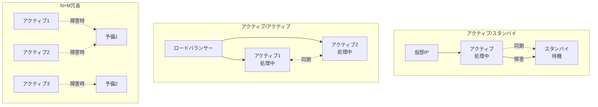
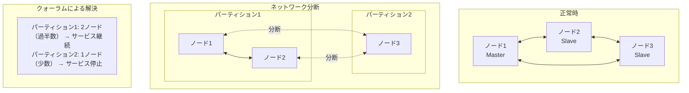
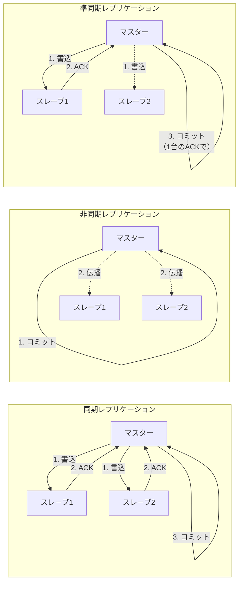

# 第11章：高可用性システムの設計

## 本章の目的と到達点

システムの停止は、ビジネスの停止を意味する。しかし、障害は必ず発生する。この矛盾を技術的に解決するのが高可用性システムの設計である。

高可用性とは何か。多くの技術者は「99.9%」や「99.99%」といった可用性の数値を思い浮かべるだろう。しかし、これらの数値は結果であって、設計の出発点ではない。真の高可用性は、障害を前提とした設計思想から生まれる。

本章では、冗長化パターンの体系的な分類から始まり、フェイルオーバーの実装メカニズム、分散システムにおける一貫性の課題、そして障害復旧の自動化まで、高可用性を実現する技術要素を体系的に解説する。特に、各技術選択がもたらすトレードオフを明確にし、要件に応じた適切な設計判断ができるようになることを目指す。

本章を読み終えた時点で、読者は以下の能力を獲得する：
- アクティブ/スタンバイ、アクティブ/アクティブなど、冗長化パターンの特性と適用基準を理解できる
- スプリットブレインなど、高可用性システム特有の問題と対策を実装できる
- CAP定理の実践的な影響を理解し、一貫性と可用性のトレードオフを適切に判断できる
- RPO/RTOの要件を満たす、現実的な障害復旧計画を立案できる

## 11.1 冗長化パターンの体系的分類

### 冗長化の本質

冗長化とは、システムの一部が故障しても全体としての機能を維持するための設計手法である。しかし、単にコンポーネントを複製すれば高可用性が実現できるわけではない。冗長化には、それぞれ異なる特性を持つ複数のパターンが存在し、要件に応じて適切に選択する必要がある。

主要な冗長化パターンを[図11-1]に示す。

[図11-1: 冗長化パターン]


### アクティブ/スタンバイ構成の実装詳細

アクティブ/スタンバイ構成は、最も基本的な冗長化パターンである。通常時はアクティブノードがすべてのリクエストを処理し、スタンバイノードは待機状態にある。

#### コールドスタンバイ

コールドスタンバイは、スタンバイノードが停止状態で待機する構成である。

**利点**：
- リソース消費が最小限
- ライセンスコストの削減
- 構成がシンプル

**欠点**：
- フェイルオーバー時間が長い（数分〜数十分）
- データ同期の遅延
- 定期的な動作確認が必要

**実装例（PostgreSQLのコールドスタンバイ）**：
```bash
# アクティブノードでのベースバックアップ
pg_basebackup -h active-server -D /var/lib/postgresql/standby -U replication -v -P -W

# スタンバイノードの起動時設定
echo "standby_mode = 'on'" >> /var/lib/postgresql/standby/recovery.conf
echo "primary_conninfo = 'host=active-server port=5432 user=replication'" >> /var/lib/postgresql/standby/recovery.conf
```

#### ウォームスタンバイ

ウォームスタンバイは、スタンバイノードが起動状態でデータを同期し続ける構成である。

**利点**：
- フェイルオーバー時間が短い（秒〜数分）
- データの鮮度が高い
- 読み取り負荷の分散が可能

**欠点**：
- 常時リソースを消費
- ネットワーク帯域の使用
- 同期遅延の管理が必要

**実装における考慮点**：
```
同期方式の選択：
- 非同期レプリケーション：パフォーマンス優先、データロスの可能性
- 同期レプリケーション：データ整合性優先、パフォーマンスへの影響
- 準同期レプリケーション：バランス型、タイムアウト設定が重要
```

#### ホットスタンバイ

ホットスタンバイは、スタンバイノードが読み取り専用でサービスを提供する構成である。

**利点**：
- リソースの有効活用
- 読み取り性能の向上
- 即時フェイルオーバー

**欠点**：
- 書き込みの一貫性管理が複雑
- アプリケーション側の対応が必要
- 同期遅延による読み取り不整合

### アクティブ/アクティブ構成の課題と解決

アクティブ/アクティブ構成では、すべてのノードが同時にサービスを提供する。これは理想的に見えるが、実装には多くの課題がある。

#### データ一貫性の課題

複数のノードで同時に書き込みが発生する場合、一貫性の維持が最大の課題となる。

**書き込み競合の例**：
```
ノードA: UPDATE users SET balance = balance - 100 WHERE id = 1;
ノードB: UPDATE users SET balance = balance - 50 WHERE id = 1;

初期値: balance = 1000
期待値: balance = 850
実際の結果: balance = 900 または 950（最後に適用された更新による）
```

#### 解決アプローチ

**1. パーティショニング**

データを論理的に分割し、各ノードが異なるパーティションを担当する。

```
ノードA: ユーザーID 1-1000000を担当
ノードB: ユーザーID 1000001-2000000を担当

利点：書き込み競合が発生しない
欠点：ノード障害時に一部データへのアクセスが不可
```

**2. マスター選出**

動的にマスターノードを選出し、書き込みはマスター経由で行う。

```
実装例（Redis Sentinelによるマスター選出）：
1. Sentinelがマスターを監視
2. マスター障害を検知（過半数の合意）
3. スレーブから新マスターを選出
4. クライアントに新マスターを通知
```

**3. 分散合意アルゴリズム**

Raft、Paxosなどのアルゴリズムを使用して、分散環境での合意形成を行う。

```
Raftアルゴリズムの基本フロー：
1. リーダー選出
2. ログレプリケーション
3. 過半数の合意で確定
4. 全ノードへの適用
```

### N+M冗長構成

N+M構成は、N個のアクティブノードに対してM個の予備ノードを用意する構成である。

**設計の考慮点**：
```
必要な予備ノード数の計算：
- 単一障害を許容: M = 1
- 同時2障害を許容: M = 2
- メンテナンス中の障害も考慮: M = 2以上推奨

例：5+2構成
- 通常時：5ノードで負荷分散
- 1ノード障害：6ノードで継続（性能低下なし）
- 2ノード障害：5ノードで継続（設計容量を維持）
```

## 11.2 フェイルオーバーの実装メカニズム

### ハートビートとクォーラムの設計

フェイルオーバーの起点となるのは、障害の検知である。ハートビートは、ノードの生存確認を行う基本的なメカニズムだが、その実装には多くの考慮点がある。

#### ハートビート間隔の設計

ハートビート間隔は、障害検知時間とネットワーク負荷のトレードオフである。

```
推奨設定値：
- LAN環境：1-5秒
- WAN環境：5-30秒
- 不安定な環境：30-60秒

計算式：
障害検知時間 = ハートビート間隔 × タイムアウト回数
ネットワーク負荷 = (パケットサイズ × ノード数 × 2) / ハートビート間隔
```

#### タイムアウトとリトライの戦略

単一のハートビート失敗で障害と判断すると、誤検知が増加する。

**実装パターン**：
```python
class HeartbeatMonitor:
    def __init__(self, interval=5, timeout=1, max_failures=3):
        self.interval = interval
        self.timeout = timeout
        self.max_failures = max_failures
        self.failure_count = defaultdict(int)
    
    def check_node(self, node):
        try:
            response = self.send_heartbeat(node, timeout=self.timeout)
            if response:
                self.failure_count[node] = 0
                return True
        except TimeoutError:
            self.failure_count[node] += 1
            
        if self.failure_count[node] >= self.max_failures:
            return False  # ノード障害と判定
        
        return True  # まだ障害とは判定しない
```

### スプリットブレイン対策

スプリットブレインは、ネットワーク分断により複数のノードが自身をマスターと認識する状態である。これはデータの不整合を引き起こす重大な問題である。

スプリットブレインの発生と対策を[図11-2]に示す。

[図11-2: スプリットブレイン対策]


#### クォーラムベースの解決

過半数の合意を必要とすることで、スプリットブレインを防ぐ。

```
3ノードクラスタの例：
- 正常時：3ノードすべてが通信可能
- ネットワーク分断：2ノード + 1ノードに分離
- クォーラム = 2（過半数）
- 結果：2ノード側のみがサービス継続、1ノード側は停止
```

**実装上の注意点**：
```python
def can_form_quorum(total_nodes, available_nodes):
    quorum_size = (total_nodes // 2) + 1
    return available_nodes >= quorum_size

# 偶数ノードでの問題
# 4ノードクラスタが2+2に分断された場合
# クォーラム = 3なので、両側ともサービス停止
# 解決策：Witness（投票のみ行う軽量ノード）の追加
```

#### フェンシングメカニズム

障害ノードが確実に停止していることを保証する仕組みである。

**STONITH (Shoot The Other Node In The Head)**：
```bash
# 電源制御によるフェンシング
stonith_admin --fence node2 --device ipmi

# ストレージフェンシング
# SCSIリザベーションを使用して、ストレージアクセスを遮断
sg_persist --out --register --param-sark=0x123456 /dev/sdb
sg_persist --out --reserve --param-rk=0x123456 --prout-type=3 /dev/sdb
```

### フェイルオーバー時のセッション管理

フェイルオーバー時に、既存のセッションをどう扱うかは重要な設計判断である。

#### セッション維持の戦略

**1. セッション複製**
```
利点：透過的なフェイルオーバー
欠点：パフォーマンスオーバーヘッド、複雑性

実装例（Tomcatクラスタ）：
<Cluster className="org.apache.catalina.ha.tcp.SimpleTcpCluster">
  <Manager className="org.apache.catalina.ha.session.DeltaManager"
           expireSessionsOnShutdown="false"
           notifyListenersOnReplication="true"/>
</Cluster>
```

**2. セッション永続化**
```
利点：スケーラビリティ、シンプル
欠点：永続化ストレージへの依存、レイテンシ

実装例（Redis セッション）：
session_store = RedisStore(
    host='redis-cluster',
    port=6379,
    key_prefix='session:',
    expiration_time=3600
)
```

**3. ステートレス設計**
```
利点：最高のスケーラビリティ、シンプル
欠点：アプリケーション設計の制約

実装例（JWT トークン）：
{
  "user_id": 12345,
  "permissions": ["read", "write"],
  "exp": 1640995200
}
```

## 11.3 分散システムの一貫性保証

### CAP定理の実践的影響

CAP定理は、分散システムにおいて一貫性（Consistency）、可用性（Availability）、分断耐性（Partition tolerance）の3つを同時に満たすことはできないことを示している。

しかし、実践においては、これは「選択」ではなく「バランス」の問題である。

#### 一貫性モデルの分類

**強一貫性（Linearizability）**
```
特徴：
- すべての操作が瞬時に反映されたように見える
- 最も直感的だが、最もコストが高い

実装例：
- 分散ロック
- 金融取引
- 在庫管理
```

**結果整合性（Eventual Consistency）**
```
特徴：
- 最終的にすべてのノードが同じ状態に収束
- 高い可用性とパフォーマンス

実装例：
- ソーシャルメディアの「いいね」数
- 商品レビュー
- アクセスカウンター
```

**因果一貫性（Causal Consistency）**
```
特徴：
- 因果関係のある操作の順序を保証
- 強一貫性と結果整合性の中間

実装例：
- チャットアプリケーション
- コラボレーション編集
- ワークフロー管理
```

### 結果整合性の実装パターン

結果整合性は、多くの実用的なシステムで採用されている。その実装には、いくつかの確立されたパターンがある。

#### ベクタークロック

分散システムにおける因果関係を追跡する仕組みである。

```python
class VectorClock:
    def __init__(self, node_id):
        self.node_id = node_id
        self.clock = defaultdict(int)
    
    def increment(self):
        """自ノードのクロックをインクリメント"""
        self.clock[self.node_id] += 1
    
    def update(self, other_clock):
        """他ノードのクロックを受信して更新"""
        for node, timestamp in other_clock.items():
            self.clock[node] = max(self.clock[node], timestamp)
        self.increment()
    
    def happens_before(self, other):
        """因果関係の判定"""
        for node in set(self.clock.keys()) | set(other.clock.keys()):
            if self.clock.get(node, 0) > other.clock.get(node, 0):
                return False
        return True
```

#### CRDT（Conflict-free Replicated Data Types）

競合が発生しないように設計されたデータ構造である。

**G-Counter（Grow-only Counter）の実装**：
```python
class GCounter:
    def __init__(self, node_id):
        self.node_id = node_id
        self.counts = defaultdict(int)
    
    def increment(self, value=1):
        """カウンターをインクリメント"""
        self.counts[self.node_id] += value
    
    def merge(self, other):
        """他ノードのカウンターとマージ"""
        for node, count in other.counts.items():
            self.counts[node] = max(self.counts[node], count)
    
    def value(self):
        """現在の合計値を取得"""
        return sum(self.counts.values())
```

#### 読み取り修復（Read Repair）

読み取り時に不整合を検出し、修復する仕組みである。

```python
class ReadRepair:
    def __init__(self, nodes, quorum_size):
        self.nodes = nodes
        self.quorum_size = quorum_size
    
    def read(self, key):
        # 複数のノードから読み取り
        responses = []
        for node in self.nodes[:self.quorum_size + 1]:
            try:
                value, version = node.get(key)
                responses.append((node, value, version))
            except:
                continue
        
        if len(responses) < self.quorum_size:
            raise Exception("Quorum not reached")
        
        # 最新バージョンを特定
        latest_version = max(r[2] for r in responses)
        latest_value = next(r[1] for r in responses if r[2] == latest_version)
        
        # 古いノードを修復
        for node, value, version in responses:
            if version < latest_version:
                node.put(key, latest_value, latest_version)
        
        return latest_value
```

### 分散トランザクションの実装

分散環境でのトランザクション処理は、単一ノードとは異なる課題を持つ。

#### 2フェーズコミット（2PC）

最も基本的な分散トランザクションプロトコルである。

```python
class TwoPhaseCommit:
    def __init__(self, coordinator, participants):
        self.coordinator = coordinator
        self.participants = participants
    
    def execute_transaction(self, transaction):
        transaction_id = generate_unique_id()
        
        # Phase 1: Prepare
        prepare_results = []
        for participant in self.participants:
            try:
                result = participant.prepare(transaction_id, transaction)
                prepare_results.append((participant, result))
            except Exception as e:
                # 準備失敗、全体をアボート
                self._abort_all(transaction_id, prepare_results)
                raise e
        
        # すべての参加者が準備完了を確認
        if all(result == "READY" for _, result in prepare_results):
            # Phase 2: Commit
            try:
                for participant, _ in prepare_results:
                    participant.commit(transaction_id)
                return "COMMITTED"
            except Exception as e:
                # コミット中の障害、リカバリが必要
                self._recovery_protocol(transaction_id)
                raise e
        else:
            # Phase 2: Abort
            self._abort_all(transaction_id, prepare_results)
            return "ABORTED"
```

**2PCの問題点**：
- コーディネーターの単一障害点
- ブロッキングプロトコル（参加者が待機状態になる）
- ネットワーク分断時の不確定状態

#### 3フェーズコミット（3PC）

2PCの問題を部分的に解決するが、より複雑になる。

```
フェーズ構成：
1. CanCommit: 参加者の準備状態を確認
2. PreCommit: 参加者にプリコミットを指示
3. DoCommit: 実際のコミットを実行

利点：非ブロッキング（タイムアウトで判断可能）
欠点：ネットワーク分断時の一貫性保証が困難
```

## 11.4 レプリケーション戦略の選択

### 同期vs非同期レプリケーション

レプリケーションの同期性は、データの一貫性とパフォーマンスのトレードオフを決定する重要な要素である。

各レプリケーション方式の特性を[図11-3]に示す。

[図11-3: レプリケーション方式]


#### 同期レプリケーション

```
特徴：
- 書き込み完了前にすべてのレプリカへの反映を待つ
- データロスがゼロ
- 書き込みレイテンシが増加

実装例（PostgreSQL同期レプリケーション）：
synchronous_commit = on
synchronous_standby_names = 'standby1, standby2'

パフォーマンス影響：
- ローカル書き込み: 1ms
- 同一データセンター内同期: 2-5ms
- 異なるデータセンター間同期: 10-100ms
```

#### 非同期レプリケーション

```
特徴：
- 書き込み完了後、バックグラウンドでレプリカに反映
- 高いパフォーマンス
- データロスの可能性

実装での考慮点：
- レプリケーションラグの監視
- 読み取り一貫性の管理
- フェイルオーバー時のデータロス許容度
```

#### 準同期レプリケーション

同期と非同期の中間的なアプローチである。

```python
class SemiSyncReplication:
    def __init__(self, timeout_ms=1000, min_replicas=1):
        self.timeout_ms = timeout_ms
        self.min_replicas = min_replicas
    
    def write(self, data):
        # プライマリに書き込み
        primary_result = self.primary.write(data)
        
        # レプリカへの非同期送信を開始
        replica_futures = []
        for replica in self.replicas:
            future = self.send_async(replica, data)
            replica_futures.append(future)
        
        # タイムアウトまで、最小数のレプリカからの応答を待つ
        confirmed_replicas = 0
        start_time = time.time()
        
        while confirmed_replicas < self.min_replicas:
            if (time.time() - start_time) * 1000 > self.timeout_ms:
                # タイムアウト、非同期モードに切り替え
                break
            
            for future in replica_futures:
                if future.done() and future.result() == "ACK":
                    confirmed_replicas += 1
        
        return {
            "status": "success",
            "mode": "semi-sync" if confirmed_replicas >= self.min_replicas else "async",
            "confirmed_replicas": confirmed_replicas
        }
```

### マルチマスターレプリケーションの実装課題

マルチマスター構成では、複数のノードで同時に書き込みを受け付ける。これは高い可用性を提供するが、実装は複雑である。

#### 書き込み競合の解決

**Last Write Wins (LWW)**
```python
class LastWriteWins:
    def resolve_conflict(self, value1, timestamp1, value2, timestamp2):
        if timestamp1 > timestamp2:
            return value1
        elif timestamp2 > timestamp1:
            return value2
        else:
            # タイムスタンプが同じ場合は、決定的な方法で選択
            return max(value1, value2)  # または、ノードIDで判定
```

**アプリケーション固有の解決**
```python
class ApplicationSpecificResolver:
    def resolve_conflict(self, conflicts):
        # 例：ショッピングカートの場合
        if self.object_type == "shopping_cart":
            # すべてのアイテムをマージ
            merged_items = {}
            for version in conflicts:
                for item_id, quantity in version.items():
                    merged_items[item_id] = max(
                        merged_items.get(item_id, 0), 
                        quantity
                    )
            return merged_items
        
        # 例：カウンターの場合
        elif self.object_type == "counter":
            # 増分の合計を計算
            return sum(v.increment for v in conflicts)
```

#### 循環レプリケーションの防止

マルチマスター環境では、変更が循環して適用される可能性がある。

```python
class ReplicationLoop Prevention:
    def __init__(self, node_id):
        self.node_id = node_id
        self.processed_changes = set()
    
    def apply_change(self, change):
        # 変更の一意識別子を生成
        change_id = f"{change.origin_node}:{change.timestamp}:{change.sequence}"
        
        # すでに処理済みの変更は無視
        if change_id in self.processed_changes:
            return False
        
        # 変更を適用
        self.apply_to_local_db(change)
        
        # 処理済みとしてマーク
        self.processed_changes.add(change_id)
        
        # 他のノードに転送（元のノードは除外）
        for peer in self.peers:
            if peer.node_id != change.origin_node:
                peer.replicate(change)
        
        return True
```

### レプリケーション遅延の管理

レプリケーション遅延は、非同期レプリケーションにおける重要な課題である。

#### 遅延の測定

```python
class ReplicationLagMonitor:
    def measure_lag(self):
        # プライマリの現在位置を取得
        primary_position = self.primary.get_replication_position()
        
        lag_metrics = {}
        for replica in self.replicas:
            # レプリカの現在位置を取得
            replica_position = replica.get_replication_position()
            
            # 遅延を計算（バイト数または時間）
            lag_bytes = primary_position.lsn - replica_position.lsn
            lag_time = primary_position.timestamp - replica_position.timestamp
            
            lag_metrics[replica.name] = {
                'lag_bytes': lag_bytes,
                'lag_seconds': lag_time,
                'is_critical': lag_time > self.critical_threshold
            }
        
        return lag_metrics
```

#### 読み取り一貫性の保証

```python
class ConsistentRead:
    def __init__(self, primary, replicas):
        self.primary = primary
        self.replicas = replicas
    
    def read(self, key, consistency_level="eventual"):
        if consistency_level == "strong":
            # 常にプライマリから読む
            return self.primary.read(key)
        
        elif consistency_level == "bounded_staleness":
            # 許容される遅延内のレプリカから読む
            for replica in self.replicas:
                if replica.lag_seconds < self.max_staleness_seconds:
                    return replica.read(key)
            
            # 条件を満たすレプリカがない場合はプライマリから
            return self.primary.read(key)
        
        elif consistency_level == "read_your_writes":
            # セッションごとに最後の書き込みタイムスタンプを追跡
            last_write_ts = self.session.last_write_timestamp
            
            for replica in self.replicas:
                if replica.has_replicated_up_to(last_write_ts):
                    return replica.read(key)
            
            return self.primary.read(key)
        
        else:  # eventual consistency
            # 任意のレプリカから読む
            return random.choice(self.replicas).read(key)
```

## 11.5 障害復旧の自動化設計

### カスケード障害の防止

一つの障害が連鎖的に他のコンポーネントに影響を与えるカスケード障害は、システム全体をダウンさせる可能性がある。

#### サーキットブレーカーパターン

```python
class CircuitBreaker:
    def __init__(self, failure_threshold=5, timeout=60, half_open_requests=3):
        self.failure_threshold = failure_threshold
        self.timeout = timeout
        self.half_open_requests = half_open_requests
        
        self.failure_count = 0
        self.last_failure_time = None
        self.state = "CLOSED"  # CLOSED, OPEN, HALF_OPEN
        self.half_open_count = 0
    
    def call(self, func, *args, **kwargs):
        if self.state == "OPEN":
            if time.time() - self.last_failure_time > self.timeout:
                self.state = "HALF_OPEN"
                self.half_open_count = 0
            else:
                raise CircuitOpenException("Circuit breaker is OPEN")
        
        try:
            result = func(*args, **kwargs)
            
            # 成功時の処理
            if self.state == "HALF_OPEN":
                self.half_open_count += 1
                if self.half_open_count >= self.half_open_requests:
                    self.state = "CLOSED"
                    self.failure_count = 0
            
            return result
            
        except Exception as e:
            self.failure_count += 1
            self.last_failure_time = time.time()
            
            if self.failure_count >= self.failure_threshold:
                self.state = "OPEN"
            
            raise e
```

#### バックプレッシャーの実装

システムが過負荷になった際に、上流に圧力をかけて流入を制限する仕組みである。

```python
class BackpressureQueue:
    def __init__(self, max_size=1000, high_watermark=0.8, low_watermark=0.6):
        self.queue = Queue(maxsize=max_size)
        self.max_size = max_size
        self.high_watermark = high_watermark
        self.low_watermark = low_watermark
        self.accepting = True
    
    def put(self, item, timeout=None):
        current_usage = self.queue.qsize() / self.max_size
        
        # 高水準に達したら受付を停止
        if current_usage >= self.high_watermark:
            self.accepting = False
        
        # 低水準まで下がったら受付を再開
        elif current_usage <= self.low_watermark:
            self.accepting = True
        
        if not self.accepting:
            raise BackpressureException("System overloaded")
        
        self.queue.put(item, timeout=timeout)
    
    def get_pressure_signal(self):
        """上流システムへの圧力シグナル"""
        usage = self.queue.qsize() / self.max_size
        if usage < 0.5:
            return "GREEN"  # 正常
        elif usage < 0.8:
            return "YELLOW"  # 注意
        else:
            return "RED"  # 危険
```

### 自動復旧の限界設定

自動復旧は便利だが、無制限に行うと問題を悪化させる可能性がある。

#### 復旧試行の制限

```python
class RecoveryController:
    def __init__(self, max_attempts=3, backoff_base=2, max_backoff=300):
        self.max_attempts = max_attempts
        self.backoff_base = backoff_base
        self.max_backoff = max_backoff
        self.recovery_history = defaultdict(list)
    
    def should_attempt_recovery(self, component_id):
        history = self.recovery_history[component_id]
        
        # 最大試行回数のチェック
        recent_attempts = [
            attempt for attempt in history
            if time.time() - attempt['timestamp'] < 3600  # 1時間以内
        ]
        
        if len(recent_attempts) >= self.max_attempts:
            return False, "Max recovery attempts reached"
        
        # バックオフ時間の計算
        if recent_attempts:
            last_attempt = recent_attempts[-1]
            backoff_time = min(
                self.backoff_base ** len(recent_attempts),
                self.max_backoff
            )
            
            if time.time() - last_attempt['timestamp'] < backoff_time:
                return False, f"In backoff period ({backoff_time}s)"
        
        return True, "Recovery allowed"
    
    def record_recovery_attempt(self, component_id, success):
        self.recovery_history[component_id].append({
            'timestamp': time.time(),
            'success': success
        })
        
        # 古い履歴の削除
        cutoff_time = time.time() - 86400  # 24時間
        self.recovery_history[component_id] = [
            attempt for attempt in self.recovery_history[component_id]
            if attempt['timestamp'] > cutoff_time
        ]
```

#### 人間の介入が必要な状況の判定

```python
class EscalationManager:
    def __init__(self):
        self.escalation_rules = {
            'data_corruption': {
                'auto_recovery': False,
                'reason': 'Potential data loss requires manual verification'
            },
            'security_breach': {
                'auto_recovery': False,
                'reason': 'Security incidents require investigation'
            },
            'repeated_failures': {
                'threshold': 5,
                'timeframe': 3600,
                'reason': 'Pattern suggests underlying issue'
            },
            'cascade_risk': {
                'affected_components': 3,
                'reason': 'Multiple component failure requires coordination'
            }
        }
    
    def requires_human_intervention(self, incident):
        # データ破損やセキュリティ侵害は即座にエスカレーション
        if incident.type in ['data_corruption', 'security_breach']:
            return True, self.escalation_rules[incident.type]['reason']
        
        # 繰り返し障害のチェック
        if incident.failure_count > self.escalation_rules['repeated_failures']['threshold']:
            return True, self.escalation_rules['repeated_failures']['reason']
        
        # カスケード障害のリスク評価
        if len(incident.affected_components) >= self.escalation_rules['cascade_risk']['affected_components']:
            return True, self.escalation_rules['cascade_risk']['reason']
        
        return False, None
```

### 障害復旧手順の自動化

#### ランブックの実装

運用手順を自動化可能な形式で記述する。

```python
class AutomatedRunbook:
    def __init__(self):
        self.procedures = {}
    
    def register_procedure(self, incident_type, steps):
        """インシデントタイプに対する復旧手順を登録"""
        self.procedures[incident_type] = steps
    
    def execute_recovery(self, incident):
        if incident.type not in self.procedures:
            raise Exception(f"No procedure defined for {incident.type}")
        
        steps = self.procedures[incident.type]
        recovery_log = []
        
        for step in steps:
            try:
                # 前提条件のチェック
                if not self.check_preconditions(step.preconditions):
                    recovery_log.append({
                        'step': step.name,
                        'status': 'SKIPPED',
                        'reason': 'Preconditions not met'
                    })
                    continue
                
                # ステップの実行
                result = step.execute()
                
                # 成功条件の確認
                if self.verify_success(step.success_conditions):
                    recovery_log.append({
                        'step': step.name,
                        'status': 'SUCCESS',
                        'result': result
                    })
                else:
                    recovery_log.append({
                        'step': step.name,
                        'status': 'FAILED',
                        'result': result
                    })
                    
                    # 失敗時のロールバック
                    if step.rollback:
                        step.rollback()
                    
                    break
                    
            except Exception as e:
                recovery_log.append({
                    'step': step.name,
                    'status': 'ERROR',
                    'error': str(e)
                })
                break
        
        return recovery_log
```

#### 復旧手順の例

```python
# Webサーバー障害の復旧手順
web_server_recovery = [
    Step(
        name="Check process status",
        execute=lambda: subprocess.check_output(['systemctl', 'status', 'nginx']),
        preconditions=lambda: True,
        success_conditions=lambda: 'active (running)' in result
    ),
    Step(
        name="Restart web server",
        execute=lambda: subprocess.call(['systemctl', 'restart', 'nginx']),
        preconditions=lambda: disk_space_available() > 1024 * 1024 * 100,  # 100MB
        success_conditions=lambda: service_responding('http://localhost:80'),
        rollback=lambda: subprocess.call(['systemctl', 'stop', 'nginx'])
    ),
    Step(
        name="Verify configuration",
        execute=lambda: subprocess.check_output(['nginx', '-t']),
        preconditions=lambda: True,
        success_conditions=lambda: 'syntax is ok' in result
    ),
    Step(
        name="Clear cache if needed",
        execute=lambda: clear_nginx_cache(),
        preconditions=lambda: cache_corruption_detected(),
        success_conditions=lambda: verify_cache_cleared()
    )
]
```

## 11.5 クラウドネイティブ環境での高可用性

### Kubernetesにおける高可用性設計

Kubernetesは、コンテナオーケストレーションプラットフォームとして、高可用性を実現するための多くの機能を提供している。

#### コントロールプレーンの高可用性

```yaml
# etcdクラスタの構成（3ノード以上推奨）
apiVersion: v1
kind: Pod
metadata:
  name: etcd
spec:
  containers:
  - name: etcd
    image: k8s.gcr.io/etcd:3.5.3-0
    command:
    - etcd
    - --name=etcd-0
    - --initial-advertise-peer-urls=https://10.0.1.10:2380
    - --listen-peer-urls=https://0.0.0.0:2380
    - --advertise-client-urls=https://10.0.1.10:2379
    - --listen-client-urls=https://0.0.0.0:2379
    - --initial-cluster=etcd-0=https://10.0.1.10:2380,etcd-1=https://10.0.1.11:2380,etcd-2=https://10.0.1.12:2380
    - --initial-cluster-state=new
    - --cert-file=/etc/kubernetes/pki/etcd/server.crt
    - --key-file=/etc/kubernetes/pki/etcd/server.key
    - --peer-cert-file=/etc/kubernetes/pki/etcd/peer.crt
    - --peer-key-file=/etc/kubernetes/pki/etcd/peer.key
    - --trusted-ca-file=/etc/kubernetes/pki/etcd/ca.crt
    - --peer-trusted-ca-file=/etc/kubernetes/pki/etcd/ca.crt
```

#### Podの高可用性パターン

**ReplicaSetによる冗長化**
```yaml
apiVersion: apps/v1
kind: Deployment
metadata:
  name: web-app
spec:
  replicas: 3
  selector:
    matchLabels:
      app: web-app
  template:
    metadata:
      labels:
        app: web-app
    spec:
      # Pod Anti-Affinityで異なるノードに配置
      affinity:
        podAntiAffinity:
          requiredDuringSchedulingIgnoredDuringExecution:
          - labelSelector:
              matchExpressions:
              - key: app
                operator: In
                values:
                - web-app
            topologyKey: kubernetes.io/hostname
      containers:
      - name: web
        image: nginx:1.21
        resources:
          requests:
            cpu: 100m
            memory: 128Mi
          limits:
            cpu: 200m
            memory: 256Mi
        livenessProbe:
          httpGet:
            path: /health
            port: 80
          initialDelaySeconds: 30
          periodSeconds: 10
        readinessProbe:
          httpGet:
            path: /ready
            port: 80
          initialDelaySeconds: 5
          periodSeconds: 5
```

**StatefulSetによるステートフルアプリケーションの高可用性**
```yaml
apiVersion: apps/v1
kind: StatefulSet
metadata:
  name: postgres-cluster
spec:
  serviceName: postgres-service
  replicas: 3
  selector:
    matchLabels:
      app: postgres
  template:
    metadata:
      labels:
        app: postgres
    spec:
      containers:
      - name: postgres
        image: postgres:13
        env:
        - name: POSTGRES_REPLICATION_MODE
          value: master
        - name: POSTGRES_REPLICATION_USER
          value: replicator
        - name: POSTGRES_REPLICATION_PASSWORD
          valueFrom:
            secretKeyRef:
              name: postgres-secret
              key: replication-password
        ports:
        - containerPort: 5432
        volumeMounts:
        - name: postgres-storage
          mountPath: /var/lib/postgresql/data
  volumeClaimTemplates:
  - metadata:
      name: postgres-storage
    spec:
      accessModes: ["ReadWriteOnce"]
      storageClassName: fast-ssd
      resources:
        requests:
          storage: 10Gi
```

### サービスメッシュによる高可用性

Istioなどのサービスメッシュを使用することで、アプリケーションレベルでの高可用性を実現できる。

```yaml
# Circuit Breakerの設定
apiVersion: networking.istio.io/v1beta1
kind: DestinationRule
metadata:
  name: productpage
spec:
  host: productpage
  trafficPolicy:
    connectionPool:
      tcp:
        maxConnections: 100
      http:
        http1MaxPendingRequests: 50
        http2MaxRequests: 100
        maxRequestsPerConnection: 2
    outlierDetection:
      consecutive5xxErrors: 5
      interval: 30s
      baseEjectionTime: 30s
      maxEjectionPercent: 50
      minHealthPercent: 30
  subsets:
  - name: v1
    labels:
      version: v1
    trafficPolicy:
      connectionPool:
        tcp:
          maxConnections: 50
```

### GitOpsによる構成管理の高可用性

インフラストラクチャの定義をGitで管理し、継続的にデプロイすることで、構成の一貫性と復旧可能性を確保する。

```yaml
# ArgoCD Application定義
apiVersion: argoproj.io/v1alpha1
kind: Application
metadata:
  name: production-app
  namespace: argocd
spec:
  project: default
  source:
    repoURL: https://github.com/company/infra-config
    targetRevision: HEAD
    path: environments/production
  destination:
    server: https://kubernetes.default.svc
    namespace: production
  syncPolicy:
    automated:
      prune: true
      selfHeal: true
      allowEmpty: false
    syncOptions:
    - Validate=true
    - CreateNamespace=true
    - PrunePropagationPolicy=foreground
    retry:
      limit: 5
      backoff:
        duration: 5s
        factor: 2
        maxDuration: 3m
```

## まとめ

高可用性システムの設計は、技術的な実装だけでなく、運用面での考慮も重要である。本章で解説した内容を総括すると：

**冗長化パターンの選択**
- アクティブ/スタンバイ：シンプルだが、リソース効率が低い
- アクティブ/アクティブ：複雑だが、リソース効率が高い
- 要件に応じた適切なパターンの選択が重要

**フェイルオーバーメカニズム**
- 確実な障害検知とスプリットブレイン対策
- セッション管理戦略の重要性
- 自動化と人間の判断のバランス

**一貫性とレプリケーション**
- CAP定理は「選択」ではなく「バランス」の問題
- 結果整合性の実装パターンの活用
- レプリケーション遅延の適切な管理

**障害復旧の自動化**
- カスケード障害の防止メカニズム
- 自動復旧の限界を認識した設計
- ランブックの自動化による確実な復旧

これらの技術要素を適切に組み合わせることで、ビジネス要件を満たす高可用性システムを構築できる。重要なのは、完璧を求めるのではなく、コストと効果のバランスを考慮した現実的な設計を行うことである。

次章では、これらの個別要素を統合し、エンドツーエンドのシステム設計について探求する。