# 第1章　なぜ形式的手法が必要なのか

## 1.1 ソフトウェアの複雑化と信頼性への挑戦

あなたが今朝スマートフォンで目覚ましを止めてから、この文章を読むまでに、どれくらいの数のソフトウェアシステムと相互作用したでしょうか。目覚ましアプリ、天気予報、メール、交通情報、決済システム、セキュリティ認証、そして無数のバックグラウンドプロセス。私たちの日常は、見えないところで動作する膨大なソフトウェアシステムの上に成り立っています。

この見えない基盤の複雑さは、過去30年で指数的に増大しました。1990年代の典型的なアプリケーションは、単一のコンピュータ上で動作し、せいぜい数万行のコードで構成されていました。しかし現代のシステムは違います。あなたがWebブラウザで検索をするとき、その一瞬の間に、世界中の数百のサーバーが協調し、数百万行のコードが実行され、複数のデータベースが更新され、セキュリティチェックが行われ、レコメンデーション算法が動作します。

この複雑さは、単純な足し算ではありません。システムの構成要素が増えるとき、それらの間の相互作用は組み合わせ的に増大します。10個の構成要素があるとき、可能な相互作用は45通りです。しかし100個になると4,950通り、1,000個になると約50万通りになります。現代のソフトウェアシステムには、しばしば数万から数十万の構成要素が存在します。

### 複雑性の本質：予期しない振る舞いの出現

この組み合わせ的な複雑さが生み出すのは、「創発的振る舞い」と呼ばれる現象です。個々の構成要素は正しく動作していても、それらが組み合わさったときに誰も予期しなかった振る舞いが現れることがあります。

2003年、北米の大停電は、オハイオ州の電力会社の制御システムのソフトウェア障害から始まりました。この障害そのものは軽微でした。しかし、この小さな問題が連鎖反応を引き起こし、最終的に5,000万人に影響を与える大停電となりました。個々の電力システムは正常に設計されていましたが、それらの相互作用が予期しない結果を生み出したのです。

この現象は、ソフトウェアシステムにおいて特に顕著です。なぜなら、ソフトウェアは本質的に離散的で、小さな変化が大きな結果の変化を引き起こす可能性があるからです。物理的なシステムでは、小さな誤差は通常小さな影響しか与えません。しかしソフトウェアでは、1ビットの違いが、システム全体の振る舞いを完全に変えてしまうことがあります。

### 信頼性への社会的要求の高まり

同時に、ソフトウェアシステムに対する社会の依存度と期待は急激に高まっています。銀行システムが1時間停止すれば、数億円の損失が発生します。医療機器のソフトウェアエラーは、直接的に人命に関わります。自動運転車や航空機の制御システムでは、ソフトウェアの信頼性が乗客の生命を左右します。

この社会的依存度の高まりは、ソフトウェア開発者に前例のない責任を課しています。過去には「バグは仕方がない」で済んでいたことが、今では法的責任や社会的責任を問われるようになりました。欧州のGDPRやアメリカの医療機器規制、航空宇宙産業のDO-178C標準など、ソフトウェアの品質に対する法的要求も厳格化しています。

### 複雑性と信頼性の根本的なジレンマ

ここに根本的なジレンマがあります。私たちは、より複雑で高機能なソフトウェアシステムを求めています。同時に、そのシステムにより高い信頼性を要求しています。しかし、複雑性と信頼性は、従来のアプローチでは両立が困難です。

機能を追加すれば複雑性が増し、エラーの可能性が高まります。信頼性を高めようとすれば、テストやレビューの工数が増大し、開発速度が低下します。この矛盾を解決するには、従来とは根本的に異なるアプローチが必要です。

形式的手法は、この矛盾に対する一つの答えを提供します。数学的な厳密性により、複雑なシステムでも信頼性を保証する道筋を示すのです。しかし、なぜ数学なのでしょうか。その答えを理解するために、まず歴史から学んでみましょう。

## 1.2 歴史に学ぶ：重大事故と教訓

### アリアン5号の悲劇：仕様の曖昧性がもたらした災害

1996年6月4日、欧州宇宙機関（ESA）の誇る新型ロケット、アリアン5号の初号機が打ち上げから37秒後に自爆しました。積荷には4つの高価な科学衛星が含まれており、損失額は約500億円に上りました。しかし、最も重要な損失は金銭的なものではありませんでした。欧州の宇宙開発に対する信頼と、10年以上にわたる技術開発の成果が失われたのです。

事故の原因は、ソフトウェアの単純なエラーでした。慣性誘導システムが、64ビット浮動小数点数を16ビット符号付き整数に変換しようとした際に、オーバーフローが発生したのです。この変換処理は、アリアン4号時代から使われていたコードでした。アリアン4号では問題なく動作していたのに、なぜアリアン5号では問題となったのでしょうか。

答えは、仕様の曖昧性にありました。「水平速度」という変数の取りうる範囲について、文書化された仕様は曖昧でした。アリアン4号の飛行特性では、この変数は16ビット整数の範囲内に収まっていました。しかし、アリアン5号はより強力なエンジンを持ち、異なる飛行軌道を取りました。その結果、同じ変数がより大きな値を持つようになり、オーバーフローが発生したのです。

この事故から学べる教訓は何でしょうか。第一に、「動いているから正しい」という仮定の危険性です。アリアン4号での成功は、コードの正しさを保証するものではありませんでした。それは単に、特定の条件下での動作を示していただけだったのです。

第二に、仕様の曖昧性の致命的な影響です。「水平速度」という単語は、人間にとっては明確に見えます。しかし、その取りうる値の範囲、精度、例外的な状況での振る舞いについて、厳密な定義はありませんでした。この曖昧性が、予期しない動作につながったのです。

### テラック25：医療現場での形式仕様の欠如

より深刻な事例は、1985年から1987年にかけて発生したテラック25（Therac-25）医療機器事故です。この放射線治療装置のソフトウェアエラーにより、6人の患者が過剰な放射線を被曝し、そのうち少なくとも3人が死亡しました。

テラック25の事故は、単純なプログラミングエラーが原因ではありませんでした。根本的な問題は、システムの安全性に関する仕様が不完全だったことでした。装置の設計者は、ハードウェアの安全機構に依存していた前世代の装置（テラック20）の安全性をソフトウェアで実現しようとしました。しかし、ソフトウェアによる安全制御の仕様は、形式的に検証されていませんでした。

事故の直接的な原因は、競合状態（race condition）でした。オペレーターが特定の順序でキーを入力すると、ソフトウェアが不整合な状態に陥り、治療用の電子ビームが診断用のX線モードの100倍の強度で照射されることがありました。この現象は再現が困難で、初期の事故報告では「装置の誤動作」として片付けられていました。

この事故の教訓は、安全クリティカルなシステムにおける形式的仕様の重要性です。人間の直感や経験だけでは、複雑なソフトウェアシステムの安全性を保証することはできません。特に、並行処理や非同期処理が関わる場合、可能な状態の組み合わせは人間の理解能力を超えてしまいます。

### 現代への連続性：問題は解決されていない

これらの事故は過去の話ではありません。2018年、ボーイング737 MAXの墜落事故も、本質的には同じ問題の現代版でした。MCAS（Maneuvering Characteristics Augmentation System）というソフトウェアシステムが、単一のセンサーの異常値に基づいて機体を制御し、パイロットの操作を覆したのです。

この事故でも、システムの仕様の曖昧性が問題となりました。MCASがどのような条件でいつまで動作し続けるのか、パイロットの操作とどのように相互作用するのかについて、厳密な仕様がありませんでした。結果として、パイロットは予期しないシステムの振る舞いに対処できませんでした。

2021年の東京証券取引所のシステム障害、2019年のボーイング737 MAXのソフトウェア問題、2017年のEquifax個人情報漏洩事件。これらの現代の事故も、根本的には同じパターンを示しています：複雑なシステムの仕様の曖昧性と、その結果として生じる予期しない振る舞いです。

### 事故分析から見える共通パターン

これらの事故を詳細に分析すると、共通のパターンが見えてきます：

**仕様の曖昧性**：システムの振る舞いが自然言語で記述され、解釈の余地が残されている。

**暗黙の仮定**：設計者の経験や直感に基づく前提条件が、明示的に文書化されていない。

**局所的最適化の落とし穴**：個々の構成要素は正しく動作するが、システム全体では予期しない相互作用が発生する。

**検証の不完全性**：テストやレビューでは発見できない、稀な条件下でのみ発生する問題。

これらのパターンは、従来のソフトウェア開発手法の構造的な限界を示しています。そして、これらの限界を克服するために、形式的手法という新しいアプローチが必要となるのです。

## 1.3 従来手法の限界

### テスト駆動開発の達成範囲と境界

テスト駆動開発（TDD）は、現代のソフトウェア開発において重要な手法です。コードを書く前にテストを書くことで、仕様の明確化と品質の向上を図ります。この手法は確実に品質向上に貢献しており、多くの成功事例があります。

しかし、TDDには構造的な限界があります。最も重要な限界は、「テストは正しさを証明するのではなく、特定の条件下での動作を確認するだけ」という点です。アリアン5号の事例でも見たように、アリアン4号での成功的なテストは、アリアン5号での正しさを保証しませんでした。

数学的に表現すると、TDDは「存在証明」は提供できますが、「全称証明」は提供できません。つまり、「このような入力に対してはこのような出力が得られる」ことは示せますが、「すべての可能な入力に対して正しい出力が得られる」ことは示せません。

### コードレビューの人間的限界

コードレビューは、開発チームの集合知を活用してコードの品質を向上させる手法です。経験豊富な開発者の目による検査は、多くの問題を発見できます。しかし、人間の認知能力には限界があります。

心理学の研究によると、人間が同時に把握できる情報の要素数は7±2個程度です。しかし、現代のソフトウェアシステムには、数千から数万の変数や関数が存在します。レビュアーは、これらすべての相互作用を頭の中で把握することはできません。

特に、並行処理やタイミングに依存する問題は、静的なコードレビューでは発見が困難です。テラック25の競合状態も、コードレビューでは発見されませんでした。コードの各部分は個別には正しく見えたのです。

### 静的解析ツールの部分的有効性

近年の静的解析ツールは、コンパイラの高度化により大幅に改善されています。型システムによる検査、未初期化変数の検出、メモリリークの発見など、多くの問題を自動的に検出できます。

しかし、静的解析ツールにも限界があります。最も重要な限界は、「プログラムが何をしているか」は分析できても、「プログラムが何をすべきか」は分析できないことです。つまり、実装とその意図された仕様との乖離は検出できません。

また、静的解析は「保守的」である必要があります。偽陽性（実際には問題ないのにエラーとして報告される）を避けるため、複雑な条件下での微妙な問題は検出されない場合があります。

### 従来手法の補完的価値

これらの限界を指摘することは、従来手法を否定することではありません。TDD、コードレビュー、静的解析は、それぞれ重要な価値を提供します。問題は、これらの手法だけでは、現代のソフトウェアシステムの複雑性に対応できないということです。

建築に例えるなら、従来手法は「施工時の品質管理」に相当します。材料の検査、職人の技能、工程の管理。これらはすべて重要です。しかし、複雑な建築物では、これらに加えて「構造計算」という数学的な検証が必要です。構造計算なしに高層ビルや橋を建設することは、現代では考えられません。

ソフトウェア開発にも、同様の「構造計算」が必要な段階に来ているのです。その役割を果たすのが、形式的手法です。

### 完全性の数学的意味

従来手法の限界を数学的に表現すると、「完全性」の概念に帰着します。テストは有限個の例を確認するだけで、無限の可能性を網羅できません。レビューは人間の認知限界により、複雑な相互作用を把握できません。静的解析は構文的な問題は検出できても、意味的な正しさは検証できません。

形式的手法が提供するのは、この完全性です。数学的証明により、「すべての可能な入力に対して、システムは仕様通りに動作する」ことを示すことができます。これは、質的に異なる保証レベルです。

ただし、この完全性には代償があります。形式的手法は学習コストが高く、適用に時間がかかり、すべての要求を形式化できるわけではありません。したがって、重要なのは従来手法を置き換えることではなく、適切に補完することです。

## 1.4 数学的アプローチが拓く新しい地平

### 厳密性という品質の次元

形式的手法が提供する最も重要な価値は、「厳密性」という新しい品質の次元です。従来のソフトウェア品質は、機能性、性能、保守性、可用性などの観点から評価されてきました。形式的手法は、これらに加えて「数学的正しさ」という観点を提供します。

この厳密性は、単なる理論的な満足ではありません。実用的な価値があります。数学的に厳密な仕様があれば、仕様の曖昧性による誤解を防げます。異なる開発者が同じ仕様を読んでも、同じ理解に到達できます。これは、大規模なチーム開発や長期間のプロジェクトにおいて、コミュニケーションコストを大幅に削減します。

### 設計段階での検証という革新

従来のソフトウェア開発では、問題の発見は主に実装後のテスト段階で行われていました。しかし、形式的手法を使えば、設計段階で多くの問題を発見できます。これは、品質保証のパラダイムシフトを意味します。

実装前に問題を発見することの経済的価値は計り知れません。設計段階での変更は数時間から数日の作業ですが、実装後の変更は数週間から数ヶ月を要することがあります。本番環境での障害対応となれば、その影響は事業レベルに及びます。

Amazonのような大規模なクラウドサービス企業では、システム設計の段階でTLA+による検証を行っています。これにより、実装前に分散システムの微妙な競合状態を発見し、後の大規模な障害を予防しています。

### 自動化の可能性という未来

形式的手法のもう一つの重要な価値は、自動化の可能性です。数学的に厳密な仕様があれば、その仕様からテストケースを自動生成できます。場合によっては、仕様から実装コードを自動生成することも可能です。

これは、単なる効率化以上の意味を持ちます。自動生成されたコードは、仕様との一致が保証されています。人間が手作業で実装する際に生じる「仕様の解釈ミス」や「実装時の見落とし」が排除されるのです。

フランスの交通システムや航空宇宙産業では、形式仕様からの自動コード生成が実用化されています。パリ地下鉄14号線の無人運転システムは、B方法という形式的手法により仕様記述され、その仕様から制御ソフトウェアが自動生成されています。

### 証明という知識の資産化

形式的手法により構築された証明は、知識の資産として蓄積されます。一度証明されたシステムの性質は、将来の開発において再利用できます。これは、従来のソフトウェア開発にはない新しい価値です。

例えば、暗号アルゴリズムの正しさが形式的に証明されていれば、そのアルゴリズムを使用するすべてのシステムがその正しさの恩恵を受けられます。個々のプロジェクトで暗号の実装を検証する必要がなくなるのです。

この知識の資産化は、ソフトウェア産業全体の品質向上に寄与します。基本的なアルゴリズムやプロトコルが形式的に検証されることで、それらを基盤とするアプリケーションの信頼性も向上します。

### AI時代における形式的手法の新しい役割

人工知能と機械学習の普及により、形式的手法の重要性はさらに高まっています。AIシステムの振る舞いは、従来のソフトウェア以上に予測困難です。学習により振る舞いが変化し、入力の微小な変化が出力に大きな影響を与えることがあります。

自動運転車や医療診断AI、金融取引AIなどの安全クリティカルなAIシステムでは、形式的手法による検証が必須となりつつあります。AIの判断の根拠を数学的に保証し、予期しない動作の範囲を制限する技術の開発が進んでいます。

また、形式的手法とAIの相互強化も始まっています。AIを用いて形式的仕様の作成を支援し、逆に形式的手法でAIの安全性を保証する研究が活発化しています。

### 社会基盤としてのソフトウェアへの責任

現代社会において、ソフトウェアは電力や水道と同じ社会基盤となっています。この事実は、ソフトウェア開発者に新しい責任を課しています。個人の利便性のためのアプリケーションから、社会全体の安全と安定を支えるシステムへと、ソフトウェアの役割が変化しているのです。

この変化に対応するためには、個人の技能や経験だけでは不十分です。工学的な厳密性、つまり数学に基づく体系的なアプローチが必要です。形式的手法は、ソフトウェア開発を工学として成熟させるための重要な要素です。

### 本書の旅路

この本は、形式的手法という新しい世界への招待状です。数学的記法に慣れ親しみ、論理的推論を身につけ、複雑なシステムを厳密に設計する技術を習得していただきます。

最初は抽象的で難しく感じられるかもしれません。しかし、この技術を身につけることで、より信頼性が高く、より理解しやすく、より保守しやすいソフトウェアを開発できるようになります。それは、個人のキャリアにとっても、社会全体にとっても、価値のある投資です。

次の章では、この数学的アプローチへの第一歩として、プログラミングと数学の関係を探っていきます。形式的手法は決して別世界の技術ではありません。あなたが日々使っているプログラミングの概念の自然な拡張なのです。

---

## 章末課題

### 思考演習1：システム分析
あなたが日常的に使用するソフトウェアシステムを一つ選び（例：オンラインバンキング、スマートフォンの地図アプリ、メールシステム）、以下の観点から分析してください：

1. そのシステムが完全に停止した場合、あなたの生活にどのような影響があるか
2. そのシステムで起こりうる障害の種類と、それぞれの潜在的な影響
3. その障害が起こる原因として考えられる要因（技術的、人的、組織的）
4. 形式的手法によって防げる可能性のある問題と、防げない問題の分類

### 思考演習2：事故の教訓
本章で紹介した事故事例（アリアン5号、テラック25、ボーイング737 MAX）の中から一つを選び、インターネットで詳細な事故報告書を調べて読んでください。その上で、以下について考察してください：

1. 事故の技術的な根本原因と、それがなぜ事前に発見されなかったか
2. 形式的手法のどのような技術があれば、その事故を防げた可能性があるか
3. 同様の事故が現在でも起こりうる分野や状況

### 実践演習：仕様の曖昧性体験
以下の自然言語による仕様を読み、可能な解釈の違いを列挙してください：

「ユーザーは有効なパスワードを入力することで、システムにログインできる。パスワードが間違っている場合は、適切なエラーメッセージを表示する。セキュリティのため、連続する失敗については制限を設ける。」

1. この仕様の曖昧な点を少なくとも5つ特定してください
2. それぞれの曖昧性が、どのような実装の違いや問題を引き起こす可能性があるか考察してください
3. これらの曖昧性を排除するために、どのような情報を追加で定義する必要があるか検討してください

この演習により、自然言語による仕様記述の限界と、より厳密な記述の必要性を実感していただけるでしょう。次章では、この問題を解決するための数学的アプローチを学んでいきます。