# 第8章　模型検査入門

## 8.1 自動検証の夢：コンピュータによる証明

### 人間の限界と機械の可能性

ソフトウェアシステムの複雑性が増大する中で、人間の直感や経験だけでは、システムの正しさを保証することが困難になっています。プログラマーがコードを書き、レビュアーがそれをチェックし、テスターが動作を確認する従来のプロセスでも、微妙なバグや予期しない相互作用を見落とすことがあります。

模型検査（Model Checking）は、この人間の認知的限界を、コンピュータの計算能力で補完するアプローチです。「すべての可能な実行パス」を体系的に探索し、指定された性質が満たされるかを自動的に検証します。これは、人間には不可能な網羅性を持つ検証手法です。

模型検査の革新性は、「証明の自動化」にあります。従来、システムの正しさの証明は、数学的才能と深い洞察を持つ専門家の仕事でした。しかし模型検査では、システムの仕様と検証したい性質を記述すれば、後はコンピュータが自動的に証明（または反例の発見）を行います。

### 総当たり探索の威力

模型検査の基本的なアイデアは、システムの状態空間を「総当たり」で探索することです。これは、一見非効率に思えるかもしれませんが、実際には非常に強力な手法です。

チェスや将棋のコンピュータープログラムが、人間のチャンピオンを打ち負かすことができるのも、同様の総当たり探索の力によるものです。人間は直感と経験に頼りますが、コンピュータは可能な手順をすべて計算し、最適な選択を行います。

ソフトウェア検証においても、人間が「おそらく正しいだろう」と推測する部分を、コンピュータが「確実に正しい」または「反例を発見」として決定的に判断できます。

### 形式的検証の自動化

模型検査以前の形式的検証は、主に手動の定理証明に依存していました。専門家が数学的推論を行い、システムの性質を一歩ずつ証明していくプロセスでした。この手法は理論的には強力ですが、実用性に課題がありました：

- **専門知識の要求**: 高度な数学的背景が必要
- **時間とコスト**: 証明には長期間を要する
- **エラーの可能性**: 人間による証明にもミスがある
- **スケーラビリティ**: 大規模システムには適用困難

模型検査は、これらの課題を根本的に解決しました。数学的な証明の詳細を知らなくても、システムの仕様を記述できれば検証が可能になったのです。

### 反例の教育的価値

模型検査の最も価値ある特徴の一つは、性質が満たされない場合に「反例」を提供することです。抽象的な「正しくない」という結果ではなく、具体的に「どのような状況で問題が発生するか」を示してくれます。

この反例は、システム設計者にとって極めて貴重な情報です：

- **問題の具体化**: 抽象的な問題が具体的なシナリオとして明確になる
- **原因の特定**: 問題の根本原因を追跡できる
- **修正の指針**: どこを直せばよいかが分かる
- **理解の深化**: システムの振る舞いに対する理解が深まる

### 早期発見による品質向上

模型検査は、開発プロセスの早い段階で問題を発見できます。設計段階や仕様段階での検証により、実装後に発見される問題を大幅に削減できます。

一般に、バグ修正のコストは、発見が遅れるほど増大します。説明用の架空値としてよく引用される見積もりでは、要求定義段階で発見されたバグの修正コストを1とすると、設計段階で5倍、実装段階で10倍、テスト段階で20倍、運用段階で100倍以上、といった形で表現されることがあります（前提条件・組織・対象領域により変動します）。

模型検査による早期の問題発見は、この修正コストの増大を防ぐ効果的な手段です。



### 限界の正しい理解

模型検査は強力ですが、万能ではありません。その限界を正しく理解することが、効果的な活用のために重要です：

**状態爆発問題**: システムの状態数が指数的に増大し、検証が困難になる
**抽象化の必要性**: 現実のシステムを有限のモデルに抽象化する必要がある
**性質記述の困難さ**: 検証したい性質を形式的に記述するスキルが必要
**偽陽性・偽陰性**: 抽象化により、実際には存在しない問題や見落としが発生する可能性

これらの限界を理解した上で、適切な抽象化レベルと検証戦略を選択することが、実用的な模型検査の鍵となります。

### 産業界での成功事例

模型検査は、学術的な研究だけでなく、産業界でも多くの成功事例を持っています：

**Intel**: プロセッサの設計検証で、従来のシミュレーションでは発見できないバグを検出
**Microsoft**: Windows ドライバーの検証で、ブルースクリーンエラーを大幅に削減  
**Amazon**: 分散システムの設計で、TLA+による模型検査を活用
**Airbus**: 航空機の制御システムで、安全性の保証に活用

これらの成功事例は、模型検査が理論的な技術から実用的なツールへと成熟したことを示しています。

### 第4章Alloyモデルとの連携

第4章で学習したAlloyモデリングは、模型検査の優れた入門となります。Alloyの`check`コマンドは、本質的に小規模な模型検査を実行しています：

【ツール準拠（そのまま動く）】
```alloy
// 第4章の電子メールシステム例の再検討
assert NoUnauthorizedAccess {
    all u: User, e: Email |
        canReadEmail[u, e] or not (u can access e)
}
check NoUnauthorizedAccess for 5 User, 5 Email, 3 Role
```

この`check`操作で、Alloyは指定された範囲内のすべての可能な状態を探索し、反例を見つけようとします。これは、本章で学ぶ模型検査の基本原理と同じです。

### 技術の民主化

模型検査の最も重要な貢献の一つは、形式的検証の「民主化」です。以前は一部の専門家のみが扱える技術でしたが、現在では比較的学習しやすいツールとして、より多くの開発者が活用できるようになりました。

この民主化により、形式的手法がニッチな学術技術から、実用的な開発ツールへと変化しています。今後、模型検査はソフトウェア開発の標準的な品質保証手法の一部として、広く普及していくことが期待されます。

## 8.2 状態空間とその探索

### 状態空間という概念的枠組み

状態空間（State Space）は、システムが取りうるすべての状態の集合を表す数学的概念です。この抽象化により、極めて複雑なシステムも、有限または可算無限の点の集合として理解できます。

プログラムの実行を考えてみましょう。プログラムカウンタ、変数の値、メモリの内容、入出力の状態など、実行時点でのすべての情報が「状態」を構成します。プログラムの実行は、この状態空間内での「軌道」として表現できます。

状態空間の概念は、物理学の相空間や数学の位相空間に類似しています。複雑なシステムの動的な振る舞いを、静的な幾何学的構造として捉えることで、分析と理解が可能になります。

### 状態遷移グラフの構造

状態空間の構造は、通常、状態遷移グラフ（State Transition Graph）として視覚化されます。このグラフでは、ノードが状態を、エッジが状態間の遷移を表します。

【擬似記法】
```
初期状態 → 状態1 → 状態2 → 状態3
    ↓        ↓       ↓       ↓
  状態A → 状態B → 状態C → 状態D
    ↓        ↓       ↓       ↓
  状態X → 状態Y → 状態Z → 終了状態
```

このグラフの構造から、システムの重要な性質を読み取れます：

- **到達可能性**: ある状態から別の状態に到達できるか
- **循環性**: システムに永続的なループが存在するか
- **デッドロック**: 進行不可能な状態が存在するか
- **活性**: 常に何らかの進歩が可能か

### 爆発する状態数

実際のソフトウェアシステムでは、状態数が爆発的に増大します。これは「状態爆発問題」として知られる、模型検査の最大の課題です。

**具体例での状態数計算**：

単純な例として、3つの boolean 変数を持つシステムを考えてみましょう：
- 変数 a, b, c ∈ {true, false}
- 可能な状態数 = 2³ = 8 状態

これが 10 個の boolean 変数になると：
- 可能な状態数 = 2¹⁰ = 1,024 状態

32 個の boolean 変数では：
- 可能な状態数 = 2³² = 約 43 億状態

実際のプログラムでは、整数変数、配列、ポインタなどがあり、状態数は天文学的な数字になります。64ビットの整数変数が一つあるだけで、2⁶⁴（約 1.8 × 10¹⁹）の可能な値があります。

### 到達可能性分析

すべての状態が実際の実行で到達可能なわけではありません。模型検査では、初期状態から「到達可能な状態」のみを対象とします。これにより、状態爆発問題を部分的に緩和できます。

**到達可能性の計算アルゴリズム**：

【擬似記法】
```
Reachable ← {InitialStates}
Frontier ← {InitialStates}
while Frontier ≠ ∅ do
    NewStates ← ∅
    for each state s in Frontier do
        for each successor t of s do
            if t ∉ Reachable then
                NewStates ← NewStates ∪ {t}
                Reachable ← Reachable ∪ {t}
    Frontier ← NewStates
```

このアルゴリズムは、幅優先探索（BFS）により、初期状態から到達可能なすべての状態を計算します。

### 深さ優先 vs 幅優先探索

状態空間の探索には、主に二つの戦略があります：

**深さ優先探索（DFS）**：
- **利点**: メモリ使用量が少ない
- **欠点**: 最短の反例を見つけられない場合がある
- **適用**: サイクル検出、デッドロック検出

**幅優先探索（BFS）**：
- **利点**: 最短の反例を発見
- **欠点**: メモリ使用量が多い
- **適用**: 最小ステップでの到達可能性分析

実用的な模型検査ツールでは、問題の特性に応じて探索戦略を切り替えたり、両方を組み合わせたりします。

### 状態の効率的表現

膨大な状態を効率的に表現し、管理することが、実用的な模型検査には不可欠です。

**ビットベクトル表現**：
【擬似記法】
```
状態 = [a:1, b:0, c:1, counter:5] 
→ ビットベクトル = 10100101
```

**ハッシュテーブル**：
訪問済み状態の高速な検索のため、ハッシュテーブルを使用します。状態をハッシュ値に変換し、衝突を適切に処理します。

**圧縮技術**：
類似した状態や稀な状態パターンを圧縮し、メモリ使用量を削減します。

### 部分順序簡約

並行システムでは、異なる実行順序でも同じ結果になることがあります。部分順序簡約（Partial Order Reduction）は、この冗長性を除去する技術です。

例：二つの独立した操作 A と B がある場合
- 実行順序 A→B と B→A は同等
- 一方の順序のみを探索することで、状態数を削減

この技術により、並行システムの状態爆発問題を大幅に緩和できます。

### シンボリック模型検査

従来の明示的模型検査では、各状態を個別に表現していました。シンボリック模型検査では、状態集合を論理式（特にBDD: Binary Decision Diagram）で表現します。

**BDDによる状態表現**：
【擬似記法】
```
状態集合 {(a=1,b=0), (a=1,b=1), (a=0,b=1)} 
→ BDD表現: (a ∧ ¬b) ∨ (a ∧ b) ∨ (¬a ∧ b)
→ 簡約: a ∨ (¬a ∧ b) = a ∨ b
```

この表現により、指数的に大きな状態集合も、コンパクトに表現できる場合があります。

### 反復深化探索

メモリ制約と完全性のバランスを取るため、反復深化探索（Iterative Deepening）が使われることがあります。

【擬似記法】
```
for depth = 1 to MaxDepth do
    result = DepthLimitedSearch(depth)
    if result = "property violation" then
        return counterexample
    if result = "complete" then
        return "property verified"
```

この手法により、メモリ使用量を制御しながら、段階的に探索範囲を拡大できます。

### 並列・分散探索

現代の多核プロセッサや分散環境を活用し、状態空間探索を並列化することで、検証性能を大幅に向上できます。

**Work-stealing アルゴリズム**：
【擬似記法】
```
各スレッドが独立したスタックを持ち、
作業がなくなったスレッドは他のスレッドから作業を「盗む」
```

**分散ハッシュテーブル**：
複数のマシンに状態を分散して格納し、ネットワーク越しに協調探索を行います。

これらの技術により、従来は検証不可能だった大規模システムも、実用的な時間内で検証できるようになりつつあります。

## 8.3 時相論理による性質の記述

### 動的性質の表現という挑戦

ソフトウェアシステムの「正しさ」は、単一の時点での状態だけでは判断できません。時間の経過とともに、システムがどのように振る舞うかが重要です。「要求が来たら最終的に応答する」「デッドロックは発生しない」「リソースは公平に分配される」といった性質は、システムの動的な振る舞いに関するものです。

時相論理（Temporal Logic）は、このような動的性質を数学的に厳密に表現するための言語です。通常の論理が「現在の状態」について語るのに対し、時相論理は「時間の経過」について語ることができます。

### CTL：計算木論理の世界

CTL（Computation Tree Logic）は、模型検査で最も広く使われる時相論理の一つです。CTLでは、システムの実行を「計算木」として捉えます。各ノードが状態を、各エッジが状態遷移を表し、初期状態から始まる木構造として実行の可能性を表現します。

【擬似記法】
```
        初期状態
       /    |    \
   状態1   状態2   状態3
   /  \    /  \    /  \
  ...  ... ... ... ... ...
```

CTLの基本的な演算子は、「パス量詞」と「時相演算子」の組み合わせで構成されます。

**パス量詞**：
- **A** (All paths): すべての実行パスについて
- **E** (Exists path): 少なくとも一つの実行パスについて

**時相演算子**：
- **X** (neXt): 次の状態で
- **F** (Future): いつか将来の状態で
- **G** (Globally): 常に
- **U** (Until): ～まで

### CTL式の実例と直感的理解

**安全性の表現**：
【擬似記法】
```ctl
AG(¬error)  
「すべての実行パスで、常にエラーが発生しない」
```

これは、システムが決してエラー状態に到達しないことを保証します。

**活性の表現**：
【擬似記法】
```ctl
AG(request → AF(response))
「すべての実行パスで、常に、要求があれば最終的に応答がある」
```

これは、システムが要求に対して必ず応答することを保証します。

**到達可能性の表現**：
【ツール準拠（そのまま動く）】
```ctl
EF(goal_achieved)
「少なくとも一つの実行パスで、いつか目標が達成される」
```

これは、目標状態に到達する可能性があることを示します。

**公平性の表現**：
【擬似記法】
```ctl
AG(EF(process1_scheduled) ∧ EF(process2_scheduled))
「常に、プロセス1もプロセス2もいつかはスケジュールされる可能性がある」
```

### LTL：線形時相論理の視点

LTL（Linear Temporal Logic）は、CTLとは異なるアプローチで時相性質を表現します。LTLでは、システムの実行を「線形の時間軸」として捉えます。

**LTLの基本演算子**：
- **○** (Next): 次の時刻で
- **◇** (Eventually): いつか
- **□** (Always): 常に
- **U** (Until): ～まで

**LTL式の例**：
【擬似記法】
```ltl
□(request → ◇response)
「常に、要求があればいつか応答がある」

□◇(process_scheduled)
「プロセスは無限に何度もスケジュールされる」

◇□(stable)
「いつかシステムが安定し、その後ずっと安定」
```

### CTLとLTLの表現力の違い

CTLとLTLは、異なる種類の性質を表現するのに適しています。

**CTLが得意な性質**：
【ツール準拠（そのまま動く）】
```ctl
AG(EF(reset_possible))
「常に、リセットが可能な状態への道筋が存在する」
```

この性質は、LTLでは直接表現できません。

**LTLが得意な性質**：
【擬似記法】
```ltl
□(grant1 → (¬grant2 U release1))
「プロセス1に許可が与えられたら、プロセス1が解放するまでプロセス2には許可されない」
```

この相互排除の性質は、CTLでは表現が困難です。

### 実用的な性質パターン

実際のシステム検証では、よく使われる性質のパターンがあります。

**相互排除**：
【擬似記法】
```ctl
AG(¬(critical1 ∧ critical2))
「二つのプロセスが同時にクリティカルセクションにいない」
```

**デッドロック不発生**：
【ツール準拠（そのまま動く）】
```ctl
AG(EX(true))
「常に、次の状態が存在する（システムが停止しない）」
```

**飢餓不発生**：
【擬似記法】
```ltl
□(waiting → ◇served)
「待機しているプロセスは最終的にサービスを受ける」
```

**順序性**：
【擬似記法】
```ltl
□(event_a → ○(¬event_b U event_c))
「イベントaの後、イベントcが起こるまでイベントbは起こらない」
```

### 性質の階層構造

複雑なシステムでは、性質を階層的に構造化することが有効です。

**レベル1: 基本的な型安全性**
【ツール準拠（そのまま動く）】
```ctl
AG(valid_state)
「常に有効な状態にある」
```

**レベル2: プロトコルの正しさ**
【擬似記法】
```ctl
AG(message_sent → AF(ack_received))
「送信されたメッセージには必ず確認応答がある」
```

**レベル3: 性能特性**
【擬似記法】
```ctl
AG(request → AF≤n(response))
「要求に対する応答は最大n時間以内」
```

### 性質の否定と反例

模型検査では、性質が満たされない場合の反例も重要です。

性質 `AG(safe)` が満たされない場合：
- 反例：初期状態から安全でない状態に到達するパス
- 表現：`EF(¬safe)` を満たす実行

性質 `AF(goal)` が満たされない場合：
- 反例：目標に到達しない無限実行パス
- 表現：`EG(¬goal)` を満たす実行

### 公平性制約の重要性

現実的なシステムでは、「公平性」の仮定が重要です。理論的には可能でも実際には起こりにくい実行を除外することで、より現実的な検証ができます。

**弱公平性（概念）**：ある時点以降ずっと実行可能な行動を、永遠に無視する実行（飢餓）を除外する。  
**強公平性（概念）**：無限回「実行可能になる」行動を、そのたびに回避し続ける実行を除外する。

ツールでは、探索対象のパス集合を絞る制約として与えることが多く、SMV系では `FAIRNESS`（justice）や `COMPASSION p q` で表現できます：

例（NuSMV/nuXmv の公平性制約）:
【ツール準拠（そのまま動く）】
```smv
FAIRNESS running_i
COMPASSION enabled_a executed_a
```

意味（要約）：
- `FAIRNESS p`: `p` が無限回真になるパスのみを評価対象にする（`p` が一度も起きないパスを除外）
- `COMPASSION p q`: `p` が無限回真なら `q` も無限回真となるパスのみを評価対象にする（`p` だけが無限回起きるパスを除外）

公平性の概念・TLA+での厳密な定義は、第7章「公平性の時相的表現」も参照してください。

### 性質記述の実践的ガイドライン

効果的な性質記述のためのガイドライン：

1. **具体的で検証可能**: 曖昧な表現を避け、明確に定義された状態や事象を使用
2. **段階的詳細化**: 簡単な性質から始めて、徐々に複雑な性質に拡張
3. **反例を考慮**: 性質が満たされない場合を想定し、それが本当に問題かを検討
4. **現実的な制約**: 理想的すぎる性質ではなく、実装可能な性質を記述

### ツール固有の拡張

実際の模型検査ツールでは、標準的な時相論理に加えて、実用的な拡張が提供されることがあります。

**SPIN（Promela）での例**：
【ツール準拠（そのまま動く）】
```promela
ltl fairness { []<>(critical_section) }
ltl mutual_exclusion { [](!(cs1 && cs2)) }
```

**NuSMV（SMV）での例**：
【ツール準拠（そのまま動く）】
```smv
LTLSPEC G(request -> F(response))
CTLSPEC AG(critical1 -> !critical2)
```

これらの拡張により、理論的な時相論理を実用的な検証に適用できます。

## 8.4 状態爆発問題：現実との妥協

### 組み合わせ爆発の数学的現実

状態爆発問題は、模型検査における最も根本的な挑戦です。この問題の深刻さは、しばしば過小評価されがちですが、実際の数値を見ると、その困難さが明確になります。

**具体的な計算例**：

n個のプロセスがあり、各プロセスがk個の状態を持つ場合：
- 総状態数 = k^n

10個のプロセス、各3状態の場合：
- 総状態数 = 3^10 = 59,049 状態

20個のプロセス、各3状態の場合：
- 総状態数 = 3^20 = 約 35億状態

これに時間、メッセージキュー、各種カウンタなどが加わると、状態数は天文学的な数字になります。現代の最高性能コンピュータでも、このような状態空間を完全に探索することは不可能です。

### メモリの物理的限界

模型検査では、訪問した状態を記録する必要があります。各状態を 100バイトで表現するとしても：

- 10^6 状態 = 100 MB
- 10^9 状態 = 100 GB  
- 10^12 状態 = 100 TB

10^12 状態を扱うには、100テラバイトのメモリが必要になります。これは、現在の技術では非現実的です。

### 状態爆発の根本原因

状態爆発が起こる主な原因を理解することで、効果的な対策を立てられます。

**並行性による爆発**：
【擬似記法】
```
2つのプロセス、各10状態 → 100状態
3つのプロセス、各10状態 → 1,000状態  
10つのプロセス、各10状態 → 10^10状態
```

**データ値による爆発**：
【擬似記法】
```
32ビット整数変数1個 → 2^32 = 約43億の可能性
64ビット整数変数1個 → 2^64 = 約1.8×10^19の可能性
```

**動的データ構造による爆発**：
リスト、木、グラフなどの動的データ構造は、サイズと構造の組み合わせで、状態数が爆発的に増大します。

### 抽象化：詳細の戦略的省略

状態爆発問題に対する最も基本的な対策は「抽象化」です。システムの本質的でない詳細を省略し、検証したい性質に関連する情報のみを保持します。

**データ抽象化の例**：
【擬似記法】
```
具体値: balance = 1247 → 抽象値: balance ∈ {zero, positive, negative}
具体値: array[100] → 抽象値: array_size ∈ {empty, small, large}
```

**制御抽象化の例**：
【擬似記法】
```
具体的制御フロー: 複雑なアルゴリズム
→ 抽象的制御フロー: 成功/失敗の2択
```

### 有界模型検査

有界模型検査（Bounded Model Checking）は、探索深度を制限することで、状態爆発を制御する手法です。

**基本的なアイデア**：
- k ステップ以内で到達可能な状態のみを探索
- 性質違反がk ステップ以内で発見されればNG
- k ステップ以内で発見されなければ「この範囲では OK」

**利点**：
- メモリ使用量が制御可能
- SAT ソルバーなどの高性能ツールを活用可能
- 反例が見つかった場合は短く、理解しやすい

**欠点**：
- 完全性の保証がない
- 適切な k の設定が困難

### 部分順序簡約の理論と実践

並行システムでは、多くの状態遷移の順序が結果に影響しません。部分順序簡約は、この冗長性を利用して状態数を削減します。

**独立な行動の例**：
【擬似記法】
```
プロセス1: x := x + 1
プロセス2: y := y + 1
```

これらの操作は独立なので、実行順序 (1→2) と (2→1) は同じ結果になります。部分順序簡約では、一方の順序のみを探索します。

**削減効果**：
- n個の独立な行動がある場合
- 通常の探索：n! 通りの順序
- 部分順序簡約：1 通りの代表的順序

### シンボリック模型検査の技術

シンボリック模型検査では、状態集合を論理式で表現し、集合演算を論理演算として実行します。

**BDD（Binary Decision Diagram）の活用**：
【擬似記法】
```
状態集合 S = {(x=0,y=0), (x=0,y=1), (x=1,y=1)}
→ BDD表現: (¬x ∧ ¬y) ∨ (¬x ∧ y) ∨ (x ∧ y)
→ 簡約: ¬x ∨ (x ∧ y)
```

BDDが効果的な場合、指数的に大きな状態集合も多項式サイズで表現できます。

**SAT/SMTソルバーの利用**：
現代のSATソルバーは、数百万の変数を持つ論理式を効率的に解けます。状態遷移を論理制約として表現し、SATソルバーで解くことで、高性能な検証が可能になります。

### 合成的検証

大規模システムを小さな部分に分解し、各部分を独立に検証してから、全体の性質を推論する手法です。

**仮定保証推論**：
【擬似記法】
```
コンポーネント A: 仮定 PA のもとで保証 QA
コンポーネント B: 仮定 PB のもとで保証 QB
システム全体: (PA ∧ PB) → (QA ∧ QB)
```

この手法により、各コンポーネントの状態数は小さく保ちながら、システム全体の性質を保証できます。

### 反復的詳細化

抽象化が粗すぎて偽の反例が見つかった場合、段階的に詳細化を行う手法です。

【擬似記法】
```
1. 粗い抽象化で検証
2. 反例が見つかったら、それが真の反例かを確認
3. 偽の反例なら、抽象化を詳細化
4. 1に戻って再検証
```

この反復プロセスにより、検証したい性質に対して必要最小限の詳細度を自動的に見つけられます。

### 並列・分散検証

現代の多核プロセッサやクラスター環境を活用した並列検証技術：

**並列探索戦略**：
- Work-stealing: 各スレッドが独立に探索し、負荷を動的に分散
- Hash-based partitioning: 状態のハッシュ値でワーカーを割り当て

**分散検証**：
- 複数マシンにまたがる検証
- ネットワーク通信による状態情報の共有
- 分散ハッシュテーブルによる訪問済み状態管理

### 近似・確率的手法

完全な検証が困難な場合の近似的アプローチ：

**ランダムサンプリング**：
- 状態空間から無作為に実行パスを選択
- 統計的な信頼度で性質の成立を評価

**モンテカルロ模型検査**：
- 確率的な探索により、高い確率で反例を発見
- 完全性は保証されないが、実用的な時間で実行可能

### 実用的な戦略選択

実際のプロジェクトでは、複数の技術を組み合わせた戦略が効果的です：

**段階的アプローチ**：
1. 有界模型検査で簡単な問題を発見
2. 抽象化により重要な性質を検証
3. 必要に応じてシンボリック検査や並列検査を適用

**コストベネフィット分析**：
- 検証コスト vs 発見される問題の価値
- 完全性 vs 実用的な検証時間
- 自動化の程度 vs 人的介入の必要性

状態爆発問題は完全に解決できるものではありませんが、適切な技術の組み合わせにより、実用的なレベルでの検証が可能になります。重要なのは、問題の特性を理解し、最適な手法を選択することです。

## 8.5 反例の解釈と活用

### 反例という贈り物

模型検査において反例（Counterexample）は、単なるエラー報告ではありません。それは、システムの隠れた問題を具体的に示してくれる「贈り物」です。抽象的な「仕様を満たさない」という結果ではなく、「どのような状況で、どのような順序で問題が発生するか」を詳細に教えてくれます。

優れた設計者は、反例から多くのことを学びます。反例を見て「バグを直そう」と考えるだけでなく、「なぜこの問題が発生したのか」「設計のどの部分に問題があるのか」「類似の問題が他にもないか」を深く考察します。

### 反例の解剖学

典型的な反例は、以下の要素から構成されます：

**1. 実行トレース**: 初期状態から性質違反状態までの状態列
**2. 状態情報**: 各状態での変数の値
**3. 遷移情報**: 状態間の遷移を引き起こした行動
**4. 時刻情報**: 各ステップでの論理的時刻

**具体例**：相互排除違反の反例
【擬似記法】
```
State 0: (Initial)
  process1_state = "thinking"
  process2_state = "thinking"  
  flag1 = false, flag2 = false
  turn = 1

State 1: (Process1 wants to enter)
  process1_state = "trying"
  process2_state = "thinking"
  flag1 = true, flag2 = false
  turn = 1

State 2: (Process2 wants to enter)
  process1_state = "trying"
  process2_state = "trying"
  flag1 = true, flag2 = true
  turn = 1

State 3: (Both enter critical section - VIOLATION!)
  process1_state = "critical"
  process2_state = "critical"
  flag1 = true, flag2 = true
  turn = 1
```

### 根本原因分析

反例から根本原因を特定するには、体系的な分析が必要です。

**1. 症状の特定**：
- 何が期待された動作と異なるか
- どの時点で問題が顕在化したか

**2. 前提条件の確認**：
- 問題が発生するために必要な条件は何か
- それらの条件はなぜ成立したか

**3. タイミング分析**：
- 特定の実行順序が必要か
- 異なるタイミングでも問題は発生するか

**4. 設計判断の見直し**：
- 問題の根底にある設計上の仮定は適切か
- 異なる設計選択で問題を回避できるか

### デッドロック反例の分析

デッドロックの反例は、特に教育的価値が高い例です。

**デッドロック反例の例**：
【擬似記法】
```
State N: (Deadlock detected)
  Process A: waiting for Resource 2, holding Resource 1
  Process B: waiting for Resource 1, holding Resource 2
  Available resources: none
  Possible transitions: none
```

**分析のポイント**：
- **循環待機の形成過程**: どのような順序で資源が取得されたか
- **回避可能性**: どの時点で異なる選択をすれば回避できたか
- **設計改善**: 資源順序付けや タイムアウトで回避可能か

### 時相的性質違反の分析

時相的性質の違反は、より複雑な分析が必要です。

**活性違反の例**：「要求があれば最終的に応答する」が満たされない
【擬似記法】
```
反例: 無限ループで応答が生成されない実行パス
State 0 → State 1 → State 2 → State 1 → State 2 → ...
```

**分析手法**：
- **強連結成分の特定**: ループを形成している状態集合
- **公平性の確認**: 応答生成の機会があるのに選択されていないか
- **外部条件の分析**: 応答を阻害している外部要因はないか

### 偽の反例への対処

抽象化により生成された反例が、実際のシステムでは発生しない場合があります。これを「偽の反例（Spurious Counterexample）」と呼びます。

**偽の反例の特徴**：
- 抽象化により失われた情報に依存している
- 実装レベルでは不可能な状態遷移を含む
- 現実的でないタイミングや条件を仮定している

**対処法**：
1. **抽象化の詳細化**: より詳細な情報を保持
2. **制約の追加**: 現実的でない遷移を除外
3. **具体化による確認**: 元のシステムで反例が再現できるか確認

### 反例の最小化

長い反例は理解が困難なため、最小化が重要です。

**最小化の手法**：
- **二分探索**: 反例の中間部分を除去して最短経路を発見
- **因果関係分析**: 性質違反に直接関係しないステップを除去
- **状態投影**: 関連する変数のみに注目して簡約

**最小化の例**：
【擬似記法】
```
元の反例: 50ステップ
最小化後: 8ステップ（本質的な遷移のみ）
```

### 反例の視覚化

複雑な反例を理解するには、適切な視覚化が重要です。

**状態遷移図**：
【擬似記法】
```
[State0] --action1--> [State1] --action2--> [State2]
    |                    |                    |
  var1=0              var1=1              var1=2
  var2=false          var2=false          var2=true
```

**タイムライン図**：
【擬似記法】
```
Process A: |----thinking----|--trying--|--critical--|
Process B: |----thinking----|----trying----|--critical--|
Time:      0              5           10           15
```

**メッセージシーケンス図**：
【擬似記法】
```
Client    Server    Database
  |         |          |
  |--req--->|          |
  |         |--query-->|
  |         |<--resp---|
  |<--err---|          |
```

### 反例からの学習と改善

反例分析の目標は、単一の問題修正ではなく、システム全体の改善です。

**パターン認識**：
- 類似の問題が他の場所にもないか
- 同じ設計判断が他の問題を引き起こしていないか
- 系統的な設計改善の必要性はないか

**予防的改善**：
- 発見された問題の類型を分析
- 設計ガイドラインや チェックリストの更新
- 自動化された検証項目の追加

### ツールによる反例分析支援

現代の模型検査ツールは、反例分析を支援する様々な機能を提供します。

**NuSMVの反例機能**：
【ツール準拠（そのまま動く）】
```smv
-- 反例の表示
show_traces -v
-- 反例の保存
write_traces -o counterexample.xml
```

**SPINの反例機能**：
【ツール準拠（そのまま動く）】
```bash
# 反例の詳細表示
spin -t -p model.pml
# 反例のシミュレーション
spin -t model.pml
```

**TLCの反例機能**：
- ステップごとの状態表示
- 変数の変化の追跡
- エラー状態の詳細分析

### 反例駆動の開発プロセス

反例を開発プロセスに統合することで、品質を継続的に改善できます。

**反例データベース**：
- 発見された反例の系統的な記録
- 分類と検索機能
- 修正方法と効果の追跡

**回帰テスト**：
- 修正により反例が解消されたかの確認
- 新しい問題が発生していないかのチェック
- 性能への影響の評価

**教育リソース**：
- 典型的な問題パターンの共有
- 新人への教育材料として活用
- 設計レビューでの参考資料

反例は、模型検査の最も価値ある成果物の一つです。それを適切に分析し、活用することで、システムの品質向上だけでなく、設計者の能力向上にも大きく貢献します。

## 8.6 主要ツールの比較と選択指針

### 模型検査ツールの生態系

模型検査の実用化に伴い、様々な特徴を持つツールが開発されてきました。それぞれのツールは、特定の問題領域や検証手法に特化しており、適切なツール選択は検証の成功に大きく影響します。ツールの特徴を理解し、プロジェクトの要求に最適なものを選択することが重要です。

### SPIN：並行システム検証の先駆者

SPINは、Gerard Holzmannにより開発された、並行システム検証のための代表的なツールです。

**主要特徴**：
- **Promela言語**: 並行プロセスの記述に特化
- **部分順序簡約**: 並行性による状態爆発を効率的に削減
- **メモリ効率**: 大規模状態空間の効率的な探索
- **ランダムシミュレーション**: 検証前の予備検査

**適用領域**：
【ツール準拠（そのまま動く）】
```promela
proctype Producer() {
    do
    :: buffer!msg -> printf("Produced\n")
    od
}

proctype Consumer() {
    do  
    :: buffer?msg -> printf("Consumed\n")
    od
}

init {
    run Producer();
    run Consumer()
}
```

**利点**：
- 並行システムの自然な記述
- 高度に最適化された検証エンジン
- 産業界での豊富な実績

**制約**：
- データ型の制限
- 学習コストの高さ
- グラフィカルインターフェースの不足

### NuSMV：シンボリック検証の代表格

NuSMVは、シンボリック模型検査の先駆的なツールです。

**主要特徴**：
- **BDD（Binary Decision Diagram）**: 大規模状態集合の効率的表現
- **CTL/LTL サポート**: 豊富な時相論理の支援
- **階層的仕様記述**: 複雑なシステムの構造化記述
- **反例生成**: 詳細な診断情報

**仕様記述例**：
【ツール準拠（そのまま動く）】
```smv
MODULE main
VAR
    state : {idle, req, crit, exit};
    flag : boolean;

ASSIGN
    init(state) := idle;
    next(state) := case
        state = idle & input : req;
        state = req & !other.flag : crit;
        state = crit : exit;
        state = exit : idle;
    esac;

LTLSPEC G(state = crit -> F(state = exit))
```

**利点**：
- 宣言的な仕様記述
- 強力なシンボリック検証エンジン
- 学術・産業両方での実績

**制約**：
- メモリ集約的
- BDD構築の失敗リスク
- 動的データ構造の制限

### TLC：TLA+の実行エンジン

TLCは、TLA+仕様専用の模型検査器です。

**主要特徴**：
- **高レベル仕様**: 数学的記法による自然な記述
- **型システム**: 豊富なデータ型のサポート
- **分散検証**: 複数マシンでの並列検証
- **設定の柔軟性**: 詳細な検証パラメータの制御

**TLA+仕様例**：
【擬似記法】
```tla
Init ≜ balance = [a ∈ Accounts ↦ 0]

Transfer(from, to, amount) ≜
    ∧ balance[from] ≥ amount
    ∧ balance' = [balance EXCEPT 
        ![from] = @ - amount,
        ![to] = @ + amount]

Next ≜ ∃ from, to ∈ Accounts, amount ∈ Nat :
    Transfer(from, to, amount)
```

**利点**：
- 表現力の高い仕様言語
- 抽象的モデリングに適している
- 分散システムの記述に優れている

**制約**：
- 学習曲線の急峻さ
- 実装との距離
- ツールチェーンの限定性

### CBMC：ソフトウェア検証の実用ツール

CBMCは、C/C++プログラムの有界模型検査ツールです。

**主要特徴**：
- **実コード検証**: 実際のC/C++プログラムを直接検証
- **SAT ベース**: 現代的なSATソルバーの活用
- **反例実行**: 実際に実行可能な反例プログラム生成
- **産業標準**: 自動車・航空宇宙業界での活用

**検証例**：
【ツール準拠（そのまま動く）】
```c
int array[10];
int index;

// 配列境界チェック
assert(index >= 0 && index < 10);
array[index] = 42;

// オーバーフローチェック  
int x, y, sum;
assume(x > 0 && y > 0);
sum = x + y;
assert(sum > x && sum > y);
```

**利点**：
- 実装レベルでの検証
- 既存コードの活用
- バグの具体的な特定

**制約**：
- 有界検証のみ
- 抽象化の困難さ
- 大規模プログラムでの性能問題

### UPPAAL：リアルタイムシステム専用

UPPAALは、リアルタイムシステムの検証に特化したツールです。

**主要特徴**：
- **時間オートマトン**: 時間制約を持つシステムの自然な記述
- **グラフィカル UI**: 視覚的な状態機械の編集
- **時刻制約**: リアルタイム性質の厳密な検証
- **最適化**: 最短時間や最小コストの経路発見

**時間オートマトン例**：
【擬似記法】
```
// リアルタイムタスクの記述
process Task {
    clock t;
    
    state Idle {
        when(trigger && t >= period) -> Running { t := 0; }
    }
    
    state Running {
        when(t <= deadline) -> Idle;
        when(t > deadline) -> Error; // デッドライン違反
    }
}
```

**利点**：
- リアルタイム特性の正確な検証
- 直感的なグラフィカル記述
- 最適化問題の解決

**制約**：
- 特定領域への限定
- 学習コストの高さ
- 大規模システムでの制限

### ツール選択の決定要因

適切なツールを選択するための主要な判断基準：

**1. 検証対象の特性**
- **並行システム** → SPIN, TLC
- **ハードウェア/組み込み** → NuSMV, UPPAAL  
- **ソフトウェアコード** → CBMC, JAVA PATHFINDER
- **リアルタイムシステム** → UPPAAL, TIMES

**2. 要求される検証の深度**
- **完全検証** → シンボリック手法（NuSMV）
- **バグ発見** → 明示的検証（SPIN, TLC）
- **有界検証** → SAT ベース（CBMC）

**3. チームの技術的背景**
- **数学的背景** → TLA+/TLC
- **プログラミング中心** → CBMC, JAVA PATHFINDER
- **モデリング経験** → NuSMV, UPPAAL

**4. プロジェクトの制約**
- **学習時間** → 短期：CBMC、長期：TLA+
- **既存ツールチェーン** → 統合可能性を考慮
- **性能要求** → 対象システムのサイズと複雑性

### 統合的なツール活用戦略

実際のプロジェクトでは、複数ツールの組み合わせが効果的です：

**段階的検証アプローチ**：
1. **設計段階**: TLA+ で高レベル仕様を検証
2. **詳細設計**: NuSMV で制御ロジックを検証  
3. **実装段階**: CBMC で実際のコードを検証
4. **統合段階**: SPIN で並行動作を検証

**相補的検証**：
- **性質の種類**: 安全性（CBMC）+ 活性（SPIN）
- **抽象化レベル**: 高レベル（TLA+）+ 低レベル（CBMC）
- **検証手法**: シンボリック（NuSMV）+ 明示的（SPIN）

### 新興ツールとトレンド

模型検査技術の発展に伴い、新しいツールも登場しています：

**CATAPULT**: 高位合成用の検証ツール
**SEAHORN**: LLVM ベースの検証フレームワーク
**SMACK**: LLVM から ブギーへの変換ツール
**KLEE**: シンボリック実行エンジン

### 実用的な導入ガイドライン

**評価フェーズ**：
1. 小規模な実例でツールを試用
2. 学習コストと効果を評価
3. 既存開発プロセスとの適合性確認

**導入フェーズ**：
1. パイロットプロジェクトでの試験導入
2. チーム内での知識共有
3. 段階的な適用範囲拡大

**定着フェーズ**：
1. 定期的なツール更新
2. 新しい検証パターンの蓄積
3. 他のプロジェクトへの展開

適切なツール選択は、模型検査の成功に決定的な影響を与えます。技術的特徴だけでなく、チームの能力、プロジェクトの制約、長期的な戦略を総合的に考慮した判断が重要です。

---

## 章末課題

**AI利用時の提出ルール（共通）**
- AIの出力は提案として扱い、合否は検証器で判定する
- 提出物: 使用プロンプト / 生成仕様・不変条件 / 検証コマンドとログ（seed/深さ/スコープ） / 反例が出た場合の修正履歴
- 詳細なテンプレは付録D・付録Fを参照する


### 基礎理解演習1：時相論理の実践

以下のシステムについて、CTLとLTLで性質を記述してください：

**エレベーター制御システム**：
- 状態：{idle, moving_up, moving_down, door_open}
- イベント：{call_button, arrive_floor, open_door, close_door}

記述すべき性質：
1. 安全性：ドアが開いている間は移動しない
2. 活性：呼び出しがあれば最終的に到着する
3. 公平性：すべての階が公平にサービスされる
4. 効率性：無駄な移動は発生しない

各性質について：
- CTL での記述
- LTL での記述  
- どちらが表現しやすいかの分析

### 基礎理解演習2：状態空間分析

以下の並行システムの状態空間を分析してください：

**2つのプロセスによる共有カウンタシステム**：
【擬似記法】
```
プロセス1: 
  loop: read counter → increment → write counter

プロセス2:
  loop: read counter → decrement → write counter
```

分析項目：
1. 可能な状態数の計算（カウンタ値0-10の場合）
2. 状態遷移図の作成
3. 競合状態の特定
4. デッドロック状態の有無
5. 部分順序簡約の適用可能性

### 実践演習1：SPIN による検証

読者・書者問題をPromela で記述し、SPIN で検証してください：

**要求**：
- 複数の読者は同時にデータを読める
- 書者は排他的にデータを書く
- 読者と書者は同時にアクセスできない
- 飢餓状態を回避する

**実装要素**：
1. Promela による プロセス定義
2. 共有データ構造の記述
3. 同期プリミティブの実装
4. 安全性・活性性質の記述
5. SPIN による検証と結果分析

### 実践演習2：NuSMV による検証

交通信号制御システムをNuSMVで記述し、検証してください：

**システム仕様**：
- 南北方向と東西方向の信号
- 各方向に赤・黄・青の3つの状態
- 車両検知センサーによる制御
- 歩行者用押しボタン

**検証項目**：
1. 安全性：対向する方向が同時に青にならない
2. 活性：すべての方向が最終的に青になる
3. 応答性：歩行者ボタンに対する適切な応答
4. 効率性：不必要な信号変更を避ける

### 発展演習：複数ツールによる段階的検証

分散データベースのコンセンサスアルゴリズムを設計し、複数のツールで段階的に検証してください：

**システム要求**：
- 3つのデータベースノード
- 過半数による合意メカニズム
- ノード障害への耐性
- データ一貫性の保証

**段階的検証プロセス**：

**Phase 1: TLA+ による高レベル設計**
1. システム全体のアルゴリズムを TLA+ で記述
2. 基本的な安全性・活性性質を検証
3. TLC による初期検証

**Phase 2: Promela による詳細化**
1. メッセージ交換プロトコルの詳細化
2. 並行性と通信の詳細な記述
3. SPIN による検証

**Phase 3: 実装レベル検証**
1. 実際のC/Java コードの実装
2. CBMC または Java PathFinder による検証
3. 単体テストとの統合

**統合分析**：
- 各段階で発見された問題の分類
- ツール間での検証結果の一貫性確認
- 抽象化レベルと発見問題の関係分析
- 実用的な検証戦略の評価

**評価項目**：
1. 各ツールの特徴と適用場面の理解
2. 段階的検証による品質向上の効果
3. 学習コストと検証効果のトレードオフ
4. 実際のプロジェクトへの適用可能性

これらの演習を通じて、模型検査の理論的理解と実践的応用能力を身につけ、次章での定理証明の学習への準備を整えてください。特に発展演習では、実際のプロジェクトで直面する複雑さと、それに対する系統的なアプローチを体験することが重要です。
